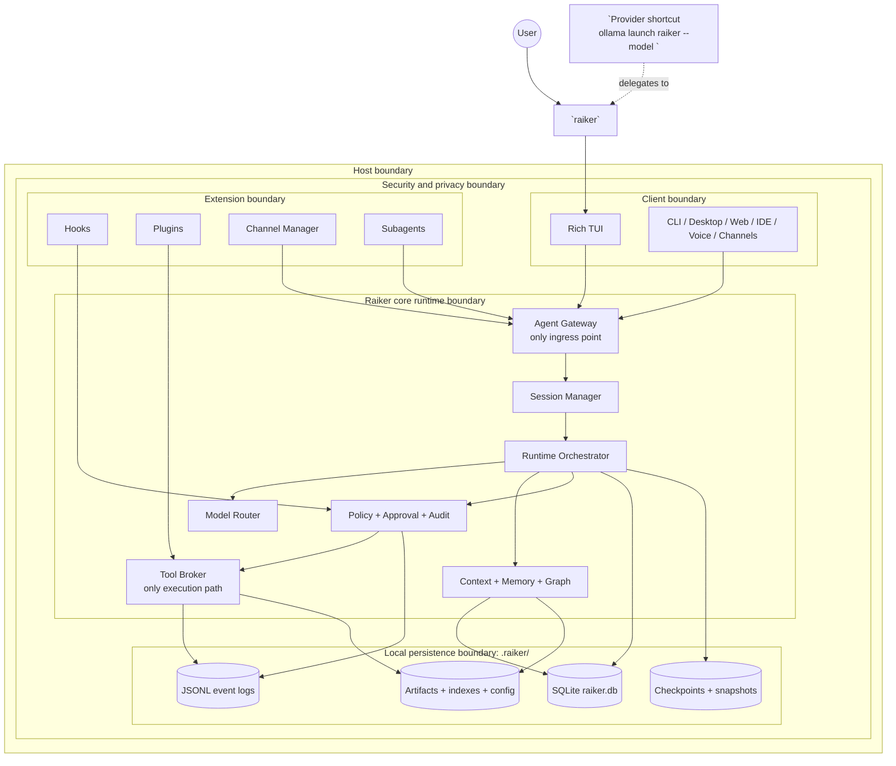
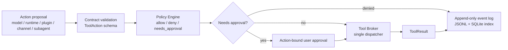

# Nested Boundaries Architecture Diagram

This document gives Raiker a clean nested-boundaries architecture view. It is intentionally compact: the purpose is to show control boundaries, not every implementation class.

The detailed component responsibilities remain in `docs/ARCHITECTURE.md`, `docs/CONTRACTS.md`, `docs/TOOLS_AND_PERMISSIONS_SPEC.md`, `docs/MODEL_RUNTIME_AND_LOCAL_INFERENCE.md`, `docs/MEMORY_AND_CONTEXT_STRATEGY.md`, and `docs/STORAGE_DATABASE_AND_SEARCH_SPEC.md`.

## Boundary rules

1. `raiker` is the only human-facing global command.
2. `raiker` launches the Rich TUI.
3. Every UI, channel, provider shortcut, or phase-scheduled client enters through the Agent Gateway.
4. No client, model, plugin, hook, channel, runtime helper, or subagent may execute tools directly.
5. Every action must pass through policy review, optional action-bound approval, Tool Broker dispatch, and event logging.
6. Model output, workspace files, channel messages, plugin content, memory, graph results, and subagent output are untrusted inputs or proposals, not privileged instructions.
7. `.raiker/` is the local persistence boundary for SQLite state, JSONL events, checkpoints, artifacts, indexes, and config.

## Clean nested boundary map

## Action execution gate

This is the non-bypass path every tool, command, plugin action, channel action, memory write, graph query, or execution adapter must follow.

## Boundary responsibilities

| Boundary | Owns | Must not do |
|---|---|---|
| Client boundary | TUI, CLI, Desktop, Web, IDE, voice, channels | Execute tools, call models directly, write storage directly |
| Gateway boundary | Envelope validation and request ingress | Bypass sessions, tools, policy, memory governance, or event logging |
| Runtime boundary | Session flow, state machine, context, planning, verification, checkpointing | Treat untrusted context as privileged instruction |
| Policy/audit boundary | Risk decisions, approvals, event log, auditability | Reuse approval for changed actions or hide security events |
| Tool boundary | Filesystem, search, shell, execution adapters, graph queries, memory tools | Execute without a policy decision |
| Model boundary | Local/hosted model routing, streaming, structured output validation | Silently fall back to remote models |
| Memory/graph boundary | Memory candidates, governed records, eidetic/gist memory, graph/codemap retrieval | Override policy or store sensitive data without governance |
| Extension boundary | Hooks, plugins, channels, subagents | Create private execution paths around the broker |
| Persistence boundary | SQLite, JSONL events, checkpoints, snapshots, artifacts, indexes, config | Mutate append-only events or store secrets without redaction/governance |

## Builder checklist

Before implementing a component, identify:

1. which boundary owns it;
2. which contract enters and exits it;
3. which event types it emits;
4. which storage tables or artifact paths it touches;
5. which policy decision can block or pause it;
6. which UI surface exposes it;
7. which tests prove the boundary cannot be bypassed.
