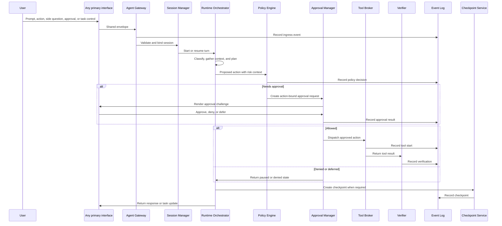
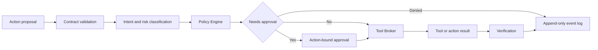

# Nested Boundaries Architecture

This document gives Raiker a detailed nested-boundaries architecture view. It shows the control boundaries that every implementation must preserve so a local or cloud builder model can implement features without inventing private paths, privileged interfaces, or unsafe shortcuts.

The detailed component responsibilities remain in:

- `README.md`
- `docs/architecture/ARCHITECTURE.md`
- `docs/architecture/CONTRACTS.md`
- `docs/architecture/COMMANDS_AND_INTERACTIVE_MODE_SPEC.md`
- `docs/architecture/WEB_UI_CONTROL_DECK_PLAN.md` (what each screen is for)
- `docs/architecture/VISUAL_DESIGN_SPEC.md` (how anything is drawn)
- `docs/architecture/CHANNELS_SPEC.md`
- `docs/architecture/TOOLS_AND_PERMISSIONS_SPEC.md`
- `docs/architecture/MODEL_RUNTIME_AND_LOCAL_INFERENCE.md`
- `docs/architecture/MEMORY_AND_CONTEXT_STRATEGY.md`
- `docs/architecture/STORAGE_DATABASE_AND_SEARCH_SPEC.md`
- `docs/architecture/SECURITY_AND_POLICY.md`
- `docs/architecture/VERIFICATION_PLAN.md`

---

## Non-Negotiable Boundary Rules

1. Raiker has no privileged human interface.
2. CLI, Rich TUI, Desktop, Web, Dashboard, IDE, Voice, Hotkeys, REST, Webhooks, Slack, Teams, Discord, Signal, Email, Browser Extension, Apple mobile app, Android mobile app, Mobile Companion, and other governed clients are equal-status primary interfaces when implemented and enabled.
3. The global `raiker` command is the local terminal entry point only. It is not the exclusive or canonical human interface.
4. `raiker` may open a Rich TUI, plain terminal client, or another configured terminal renderer. That terminal client is one primary interface among equals.
5. Every interface enters through the Agent Gateway. No UI, channel, provider shortcut, plugin, hook, model, runtime helper, subagent, or execution adapter may bypass the gateway.
6. Every action available in one enabled primary interface must have an equivalent action path in every other enabled primary interface that supports the relevant capability.
7. Equivalent action path means the same underlying contract, policy review, event logging, approval binding, session state, checkpoint behaviour, memory governance, and runtime orchestration.
8. Interface UX can differ. A terminal command, desktop button, web command palette item, mobile action sheet, voice command, chat card, email instruction, browser extension action, or REST request may all map to the same Raiker action.
9. No client, model, plugin, hook, channel, runtime helper, or subagent may execute tools directly.
10. Every tool, command, plugin action, channel action, memory write, graph query, model-launch action, checkpoint action, or execution-adapter action must pass through policy review, optional action-bound approval, Tool Broker dispatch, verification, and event logging.
11. Model output, workspace files, channel messages, plugin content, memory records, graph results, browser context, mobile attachments, voice transcripts, email content, and subagent output are untrusted inputs or proposals, not privileged instructions.
12. `.raiker/` is the local persistence boundary for SQLite state, JSONL events, checkpoints, artifacts, indexes, local config, and governed memory metadata.
13. Phase order is implementation order only. It must not create interface hierarchy or imply that later-phase interfaces are secondary.
14. If a feature is phase-scheduled, the contracts, storage hooks, gateway route, policy boundary, event model, and tests must still be specified before coding.

---

## Clean Nested Boundary Map

The Mermaid diagram below intentionally uses simple quoted labels. Avoid raw escaped newlines, slash-heavy labels, database/circle node shapes, or command flags inside node labels because GitHub's Mermaid renderer can reject them.

```mermaid
flowchart TB
  user["User"]

  subgraph PRIMARY["Equal-status primary interface boundary"]
    cli["CLI and raiker terminal entry"]
    tui["Rich TUI"]
    desktop["Desktop"]
    web["Web UI"]
    dashboard["Dashboard"]
    ide["IDE Extension"]
    mobile["Apple and Android Mobile Apps"]
    voice["Voice"]
    hotkeys["Hotkeys"]
    api["REST API"]
    browser["Browser Extension"]
    chat["Slack, Teams, Discord, Signal"]
    email["Email"]
    webhooks["Webhooks"]
  end

  provider["Provider shortcut delegates to model action"]

  user --> cli
  user --> tui
  user --> desktop
  user --> web
  user --> dashboard
  user --> ide
  user --> mobile
  user --> voice
  user --> hotkeys
  user --> chat
  user --> email
  user --> browser
  provider -.-> cli

  subgraph HOST["Host boundary"]
    subgraph TRUST["Security and privacy boundary"]
      subgraph GATE["Gateway and contract boundary"]
        gateway["Agent Gateway only ingress point"]
        contracts["Shared envelopes and actions"]
      end

      subgraph CORE["Raiker core runtime boundary"]
        session["Session Manager"]
        runtime["Runtime Orchestrator"]
        planner["Planner and Classifier"]
        context["Context Gatherer"]
        verifier["Verifier"]
        checkpoints["Checkpoint Service"]
      end

      subgraph SAFETY["Policy, approval, and audit boundary"]
        policy["Policy Engine"]
        approvals["Action-bound Approval Manager"]
        audit["Append-only Event Log"]
      end

      subgraph MODEL["Model boundary"]
        router["Model Router"]
        local_models["Local Providers"]
        hosted["Hosted Providers policy gated"]
      end

      subgraph EXEC["Tool and execution boundary"]
        broker["Tool Broker only execution path"]
        fs["Filesystem Tools"]
        search["Search and Graph Query Tools"]
        shell["Shell and Local Action Proposals"]
        exec_profiles["Execution Profiles"]
      end

      subgraph KNOW["Memory, graph, and context boundary"]
        memory["Memory Service"]
        eidetic["Eidetic and Gist Memory"]
        graph_["Graph and Codemap Service"]
        retrieval["FTS, Vector, and Graph Retrieval"]
      end

      subgraph EXT["Extension boundary"]
        hooks["Hooks"]
        plugins["Plugins"]
        channels["Channel Manager"]
        subagents["Subagents"]
      end

      subgraph STORE["Local persistence boundary"]
        sqlite["SQLite raiker database"]
        events["JSONL event logs"]
        snapshot_store["Checkpoints and snapshots"]
        artifacts["Artifacts, indexes, and config"]
      end
    end
  end

  cli --> gateway
  tui --> gateway
  desktop --> gateway
  web --> gateway
  dashboard --> gateway
  ide --> gateway
  mobile --> gateway
  voice --> gateway
  hotkeys --> gateway
  api --> gateway
  browser --> gateway
  chat --> gateway
  email --> gateway
  webhooks --> gateway

  gateway --> contracts
  contracts --> session
  session --> runtime
  runtime --> planner
  runtime --> context
  runtime --> router
  runtime --> policy
  policy --> approvals
  approvals --> broker
  policy --> audit
  broker --> verifier
  verifier --> runtime
  runtime --> checkpoints

  router --> local_models
  router --> hosted

  broker --> fs
  broker --> search
  broker --> shell
  broker --> exec_profiles

  context --> memory
  context --> eidetic
  context --> graph_
  context --> retrieval

  hooks --> policy
  plugins --> gateway
  plugins --> broker
  channels --> gateway
  subagents --> gateway

  session --> sqlite
  runtime --> sqlite
  memory --> sqlite
  graph_ --> sqlite
  audit --> events
  checkpoints --> snapshot_store
  broker --> artifacts
  retrieval --> artifacts
```



---

## Interface Action Parity Matrix

All enabled primary interfaces must route the same user capabilities through equivalent contracts. Some interfaces may need a different presentation, authentication challenge, or visual handoff for high-risk actions, but the action must still exist as a governed Raiker action.

| Capability | Terminal / Rich TUI | Desktop / Web / Dashboard | IDE | Apple / Android Mobile | Voice | Chat / Email / Webhooks | REST / Browser Extension | Shared contract path |
|---|---|---|---|---|---|---|---|---|
| Normal prompt | Plain text input | Prompt composer | Side panel prompt | Mobile composer | Voice transcript | Message body | API request / selected page action | `PromptEnvelope` |
| Side question | `? question` | Side-question field | Side thread | Quick question | Spoken question | Threaded reply | API side-question action | `UIActionEnvelope` / `ChannelMessageEnvelope` |
| Approval | Approval card | Drawer/card | Inline approval | Push/card approval | Spoken summary plus required confirmation or visual handoff | Signed approval card/reply | Authenticated approval response | action-bound approval contract |
| Pause/cancel/steer | Command or shortcut | Task controls | Task badge/menu | Task card controls | Voice command | Trusted command/reply | API task action | task-control action |
| Model launch/switch | `/launch`, `/models` | Model picker | Model command palette | Model screen | Voice command with confirmation | Trusted model command | API model action | model-control action |
| Channel link/unlink | `/channels` | Channel settings | Extension settings | Channel settings | Voice-assisted handoff | Admin command | API channel action | channel-admin action |
| Memory inspect/correct | `/memory` | Memory panel | Memory picker | Memory screen | Spoken query plus screen result | Trusted query | API memory action | memory-action contract |
| Graph/codemap query | `/graph` | Graph explorer | Symbol picker | Graph screen or handoff | Spoken query plus summary | Trusted query | API graph query | graph-query action |
| Checkpoint restore/fork | `/checkpoints` | Timeline | Editor timeline | Mobile timeline | Voice command plus confirmation | Trusted command | API checkpoint action | checkpoint-action contract |
| Diagnostics | `/doctor` | Diagnostics screen | IDE diagnostics | Mobile diagnostics | Spoken diagnostics | Trusted command | API health action | diagnostic-action contract |
| File/context attach | `@path` | Picker/drag/drop | Selected file | Files/share sheet | Spoken reference plus confirmation | Attachment | API upload/selection | attachment/context provenance |

---

## Prompt And Action Flow From Any Interface



---

## Action Execution Gate

Before any nested interface reaches policy or an executor, the broker requires a
workspace-issued, Ed25519-signed identity for the current machine turn. The
identity is bound to the authenticated owner delegation, workspace, session,
turn, principal, and `tool_broker` audience. Interface authentication therefore
does not become agent authority: the human remains the owner scope, while the
machine is the actor recorded on the action. Child-agent boundaries mint child
principals with explicit parent ancestry. No interface, plugin relay, scheduled
run, resume path, or CLI agentic path may bypass this gate.

This is the non-bypass path every tool, command, plugin action, channel action, memory write, graph query, checkpoint restore, model control, or execution adapter must follow.



---

## Boundary Responsibilities

| Boundary | Owns | Must not do | Required proof |
|---|---|---|---|
| Equal primary interface boundary | CLI, Rich TUI, Desktop, Web, Dashboard, IDE, Voice, Hotkeys, REST, Webhooks, Slack, Teams, Discord, Signal, Email, Browser Extension, Apple mobile app, Android mobile app, Mobile Companion | Execute tools, call models directly, write storage directly, or claim primary status over another enabled interface | Contract tests for client types; docs drift test for no privileged interface wording |
| Gateway boundary | Envelope validation, request ingress, client metadata, session binding handoff | Bypass sessions, tools, policy, memory governance, or event logging | Gateway tests prove all clients route through same gateway |
| Contract boundary | PromptEnvelope, UIActionEnvelope, ChannelMessageEnvelope, ToolAction, PolicyDecision, ToolResult, AgentResponse, Checkpoint | Accept ambiguous, unversioned, or interface-specific private schemas | Schema tests for required fields and invalid values |
| Runtime boundary | Session flow, state machine, context gathering, planning, verification, checkpointing | Treat untrusted context as privileged instruction or skip policy for speed | Runtime transition tests and event sequence tests |
| Policy and approval boundary | Risk decisions, approvals, action binding, deny/defer/allow decisions, auditability | Reuse approval for changed actions, hide security events, or accept stale mobile/channel approvals | Approval binding tests and stale approval rejection tests |
| Tool boundary | Filesystem, search, shell, execution adapters, graph query tools, memory tools | Execute without a policy decision or outside broker control | Broker tests prove denied actions do not execute |
| Model boundary | Local/hosted model routing, streaming, structured output validation, tool-call format validation | Silently fall back to remote models or treat model proposals as trusted actions | Model router tests and hosted-provider policy tests |
| Memory and graph boundary | Memory candidates, governed records, eidetic/gist memory, graph/codemap retrieval, FTS/vector metadata | Override policy, store sensitive data without governance, or inject memory as trusted instruction | Memory governance tests and provenance checks |
| Extension boundary | Hooks, plugins, channels, subagents | Create private execution paths around the gateway, policy engine, or broker | Plugin/channel/subagent boundary tests |
| Persistence boundary | SQLite, JSONL events, checkpoints, snapshots, artifacts, indexes, config | Mutate append-only events, lose provenance, or store secrets without redaction/governance | Storage tests, event append-only tests, checkpoint tests |
| Remote execution boundary | Worktree, container, SSH, VPS, Kubernetes, cloud/GPU, persistent sandbox | Run without explicit profile, resource limits, egress controls, cleanup, artifact capture, and budget policy | Execution-profile policy tests |

---

## Interface Boundary Detail

### CLI and `raiker` terminal entry

- `raiker` is the local terminal command.
- It launches the configured terminal client.
- It must emit `global_command_invoked` and terminal-client events.
- It must build the same envelopes as every other interface.
- It must not become the only documented human input path.

### Rich TUI

- Rich TUI is an equal primary interface.
- It provides dense terminal panels for transcript, tasks, approvals, events, memory, graph, checkpoints, models, channels, and diagnostics.
- It can use slash-command syntax, but slash commands are interface-neutral actions.

### Desktop, Web, and Dashboard

- Desktop and Web are equal primary clients of the gateway.
- Dashboard is an equal primary operational control surface, not just a passive view.
- They must expose prompts, side questions, approvals, task controls, model controls, channel management, memory, graph, checkpoints, diagnostics, and settings.

### IDE Extension

- IDE extension is an equal primary project-aware interface.
- It can provide selected-file context, inline diffs, command palette actions, diagnostics, approval prompts, and checkpoint restore/fork.
- It must not execute editor or filesystem actions outside the gateway/tool broker path.

### Apple and Android Mobile Apps

- Apple mobile app and Android mobile app are equal primary interfaces.
- They are not notification-only companions.
- They must support prompt submission, side questions, approvals, task pause/cancel/steer, model launch/switch, channel link/unlink, memory inspection/correction, graph/codemap query, checkpoints, diagnostics, and settings.
- Mobile approvals must be bound to exact action ID and exact arguments.
- Stale mobile approval state must refresh against the gateway before approval is accepted.

### Voice and Hotkeys

- Voice and Hotkeys are equal primary interfaces when enabled.
- They may require screen, mobile, web, desktop, or terminal handoff for high-risk actions if policy requires visual review.
- A handoff is a security control, not a loss of primary-interface status.

### Chat, Email, Webhooks, Browser Extension, and REST

- These are equal primary interfaces when linked, authenticated, and enabled.
- They must preserve sender identity, session binding, rate limits, attachment provenance, and approval binding.
- Their messages are untrusted inputs and must be normalised before reaching runtime.

---

## Storage And Persistence Boundary

All durable local Raiker state lives under `.raiker/` unless an explicitly governed external execution profile or backup/export task says otherwise.

```text
.raiker/
  raiker.db                 SQLite state, metadata, indexes
  events/                   append-only JSONL event logs
  checkpoints/              checkpoint manifests and snapshots
  artifacts/                bounded task artifacts and tool outputs
  indexes/                  graph/vector/search indexes or metadata
  config/                   local policy, model, connector, plugin state
```

Persistence rules:

1. JSONL events are append-only.
2. SQLite indexes may summarise events but must not replace the raw event log.
3. Checkpoints are resumability and rewind/fork records, not a Git replacement.
4. File snapshots are required before risky file mutation once edit/write actions are implemented.
5. Memory writes must be candidates unless governance approves durable storage.
6. Sensitive data must carry provenance, sensitivity, retention, and redaction metadata.
7. Connector and model registries must be listable before implementations are wired.

---

## Phase Boundary Detail

| Phase | Boundary focus | Interface rule |
|---|---|---|
| Phase 1 | Secure local runtime core, contracts, gateway, policy, event log, first terminal client, connector/model registries | Terminal client is first implementation target only. Equal-interface contracts and Apple/Android connector profiles must already exist. |
| Phase 2 | Rich local workspace, full terminal/TUI panels, local models, hooks, checkpoints, approved memory | Rich TUI becomes more capable but not primary over other interfaces. |
| Phase 3 | Desktop, Web, Dashboard, REST, IDE, Apple mobile app, Android mobile app, plugins, graph, semantic memory | Desktop/Web/Mobile/IDE/REST become equal primary implemented clients of the same gateway. |
| Phase 4 | Channels, Voice, Hotkeys, Browser Extension, Email, Slack, Teams, Discord, Signal, MCP, subagents, remote execution | External interfaces are equal primary when linked and policy-permitted. |
| Phase 5 | Managed governance, multi-user, signed plugins, audit export, cloud/GPU budgets, enterprise controls | Governance can restrict capabilities by policy but must not create hidden bypass interfaces. |

---

## Threat And Drift Controls

| Drift risk | Required control |
|---|---|
| Builder makes TUI the only input path | Docs drift tests must reject wording that says TUI is the primary human interface or canonical user-action place. |
| Builder adds Desktop/Web/Mobile as separate runtimes | Gateway-only invariant and shared contracts must be tested. |
| Builder lets channels execute tools | Channel messages must normalise into envelopes and route through policy and Tool Broker. |
| Builder lets model call tools directly | Model output remains proposal-only until validated and policy-reviewed. |
| Builder reuses approval after action changes | Approval binding must include exact action ID, arguments, risk, target path/host, and expiry. |
| Builder stores memory directly | Memory writes must become candidates unless governance approves durable records. |
| Builder bypasses event log for performance | Every meaningful action must emit append-only events and SQLite indexes. |
| Builder treats mobile as notification-only | Mobile app spec and connector profiles must test prompt/action/approval/task/checkpoint parity. |

---

## Builder Checklist

Before implementing or changing any component, identify:

1. which boundary owns it;
2. which primary interfaces can expose it;
3. which contract enters and exits it;
4. which event types it emits;
5. which storage tables or artifact paths it touches;
6. which policy decision can block or pause it;
7. which approval surface can resolve it;
8. which checkpoint or snapshot behaviour applies;
9. which memory, graph, or context provenance applies;
10. which tests prove the boundary cannot be bypassed;
11. which docs need updating so no interface is described as primary over another.

A builder must stop and update the relevant specification before coding if any of these answers are missing.
