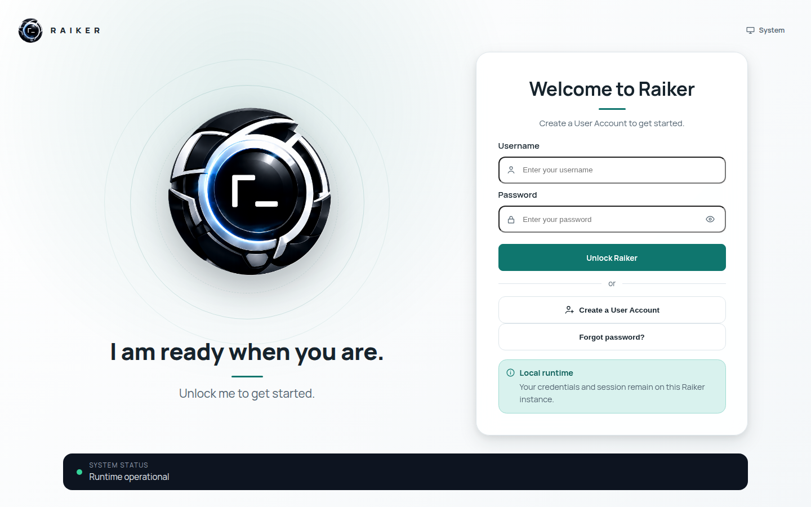

# 2. Create your account & unlock

The dashboard is gated by a **device-local lock screen**. Nothing mounts until
you have a full control session *and* the runtime bootstrap verifies. This is the
first screen you see:

## Step 1 — First-run registration

On a brand-new workspace the panel greets you with **"Welcome to Raiker → Create
a User Account to get started."**

1. Click the **Create a User Account** button (the secondary button below the
   divider). The panel switches to registration and the heading becomes *Create
   a User Account*.
2. Enter a **username** and **password**, then **confirm the password**.
3. Click **Create a User Account**.

You are dropped straight into the dashboard home ("What would you like to work
on, *name*?").

> ⚠️ **Heads-up (known UX snag):** on first run the big primary button still
> reads **"Unlock Raiker"** and tries to *log in*, so pressing it before an
> account exists returns *"Authentication failed."* You must use the secondary
> **Create a User Account** button first. Tracked as
> [FIX-01](../TO_BE_FIXED.md#fix-01--first-run-primary-button-says-unlock-raiker-but-no-account-exists-yet).

## Step 2 — Unlocking on later visits

Once an account exists, the panel is a normal **Unlock Raiker** login: username +
password → **Unlock Raiker**. If you enabled MFA you'll then be asked for the
6-digit authenticator code.

> 🔒 **Your session token lives in memory only** — it is never written to
> `localStorage`/`sessionStorage`. That's a deliberate security property: closing
> or reloading the tab means you re-authenticate. It is not a bug.

## Password & account options on the lock screen

| Control | What it does |
|---------|--------------|
| **Show/hide password** (eye icon) | Reveal the password field while typing. |
| **Forgot password?** | Local recovery: enter your username → confirm with an authenticator or one-time backup code → set a new password. |
| **Create a User Account** (when multiple people share the machine) | Spins up a *separate same-server instance* with its own workspace, mounted at its own path and opened in a new tab. |

## What "verified" means here

After you authenticate, the panel briefly shows **"Verifying runtime…"**. The
workspace only mounts if the runtime's bootstrap reads succeed. If they fail, the
screen stays locked with *"Runtime verification failed."* — the app fails closed
rather than showing you a half-working dashboard.

> ✅ **Verified:** registration → dashboard, and username/password unlock both
> work. MFA enrolment and password recovery surfaces are present (MFA enrolment
> tested from Settings → Security & Login on [page 9](09-security-vault-and-settings.md)).

Next: [Dashboard tour →](03-dashboard-tour.md)
