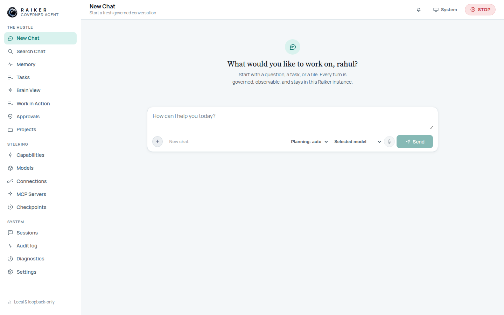

# 3. Dashboard tour

After unlocking you land on **New Chat**. The left navigation is grouped into
three sections, and the top bar carries the page title, a **notification bell**,
a **System** theme indicator, and a red **STOP** switch.

## The navigation, group by group

### The Hustle — day-to-day work

| Item | What it is |
|------|-----------|
| **New Chat** | Start a fresh governed conversation. The front door. |
| **Search Chat** | Full-text search across your conversation titles and messages. |
| **Memory** | Approved memories the agent may recall, each with provenance, scope, and sensitivity. Pin or forget them. |
| **Tasks** | Create tasks, subtasks, scheduled runs, routines, and background agents. |
| **Brain View** | A live map of stored runtime records (sessions, tasks, tools, approvals, memory, schedules, backups). |
| **Work in Action** | An operational view of subagents, queues, and schedules. |
| **Approvals** | Actions the agent proposed that need your decision. Resolving one records your decision only. |
| **Projects** | Named scopes for ongoing work — a folder plus the sessions/checkpoints created while active. |

### Steering — govern what the agent may do

| Item | What it is |
|------|-----------|
| **Capabilities** | For every capability, choose Ask / Allow / Auto / Deny, and turn integrated capabilities on or off. |
| **Models** | Model profiles and provider gates: pick where Raiker "thinks". |
| **Connections** | The Connector Store — governed service connectors and their status. |
| **MCP Servers** | Build, connect, and monitor local or remote MCP servers. |
| **Checkpoints** | Metadata snapshots taken at safe points as sessions run. |

### System — history & health

| Item | What it is |
|------|-----------|
| **Sessions** | Every conversation with its turns and the governed events behind them. |
| **Audit log** | The full append-only event record — the deep-dive view. |
| **Diagnostics** | An honest runtime-readiness/health report, derived from stored state only. |
| **Settings** | Runtime mode, security posture, appearance, per-account preferences. |

## Always-present controls

- **STOP switch** (top-right, red): a governed interrupt that halts work at a safe
  boundary.
- **Notification bell**: surfaces runtime notifications.
- **System / theme**: light and dark themes are both supported; the toggle stamps
  the theme on the page.
- **"Local & loopback-only"** footer: a standing reminder that this dashboard
  never leaves your machine.

> ✅ **Verified:** all 17 views render, in both light and dark themes, with **zero
> browser console errors**. Every view opens with an honest **empty state** on a
> fresh workspace ("No sessions yet", "Nothing waiting on you", etc.) rather than
> fake sample data.

Next: [Chat →](04-chat.md)
