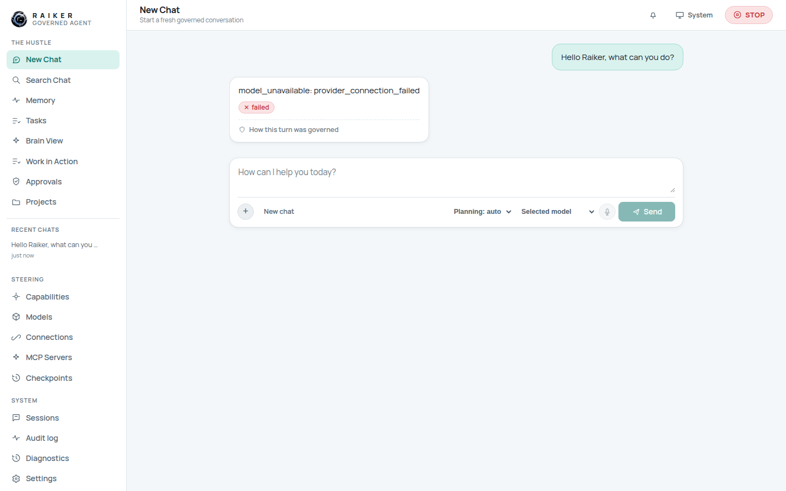
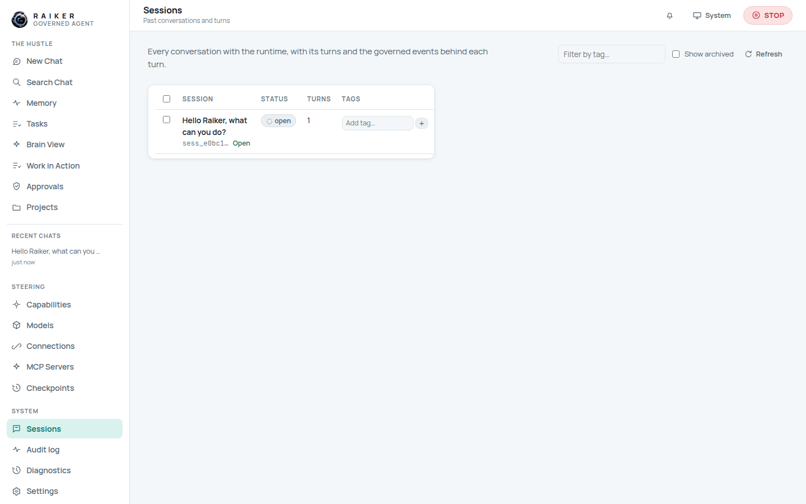
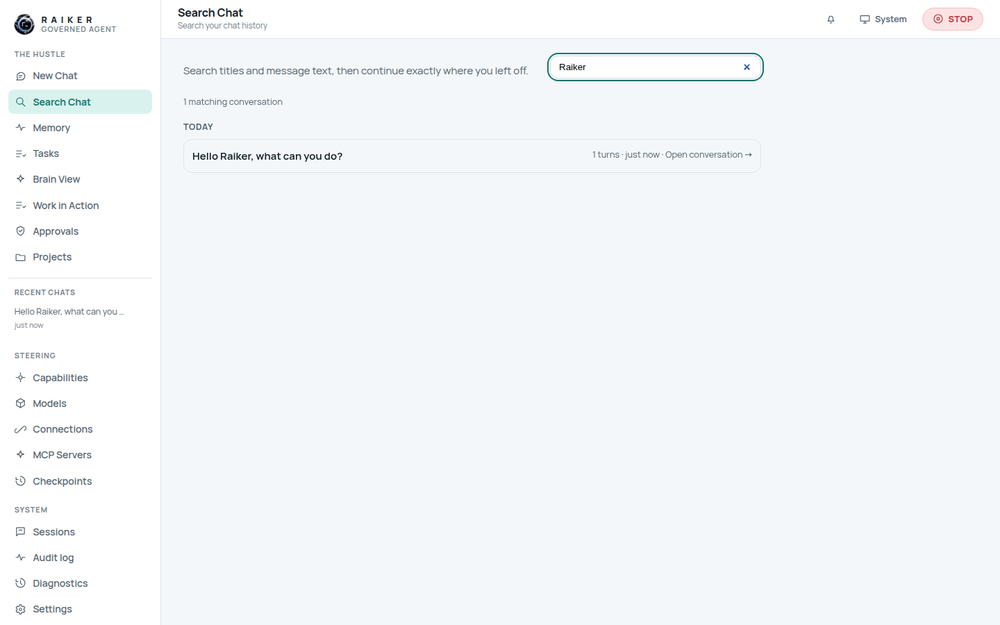

# 4. Chat: your first governed turn

**New Chat** is the front door. The composer at the bottom has:

- a large **prompt** box ("How can I help you today?"),
- a **＋ / New chat** control (attach / start-fresh),
- a **Planning** selector — *auto* / *Always plan* / *Never plan*,
- a **Selected model** dropdown (llama.cpp, Ollama, Ollama Cloud, LM Studio,
  OpenAI-compatible, OpenRouter, Hugging Face, Anthropic, OpenAI, Gemini),
- a **microphone** button, and
- **Send**.

## Step 1 — Send a prompt

Type a message and press **Send**. Your message appears as a bubble on the right,
and Raiker's turn appears on the left.



### What happens with no model connected

On a fresh workspace no model backend is selected yet, so the turn ends with an
**honest failure**:

```
model_unavailable: provider_connection_failed        ✕ failed
How this turn was governed
```

This is the *no silent runtime* rule in action — Raiker will not fabricate a
reply. To get real answers, connect a model on [page 6](06-models-and-providers.md).
Every turn, success or failure, shows a **"How this turn was governed"** trail you
can expand.

## Step 2 — Your chat is saved on the left

As soon as you send, the conversation appears under **RECENT CHATS** in the left
sidebar ("*Hello Raiker, what can you…* · just now"). Click it any time to
continue where you left off.

## Step 3 — It becomes a governed session

The conversation is a first-class **session**. Open **Sessions** to see it with
its status, turn count, tags, and last-updated time:



## Step 4 — It's searchable

Open **Search Chat**, type a word from the title or any message, and the
conversation comes back instantly with its turn count and an **Open
conversation →** link:



> **Answering the common questions directly:**
> - *Does a new chat appear on the left?* **Yes** — under **RECENT CHATS**.
> - *Is the chat searchable?* **Yes** — by title and message text in **Search Chat**.
> - *Is it saved?* **Yes** — as a governed session in **Sessions**, with a full
>   event trail in the **Audit log**.

## Planning modes

The **Planning** selector controls whether the agent runs its plan step:

- **auto** — Raiker decides per turn (default).
- **Always plan** — force the gather → plan → act → verify loop every turn.
- **Never plan** — go straight to acting for simple turns.

Next: [Tasks →](05-tasks.md)
