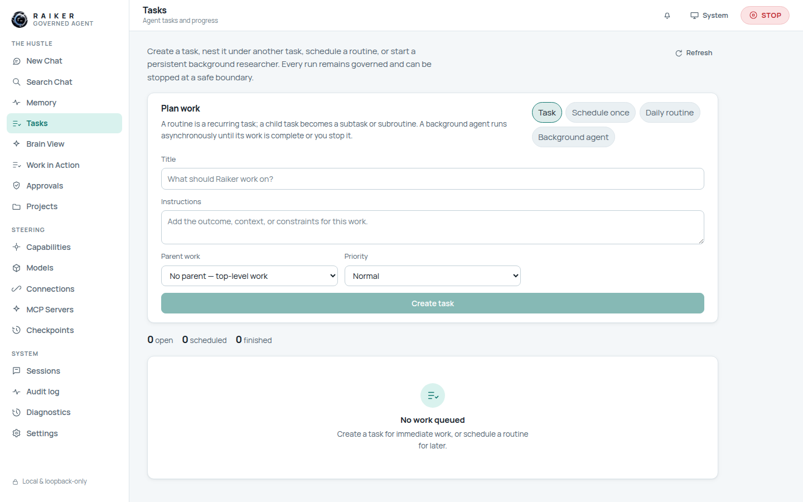
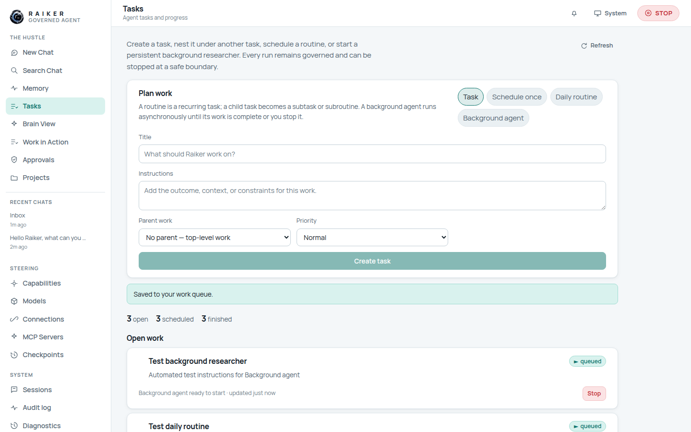

# 5. Tasks

**Tasks** is where you queue work that runs as governed agent activity — one-off
jobs, scheduled runs, recurring routines, and long-running background agents.

## The four kinds of work

Pick the kind with the chips at the top-right of the **Plan work** card:

| Chip | Meaning | Extra field |
|------|---------|-------------|
| **Task** | Immediate work, queued to run now. | — |
| **Schedule once** | Runs a single time at a chosen moment. | **Start time** (required) |
| **Daily routine** | A recurring task that runs every day. | **Start time** (required, sets the daily anchor) |
| **Background agent** | A persistent researcher that runs asynchronously until done or you stop it. | — |

## Step-by-step: create a task

1. Choose a kind (e.g. **Task**).
2. Fill **Title** ("What should Raiker work on?").
3. Optionally add **Instructions** (the outcome, context, or constraints).
4. Optionally choose **Parent work** to nest it as a subtask/subroutine under an
   existing task, and set a **Priority** (Low / Normal / High).
5. For **Schedule once** / **Daily routine**, set the **Start time**
   (`datetime-local`). The create button stays disabled until you do.
6. Click **Create task** / **Schedule task** / **Create daily routine** /
   **Start background agent**.

You'll see **"Saved to your work queue."** and the item appears under **Open
work** with a status badge and a stop control.

> ✅ **Verified:** all four kinds create successfully. The queue summary shows
> **open / scheduled / finished** counts, and each row shows its schedule
> ("Ready when you run it", "Every day, next run …", "Background agent ready to
> start") plus a **Stop** button while queued/running.

## Stopping work

Any queued, running, or paused item has a red **Stop** button that halts it at a
safe boundary. The global **STOP** switch in the top bar does the same across the
whole runtime.

## A note on results

Because task execution runs through the same model path as chat, tasks created on
a workspace with **no connected model** will finish in a failed/`model_unavailable`
state — connect a model first (see [page 6](06-models-and-providers.md)) for tasks
that actually produce output.

> ℹ️ On a fresh workspace the queue's **open / scheduled / finished** numbers can
> look surprising because immediate tasks that run without a model land in
> *finished*, and chat turns are visible as parent-work options. See
> [FIX-06](../TO_BE_FIXED.md#fix-06--task-queue-counts-are-confusing-on-a-fresh-workspace).

Next: [Models & providers →](06-models-and-providers.md)
