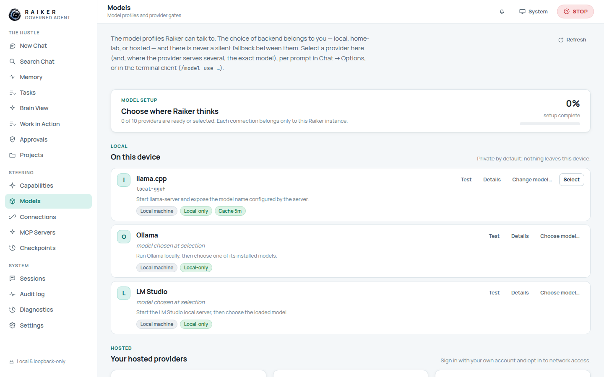
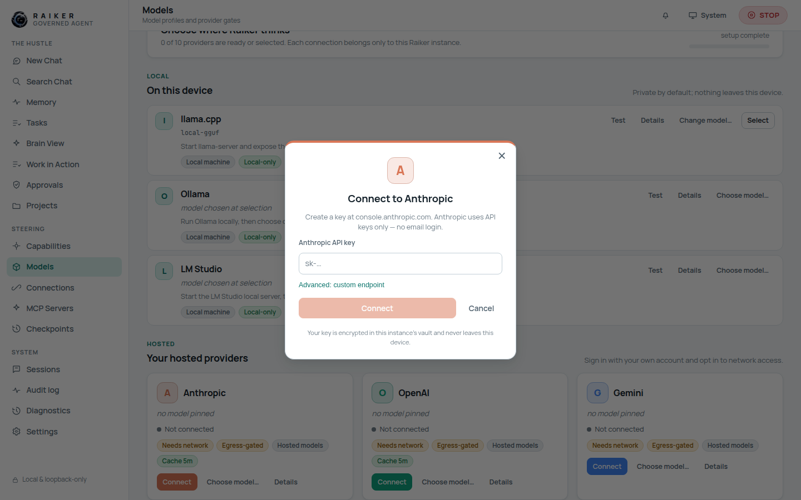

# 6. Models & providers

Raiker ships **no model** — you point it at one. The **Models** view is where you
choose where Raiker "thinks". The choice of backend belongs to you, and there is
never a silent fallback between local and hosted.

Profiles are grouped into three sections:

- **Local — On this device** (private by default): `llama.cpp`, `Ollama`, `LM Studio`.
- **Hosted — your hosted providers**: `Anthropic`, `OpenAI`, `Gemini`.
- **Advanced connections**: `OpenRouter`, `Hugging Face`, `Ollama Cloud`,
  `OpenAI-compatible` (vLLM / home-lab endpoints).

A **setup meter** at the top shows how many providers are ready or selected.

## Local models (the easy path)

`llama.cpp`, Ollama, and LM Studio work out of the box once their local server is
running:

1. Start your local server (e.g. `ollama serve`, or llama-server on `:8080`).
2. On the provider row click **Test** to confirm Raiker can reach it.
3. Click **Choose model…** — Raiker lists the served models (or lets you type a
   model id).
4. Click **Use model**, then **Select** to make it the active backend.

Local profiles are marked **Local-only** — nothing leaves your device.

## Hosted providers: the connect dialog

Each hosted card has a **Connect** button that opens a provider-branded sign-in
dialog. For Anthropic:

1. Click **Connect** on the Anthropic card.
2. Paste your **Anthropic API key** (create one at `console.anthropic.com`).
3. Optionally expand **Advanced: custom endpoint**.
4. Click **Connect**.

Your key is stored **encrypted in this instance's vault** and is never displayed
back or written to the event log. (The dialog links you to the provider's key
page — Raiker stores the key you paste; it does not perform a real OAuth
redirect.)

## ⚠️ Reality check: hosted models can't be fully enabled from the dashboard yet

Hosted inference is **implemented but fail-closed**, and in this release you
**cannot complete its activation from the web app alone**. Two gates block a
web-only user:

1. **Saving the key fails until the hosted gate is on.** With the
   `hosted_model_runtime` capability disabled (the default), the connect dialog
   returns a **403** — and the error text is mangled into
   *"Could not connect (403: `[REDACTED_SECRET]`)"* instead of the real reason
   (`provider_requires_explicit_policy_approval`).
   See [FIX-02](../TO_BE_FIXED.md#fix-02--connect-error-is-over-redacted-to-redacted_secret).

2. **Turning the gate on hits a dead end.** In **Capabilities → Hosted models →
   Turn on**, confirming reports *"Activation is blocked. Satisfy the activation
   requirement first."* with no way to satisfy it — the runtime requires a
   **threat-model acknowledgement** that the dashboard never collects or sends.
   Recording that acknowledgement is currently a command-line/operator step.
   See [FIX-03](../TO_BE_FIXED.md#fix-03--hosted-model-activation-is-impossible-from-the-web-dashboard).

**Net effect:** to actually run a hosted model today you need the terminal
client / operator flow to record the threat-model acknowledgement and enable
`hosted_model_runtime`, after which the dashboard connect + select + chat path
works. **Local models have no such gate and are the recommended path for a
web-only user.**

## The fallback sequence

Below the provider list, **Model fallback sequence** lets you order backends so a
turn never dead-ends when your first choice is down (no network, timeout, policy
denial). Add backends, reorder them with ↑/↓, and **Save sequence**. Each
candidate is still gated by its own provider policy — listing a hosted provider
here grants nothing on its own.

## Advisor model

**Advisor model** lets a local model consult one hosted model through the
governed `consult_advisor` tool. Selecting an advisor grants nothing by itself —
the consult is gated by the `advisor_model_runtime` capability (default **ask**),
the provider's policy, and egress. The question and answer never enter the audit
log; only their lengths do.

## Off-machine posture (read-only)

The **Off-machine provider posture** card shows hosted/private-network gate
states, whether an egress allowlist is configured, and the off-machine profile
count. It is **read-only** — allowlist values and API keys are never shown, and
this is *not* where you flip the hosted gate.

> ✅ **Verified:** local provider rows, the connect dialog, fallback editing, the
> advisor selector, and the read-only posture card all render and operate.
> ❌ **Not verified end-to-end from the web app:** a live hosted-model reply,
> because activation is blocked as described above.

Next: [Capabilities & approvals →](07-capabilities-and-approvals.md)
