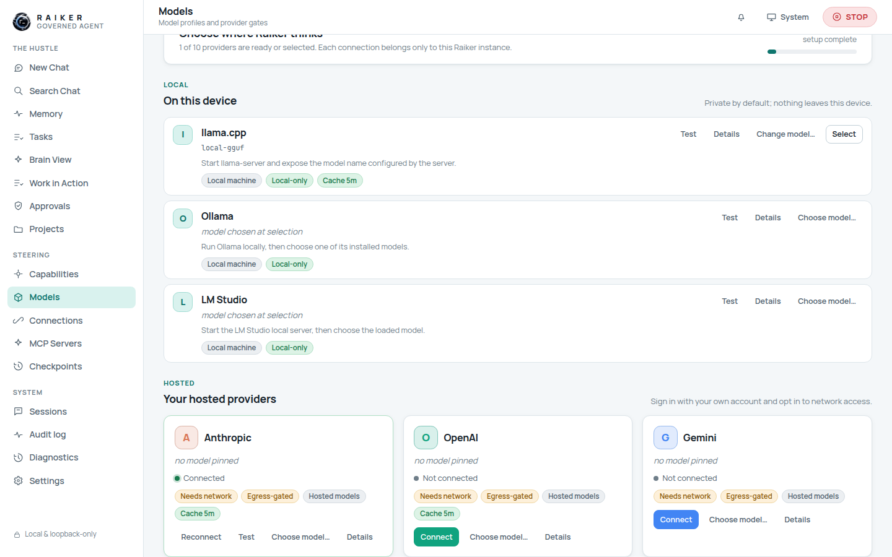
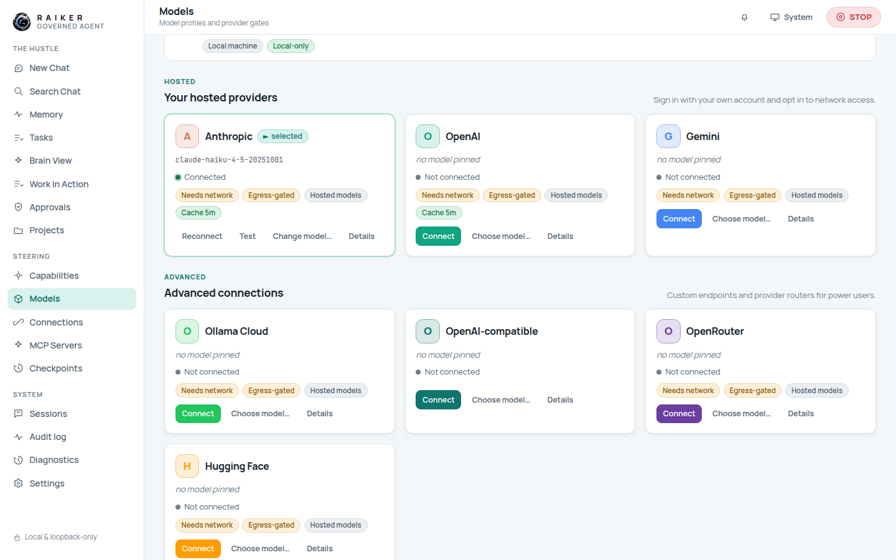
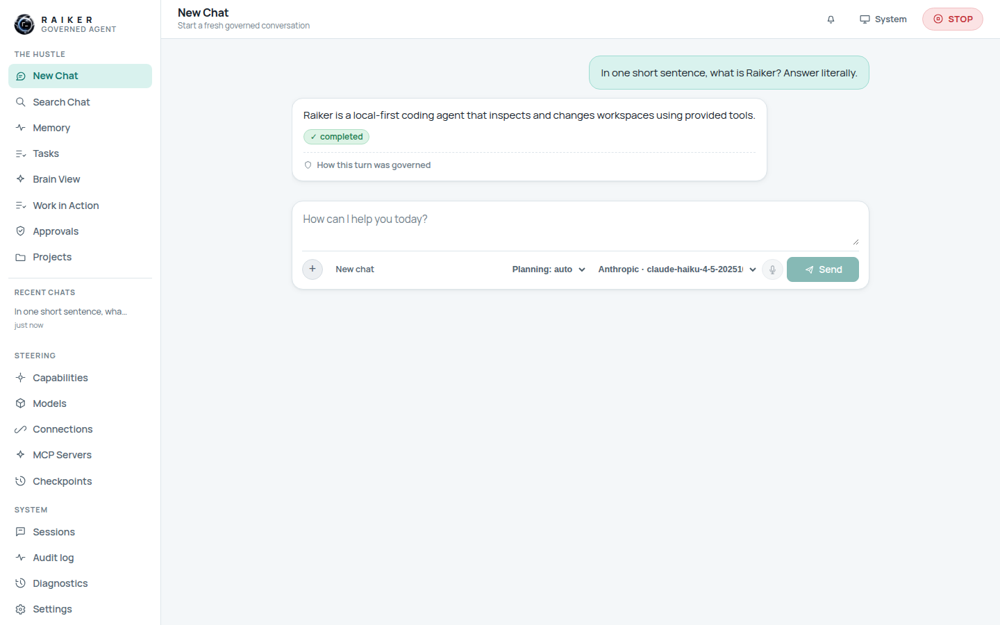

# 6. Models & providers

Raiker ships **no model** — you point it at one. The **Models** view is where you
choose where Raiker "thinks". The choice of backend belongs to you, and there is
never a silent fallback between local and hosted.

Profiles are grouped into three sections:

- **Local — On this device** (private by default): `llama.cpp`, `Ollama`, `LM Studio`.
- **Hosted — your hosted providers**: `Anthropic`, `OpenAI`, `Gemini`.
- **Advanced connections**: `OpenRouter`, `Hugging Face`, `Ollama Cloud`,
  `OpenAI-compatible` (vLLM / home-lab endpoints).

A **setup meter** at the top shows how many providers are ready or selected.

## Local models (the easy path)

`llama.cpp`, Ollama, and LM Studio work out of the box once their local server is
running:

1. Start your local server (e.g. `ollama serve`, or llama-server on `:8080`).
2. On the provider row click **Test** to confirm Raiker can reach it.
3. Click **Choose model…** — Raiker lists the served models (or lets you type a
   model id).
4. Click **Use model**, then **Select** to make it the active backend.

Local profiles are marked **Local-only** — nothing leaves your device.

## Hosted providers: the connect dialog

Each hosted card has a **Connect** button that opens a provider-branded sign-in
dialog. For Anthropic:

1. Click **Connect** on the Anthropic card.
2. Paste your **Anthropic API key** (create one at `console.anthropic.com`).
3. Optionally expand **Advanced: custom endpoint**.
4. Click **Connect**.

Your key is stored **encrypted in this instance's vault** and is never displayed
back or written to the event log. (The dialog links you to the provider's key
page — Raiker stores the key you paste; it does not perform a real OAuth
redirect.)

## Enabling a hosted provider (Anthropic / OpenAI / Gemini)

Hosted inference is **fail-closed by default** — you must explicitly enable it,
acknowledge its threat model, and confirm. All of this is now doable **entirely
from the web dashboard**. The full path, once, from a fresh workspace:

1. **Set a vault key** (Settings → Security & Login, see [page 9](09-security-vault-and-settings.md)) —
   this encrypts the provider key you're about to store.
2. **Enable the gate.** Go to **Capabilities → Hosted models → Turn on**. The
   governed step-up dialog asks for:
   - a **reason**,
   - a **confirmation token** (type any value you use as your human "I'm doing
     this on purpose" token), and
   - the **threat-model acknowledgement** checkbox ("I have reviewed the threat
     model … and accept the risk").

   

3. **Allow the mode** (optional but convenient): set **Hosted models** to
   **Allow** so hosted turns don't pause for approval each time.
4. **Connect your key.** Models → Anthropic → **Connect** → paste your key. It
   now saves successfully.

   

5. **Pick a model.** **Choose model…** lists the provider's real models; select
   one (e.g. `claude-haiku-4-5-…`) and **Use model**.

   

6. **Chat.** Send a prompt — you get a real, governed hosted reply.

   

> 🔒 **The gate is preserved, not bypassed.** You still explicitly acknowledge
> the threat model and supply a confirmation token; the acknowledgement is
> recorded against your principal and written to the audit log. Raiker simply now
> lets you do that *in the app* instead of only from the CLI.
>
> **Local models** (llama.cpp/Ollama/LM Studio) have no such gate and remain the
> simplest path if you don't need a hosted provider.

## The fallback sequence

Below the provider list, **Model fallback sequence** lets you order backends so a
turn never dead-ends when your first choice is down (no network, timeout, policy
denial). Add backends, reorder them with ↑/↓, and **Save sequence**. Each
candidate is still gated by its own provider policy — listing a hosted provider
here grants nothing on its own.

## Advisor model

**Advisor model** lets a local model consult one hosted model through the
governed `consult_advisor` tool. Selecting an advisor grants nothing by itself —
the consult is gated by the `advisor_model_runtime` capability (default **ask**),
the provider's policy, and egress. The question and answer never enter the audit
log; only their lengths do.

## Off-machine posture (read-only)

The **Off-machine provider posture** card shows hosted/private-network gate
states, whether an egress allowlist is configured, and the off-machine profile
count. It is **read-only** — allowlist values and API keys are never shown, and
this is *not* where you flip the hosted gate.

> ✅ **Verified end-to-end from the web app:** enabling *Hosted models* (with
> threat-ack + confirmation token), connecting the Anthropic key, selecting
> `claude-haiku-4-5-…`, and receiving a **live governed reply** in Chat — plus
> local provider rows, the fallback editor, advisor selector, and read-only
> posture card.

Next: [Capabilities & approvals →](07-capabilities-and-approvals.md)
