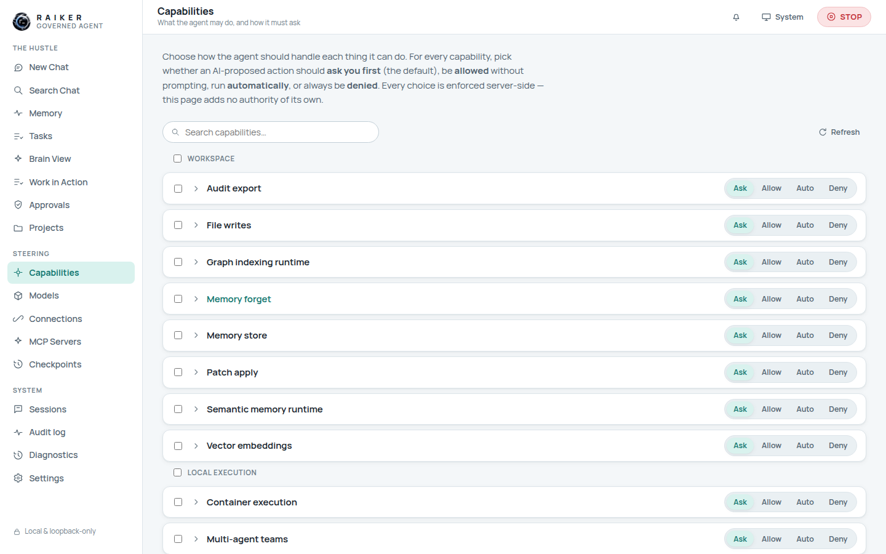
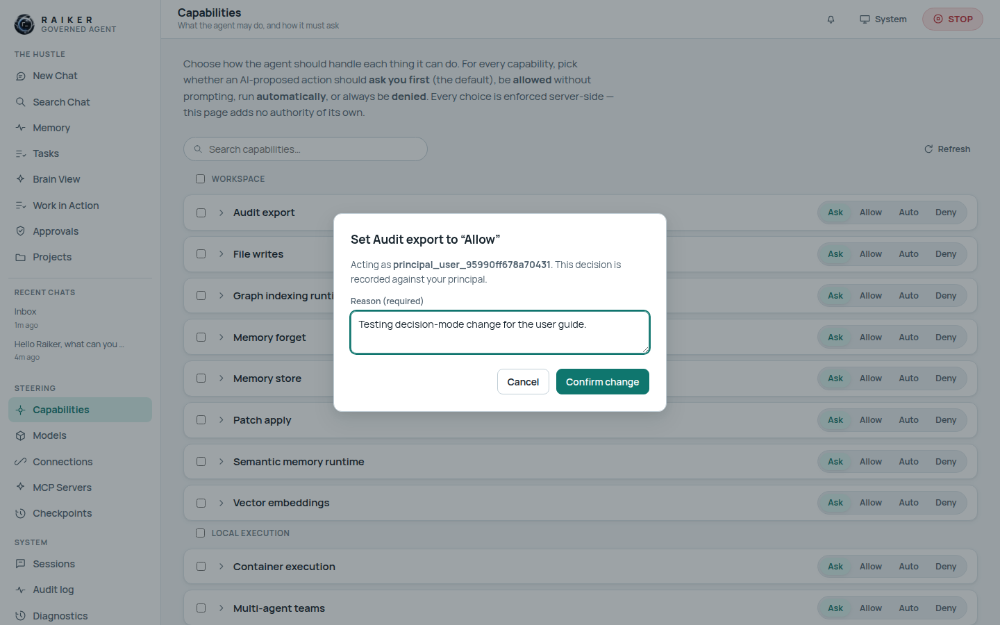
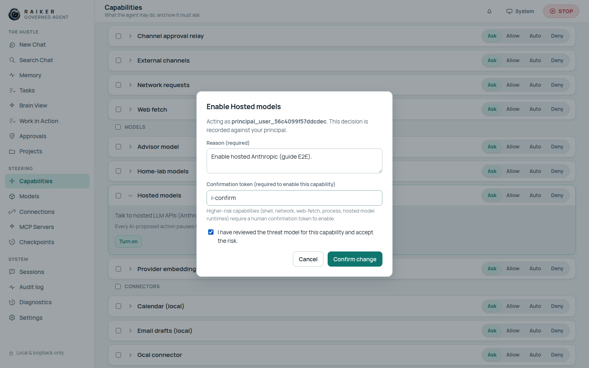
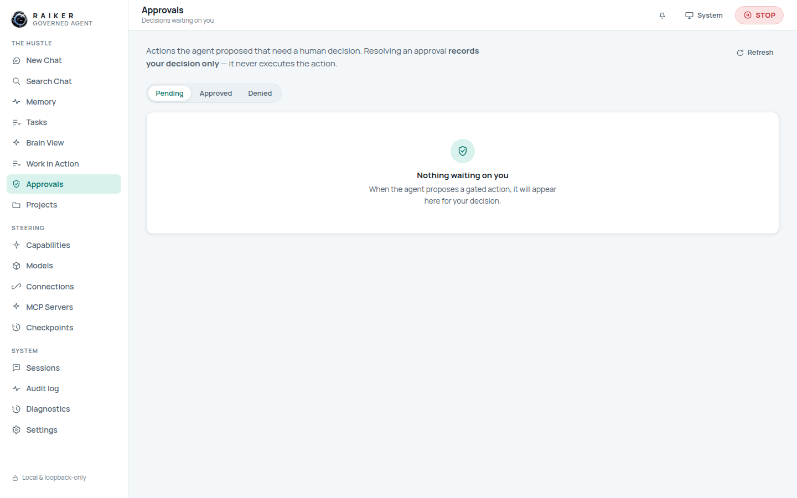

# 7. Capabilities & approvals

This is the heart of Raiker's governance. **Capabilities** decides *what the agent
may do and how it must ask*; **Approvals** is where proposed actions wait for your
decision.

## Capabilities

Every capability is a row grouped by domain (Workspace, Local execution, Models,
Connectors, …). On the right of each row are four **decision modes**:

| Mode | Meaning |
|------|---------|
| **Ask** | AI-proposed actions pause for your approval (the default). |
| **Allow** | Run without prompting, within policy. |
| **Auto** | Run automatically. |
| **Deny** | Always refuse. |

### Changing a decision mode

1. Click the mode you want (e.g. **Allow**) on a capability row.
2. A **governed change dialog** appears: *"Acting as principal_… This decision is
   recorded against your principal."*
3. Enter a **Reason (required)**.
4. Click **Confirm change**.

Every change is enforced server-side and written to the audit log — this page
adds no authority of its own.

> ℹ️ You can only set a decision mode for a capability whose **executor is
> enabled**. Try to change one that isn't and the runtime says so plainly, e.g.
> *"decision_mode_requires_executor: audit_export."* That's a guardrail, not a
> bug — turn the capability on first (below).

### Turning a capability on or off

Expand a row with the **›** chevron to reveal its description and a **Turn on** /
**Turn off** button.

- **Turn on** opens a step-up dialog asking for a **reason**. Higher-risk
  capabilities also require a **confirmation token** and a **threat-model
  acknowledgement** — the dialog shows exactly the fields that capability needs,
  because the backend now reports each gate's real activation preconditions.
  This covers **Hosted models** (Anthropic/OpenAI/Gemini), Home-lab models, the
  MCP runtimes, and the Tier-2 execution capabilities (shell, process, network,
  web-fetch).

  

- Not every disabled capability can be turned on from here. Sensitive/deferred
  domains (finance, medical, remote/cloud execution, …) have **no executor** and
  stay off by design — they show no enable path.

> ✅ **Hosted models now enable cleanly from the dashboard** (this was previously
> a dead end — see [FIX-03](../TO_BE_FIXED.md#fix-03--hosted-model-activation-is-impossible-from-the-web-dashboard)).
> You acknowledge the threat model and supply a confirmation token in the dialog;
> the acknowledgement is recorded against your principal and audited. On a fresh
> **Development preview** workspace, gates read `disabled` until you enable them —
> see [FIX-05](../TO_BE_FIXED.md#fix-05--fresh-workspace-shows-all-capability-gates-disabled-vs-readme-claim).

### Search & bulk

A **Search capabilities** box filters the list, and per-row checkboxes support
selecting several at once.

## Approvals

When the agent proposes a gated action (because its mode is **Ask**), it lands in
**Approvals** with **Pending / Approved / Denied** tabs. On a fresh workspace it
reads *"Nothing waiting on you."*

The queue opens with the highest reported risk first, so critical and high-risk
requests are easier to review. Use **Highest risk first** or **Newest first** to
change the local ordering. This only changes the presentation of the server's
reported risk and request time; it does not alter any approval, priority, or
execution state.

When an approval has a time limit, its detail shows the server-reported expiry.
If the server reports it as expired, the decision controls are withheld and the
queue asks you to refresh. The resolution endpoint checks the expiry again, so a
browser clock or stale page can never turn an expired request into a valid decision.

Critical approvals are visibly separate from ordinary metadata-only decisions.
Their review keeps the immutable preview visible, then requires a decision note
and a fresh password or MFA step-up before it asks the server to resolve the
critical lifecycle. The browser never supplies a trust flag: the server requires
an elevated session and re-checks the intent before recording a denial or
attempting its governed execution path.

> 🔑 **Approval resolution is usually metadata-only.** Approving or denying normally
> records your decision without executing the action. The only narrow exception is a
> principal-bound connector-write intent: its review card and final server response
> explicitly say that the exact intent executed once.

Next: [Connections & MCP →](08-connections-and-mcp.md)
