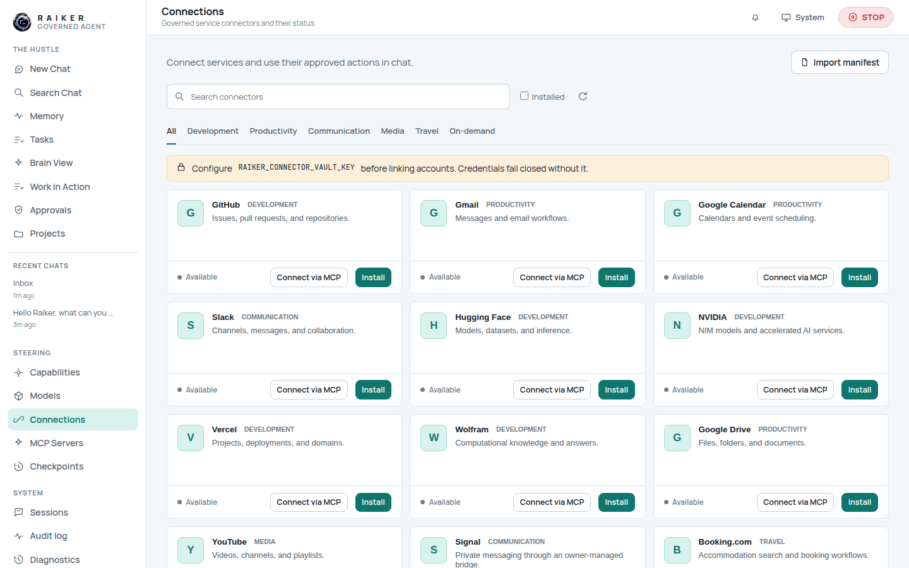
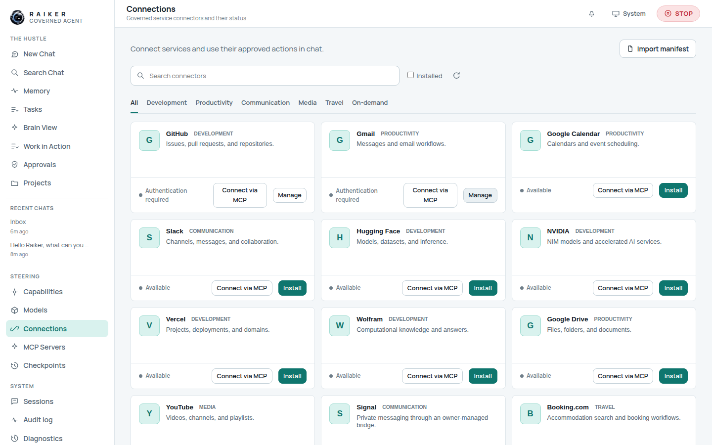
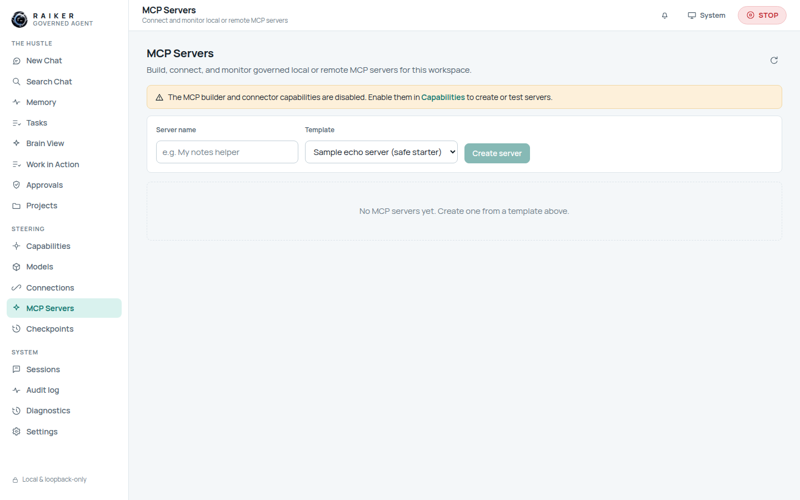

# 8. Extensions: connectors & MCP

**Extensions** is one destination with four tabs — Connectors, MCP servers,
Plugins, and Channels. The Connectors tab opens on a **Readiness** overview.

## Readiness: four facts, not one badge

Every extension reports four independent, server-derived facts:

| Fact | What it means |
|------|---------------|
| **Installed** | It is present in this workspace. |
| **Account connected** | A credential is stored in the vault. Its value is never shown here, or anywhere else in the dashboard. |
| **Enabled for the session** | You turned it on for this session. |
| **Usable now** | The runtime will accept a governed call. |

An extension is usable only when the server confirms all four. Selecting a row
opens an inspector that shows each step, names the first unmet condition in plain
language, and reports the governance facts behind it — capability, gate state,
decision mode, egress host, and whether that host is on the allowlist.

Nothing here grants anything. Changing any of these still goes through the
capability gate, the credential vault, and the approval path.

## Plugins and Channels

Both tabs say plainly that they are not available yet, and why. Plugin panels
need an accepted route, permission, and accessibility contract; channels and
webhooks need an accepted delivery contract and threat model. The tabs exist so
the gap is visible rather than silently missing — nothing is installed, and no
plugin code runs in the browser.

## Connectors (the Connector Store)

The Connectors tab lists governed service connectors — GitHub, Gmail, Google
Calendar, Slack, Hugging Face, NVIDIA, Vercel, Wolfram, Google Drive, YouTube,
Signal, Booking.com, and more — filterable by category (Development,
Productivity, Communication, Media, Travel, On-demand).

### Before you connect anything: set the vault key

Every card sits under a banner: **"Configure `RAIKER_CONNECTOR_VAULT_KEY` before
linking accounts. Credentials fail closed without it."** Set a valid vault key
first (see [page 9](09-security-vault-and-settings.md)) — otherwise saving a
credential fails closed.

### Installing a connector

1. Set a valid vault key (once).
2. On a connector card, click **Install**.
3. The card flips to an installed state showing **Authentication required**, with
   **Connect via MCP** and **Manage** actions.

You can also **Import manifest** to add a connector from a manifest file, and
search connectors by name.

> ✅ **Verified:** with a valid vault key set, **Install** works and moves the
> connector to "Authentication required". Without a valid vault key, credential
> storage fails closed — as intended.

## MCP servers

The **MCP servers** tab lets you build, connect, and monitor governed local or remote
Model Context Protocol servers for this workspace.

The view offers a **Server name** field, a **Template** picker (e.g. "Sample echo
server (safe starter)"), and a **Create server** button.

> ⚠️ **Gated by default.** The MCP builder/connector capabilities are **disabled**
> on a fresh workspace, and the page tells you so: *"The MCP builder and connector
> capabilities are disabled. Enable them in Capabilities to create or test
> servers."* Clicking **Create server** while disabled returns a governed
> **403** with a clear message rather than doing anything.
>
> To use MCP you must enable `mcp_builder_runtime` / `mcp_connector_runtime` in
> **Capabilities**. These are **Tier-2** gates: turning them on requires a
> **confirmation token** and a threat-model acknowledgement in the step-up dialog
> (the same operator/CLI-issued token used for shell/network capabilities).
> Minor UX issue: the **Create server** button is clickable even while the
> capability is off — see
> [FIX-04](../TO_BE_FIXED.md#fix-04--mcp-create-server-button-is-clickable-while-the-capability-is-disabled).

Next: [Security, vault & settings →](09-security-vault-and-settings.md)
