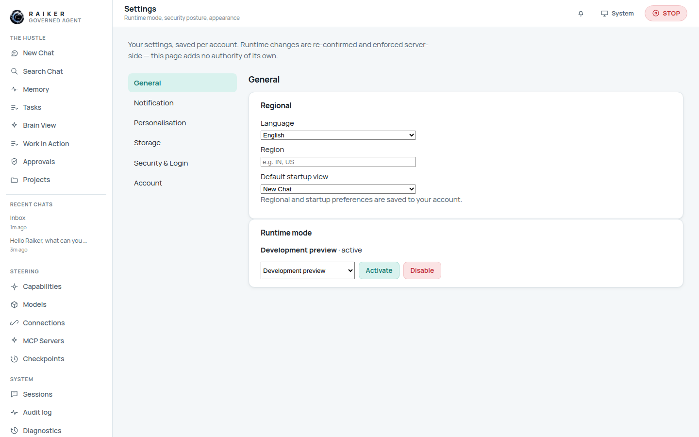
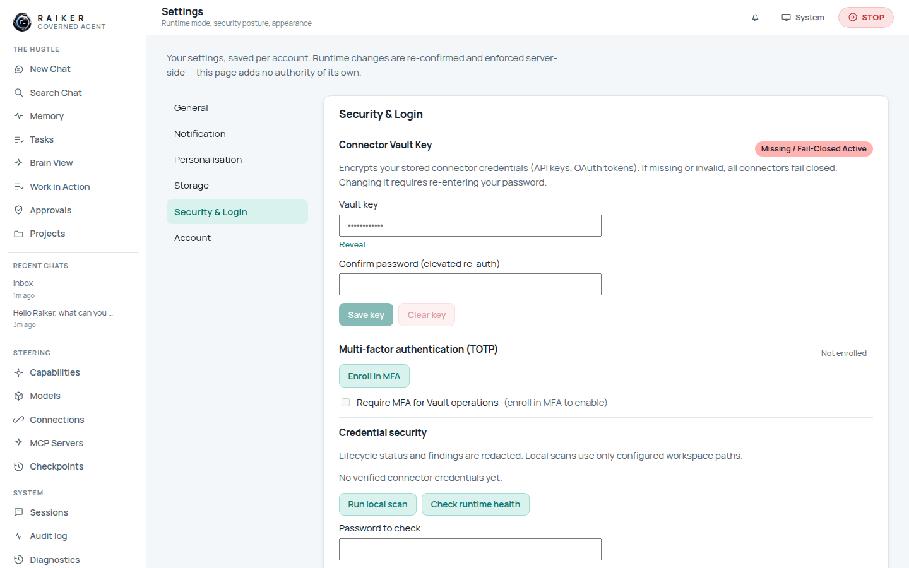
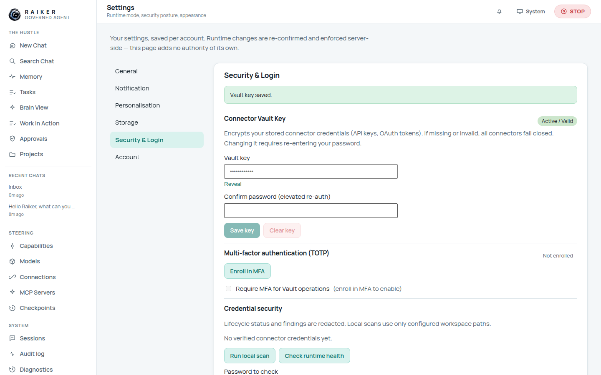

# 9. Security, vault & settings

Open **Settings**. Preferences are saved per account; runtime changes are
re-confirmed and enforced server-side. There are six tabs: **General**,
**Notification**, **Personalisation**, **Storage**, **Security & Login**, and
**Account**.

## General



- **Regional** — Language (English, हिन्दी, Español, Français, Deutsch, …), Region,
  and **Default startup view** (which page opens after unlock).
- **Runtime mode** — shows the active mode (**Development preview** by default)
  with **Activate** / **Disable** controls. Changing it is a governed mutation.

## Personalisation, Notification, Storage

- **Personalisation** — appearance (theme, spacing, font). The whole dashboard is
  theme-aware; light and dark both work.
- **Notification** — notification preferences surfaced through the bell.
- **Storage** — local data controls for this account.

## Security & Login (the important one)



### Connector Vault Key

Encrypts your stored connector/provider credentials. If missing or invalid, **all
connectors fail closed** — the badge reads **"Missing / Fail-Closed Active."**

To set it:

1. Enter a **Vault key**.
2. Enter your password under **Confirm password (elevated re-auth)**.
3. Click **Save key**. On success the badge flips to **"Active / Valid."**



> ⚠️ **The vault key must be a valid Fernet key** — a 32-byte, URL-safe base64
> string (44 characters, ending in `=`), e.g.
> `btT91G3B79lItBUZHhg4PhfOaJudCqnvVP7GSqCJKnk=`. A human-typed passphrase is
> rejected with *"Could not save the vault key. (connector_vault_key_invalid)"*,
> and the field gives **no hint** about the required format or how to generate a
> key. See [FIX-07](../TO_BE_FIXED.md#fix-07--vault-key-field-requires-a-fernet-key-but-gives-no-format-hint).
> Generate one with:
> ```bash
> python -c "from cryptography.fernet import Fernet; print(Fernet.generate_key().decode())"
> ```

### Multi-factor authentication (TOTP)

Click **Enroll in MFA** to add an authenticator app. You can then require **MFA
for Vault operations**. MFA seeds use a separate internal key, so MFA and the
vault are independent.

### Credential security

- **Run local scan** and **Check runtime health** report on stored credentials
  (lifecycle status and findings are redacted; scans use only configured
  workspace paths).
- **Password to check** lets you check a password's exposure locally.

### Change password

Also on this tab: change your account password (old → new).

## Account

Basic account details for the signed-in principal.

> ✅ **Verified:** all six tabs render; setting a valid Fernet vault key via the
> UI succeeds and flips the badge to "Active / Valid"; MFA-enrol and credential
> scan controls are present and interactive.

Next: [Sessions, search, audit & diagnostics →](10-sessions-audit-diagnostics.md)
