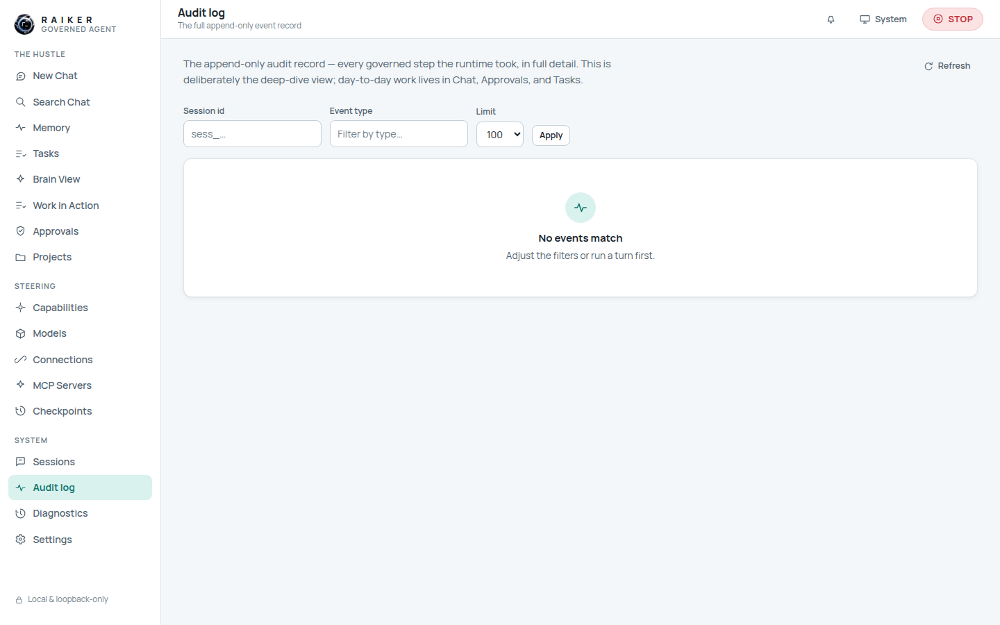
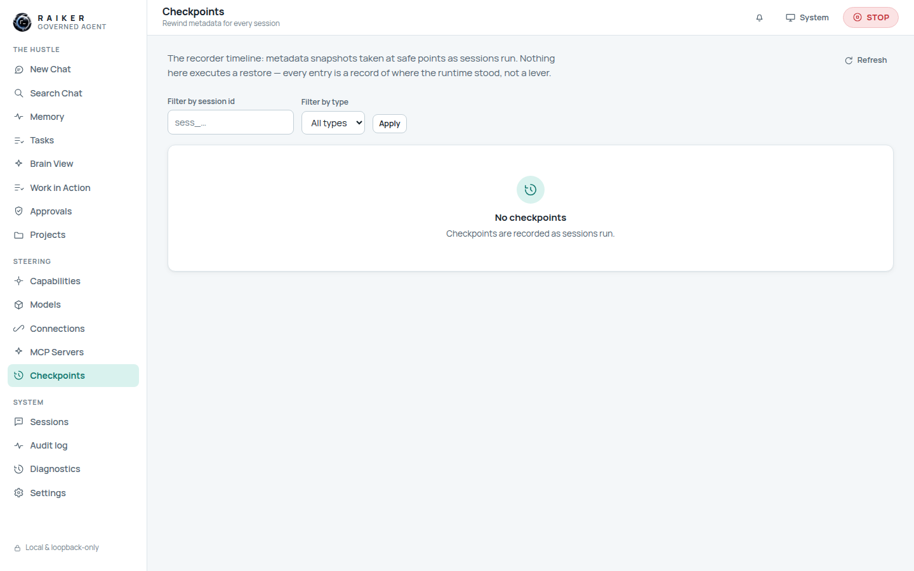
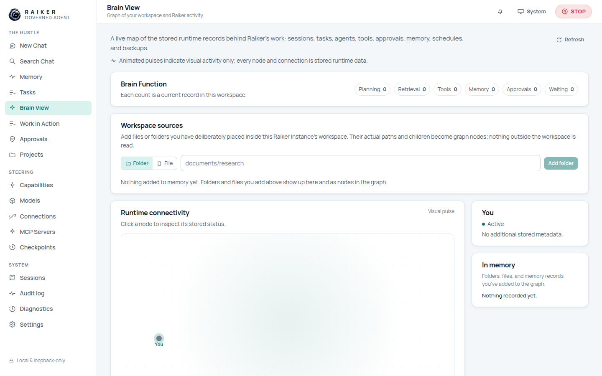
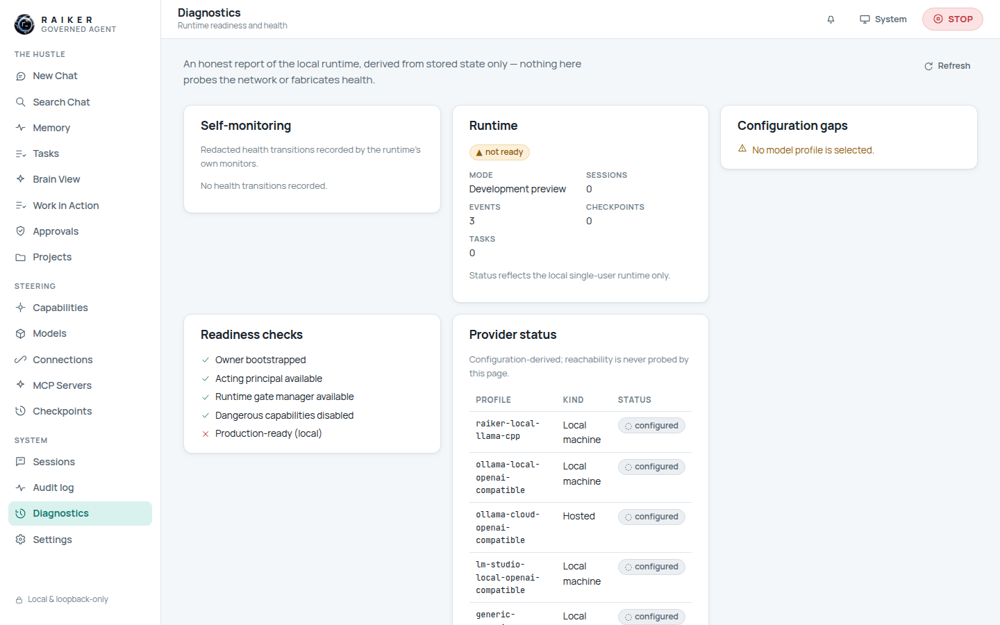

# 10. Sessions, search, audit & diagnostics

These System-group views are where your history lives and where the runtime is
honest about its own state.

## Sessions

Every conversation with the runtime, with its turns and the governed events behind
each turn. Filter by tag, show archived, and open any session to replay it. Its
detail also links directly to that session's Audit log and Checkpoints timeline.

## Audit log

The **append-only** event record — every governed step the runtime took, in full
detail. Filter by **session id**, **event type**, and **limit** (50 / 100 / 250 /
500). This is the deep-dive; day-to-day work lives in Chat, Approvals, and Tasks.

On a fresh workspace it already holds a few bootstrap events, and it grows with
every turn, decision, and mutation you make.

## Checkpoints

The recorder timeline: metadata snapshots taken at safe points as sessions run.
Filter by session id and type. **Nothing here executes a restore** — every entry
is a record of where the runtime stood, not a lever.

## Brain View & Work in Action

- **Brain View** — a live map of stored runtime records (sessions, tasks, agents,
  tools, approvals, memory, schedules, backups) with counts. Animated pulses are
  visual only; every node is a real stored record.
- **Work in Action** — an operational view of subagents, queues, and schedules.
  Idle character movement is visual only; it does not mean the agent is working.

## Memory

Approved memories the agent may recall, each with provenance, scope, and
sensitivity. You can **pin** ones that matter, **forget** anything you don't want
reused, toggle **Incognito** (withhold approved memory from context), and
**export/import** memory as JSON. Durable memory mutations (`memory-store` /
`memory-forget`) are approval-governed, and secret-like content is denied before
approval.

## Diagnostics

An honest report of the local runtime, derived from stored state only — nothing
here probes the network or fabricates health.

It reports self-monitoring health transitions and headline facts —
**Runtime ready/not-ready**, **Mode**, **Sessions**, **Events**, **Checkpoints** —
so you always know exactly where the runtime stands.

> ✅ **Verified:** Sessions, Audit log, Checkpoints, Brain View, Work in Action,
> Memory, and Diagnostics all render with honest, data-backed content and empty
> states. No fabricated health or activity.

---

That's the end-to-end tour. For the full list of what worked and what didn't
during this run, see [`../TO_BE_FIXED.md`](../TO_BE_FIXED.md).
