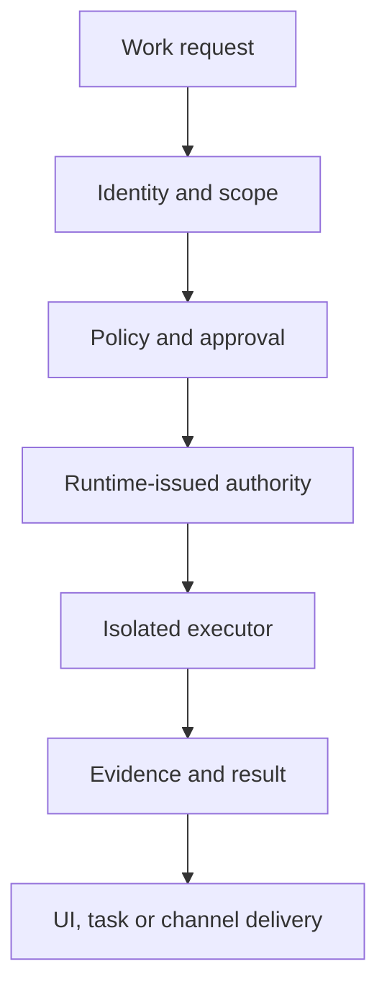

# Raiker Release-Readiness, Product, UI/UX and Runtime Review — 2026-09-13

## Status, scope and non-implementation boundary

This is a **documentation-only review** of Raiker at `main` commit
`327610ad0816cb5ce90590e29ef30179b7caa5a5`. It does not implement, fix, enable,
disable, or reconfigure any application, runtime, installer, security control,
workflow, or user interface behavior.

The review covers:

- Permissions;
- Chat, Build and Design;
- Models;
- the Settings popup and every registered Settings page;
- Tasks;
- Memory, including memory age, retention, management and recall usage;
- Messaging;
- Extensions → MCP servers;
- Projects;
- the account-identity symptom reported as
  `The workspace's real owner is principal_user_ac5eb6e5f7620f0d`;
- the common runtime, process, network, credential and authority boundaries these
  surfaces depend on;
- first-release readiness;
- transferable features and security patterns found in two external agent
  implementations, expressed here as Raiker requirements without product or
  repository names.

This is a static source, documentation, test-contract and workflow-state review.
It is not a fresh penetration test, clean-machine installer run, accessibility
audit with assistive technology, cross-platform visual run, or live-provider
acceptance campaign. Recommendations are therefore marked separately from
verified defects and verified implementation.

**Final completeness review:** Every requested page is covered, but this is not
a claim of exhaustive feature parity with two evolving external repositories or
a completed live release certification. Sections 14–16 add individual decisions, newly identified defects and feature/security adaptation contracts. Section 13 records remaining evidence
limits, decision conflicts resolved, and implementation contracts added in the
final pass. Recommendations must not be interpreted as newly discovered
exploits or as permission to implement them.

## Evidence vocabulary

| Label | Meaning |
|---|---|
| **Implemented** | Current source and tests expose the behavior. |
| **Partial** | A useful foundation exists, but the user journey or hard boundary is incomplete. |
| **Observed** | The owner has reproduced the behavior; the exact source path may still require live tracing. |
| **Static finding** | Current source directly exposes the issue without requiring a live run. |
| **Unverified** | The repository suggests the behavior, but this review did not execute the required live scenario. |
| **Recommendation** | Proposed work only; it is not represented as shipped. |

---

# Executive decision

## Release verdict

**Raiker is not ready to be called a generally available, production-stable
first release.** It is credible as a private alpha or tightly controlled
technical preview for its owner, provided that the release notes clearly state
the unsupported and unverified paths.

This conclusion is not based on cosmetic polish. Raiker already has strong
foundations: capability gates, approval modes, re-governance, immutable action
evidence, checkpoints, local account security, model choice, projects, scheduled
work, memory review, MCP management and a substantial test suite. The blockers
are places where the visible product promise is stronger than the proven end-to-
end contract.

### Release classification

| Release label | Decision | Conditions |
|---|---|---|
| Private developer preview | **Ready with caveats** | One trusted owner, backed-up workspace, explicit unsupported-feature list, no assumption that all remote/runtime paths are production hardened. |
| Public alpha | **Not signed off** | Identity presentation regression closed; exposed MCP/process/ingress paths verified; clean install/update/uninstall passes on supported OSes; critical live paths re-run. |
| Public beta | **Not yet** | All advertised Project/Design/Messaging/MCP journeys meet their contracts; recovery, accessibility and supported-provider evidence pass. Advanced features may be explicitly out of scope. |
| Stable v1 | **Not yet** | All release gates below pass, security boundaries are mechanically universal, installers own their dependencies, and support/rollback/provenance contracts are documented and exercised. |

## What blocks a public first release

> **Implementation status, 2026-09-13.** Three of these are closed and recorded
> in [`FIXED_ITEMS.md`](FIXED_ITEMS.md) — RR-IDENTITY-01 as
> [FIXED-501](FIXED_ITEMS.md#fixed-501--raiker-knew-its-owners-authorisation-key-and-not-their-name),
> RR-MCP-01 as
> [FIXED-500](FIXED_ITEMS.md#fixed-500--every-local-mcp-server-was-handed-raikers-whole-environment),
> and RR-PROJECT-01 as
> [FIXED-496](FIXED_ITEMS.md#fixed-496--new-chat-on-a-project-card-opened-a-chat-that-belonged-to-no-project).
> The Status column below records that; the rest of this document remains the
> review as written, and the remaining blockers remain open. This review is
> still a documentation-only review — the implementation it describes was
> carried out separately and is evidenced there, not here.

| ID | Priority | Status | Blocker | Evidence and reason |
|---|---:|---|---|---|
| RR-IDENTITY-01 | P0 | **Closed** ([FIXED-501](FIXED_ITEMS.md#fixed-501--raiker-knew-its-owners-authorisation-key-and-not-their-name)) | Internal principal ID reaches owner-facing/model-facing language | The account routes already return a display name, and `UserMetadata` has a `display_name` field, but prompt envelopes populate only `id=principal_id`. The exact rendered sentence is owner-observed and not present as a static literal. |
| RR-AUTHORITY-01 | P0 | Open | Side-effect authority is not yet proven mechanically exclusive across every executor | Raiker has strong governance, but release assurance requires a type/issuer boundary that a future route, plugin, scheduler or connector cannot bypass by convention. |
| RR-MCP-01 | P0/P1 | **Closed** ([FIXED-500](FIXED_ITEMS.md#fixed-500--every-local-mcp-server-was-handed-raikers-whole-environment)) | MCP stdio inherits the Raiker process environment | `raiker/runtime/executors/mcp.py` starts the subprocess without a constructed `env`, creating an ambient-secret exposure class. |
| RR-MCP-02 | P1 | Open | Remote MCP trust and network reach are under-specified | URL parsing is present, but owner-added remote endpoints are treated as authorization without a shared destination trust class, redirect/DNS-rebinding contract and explicit private-network grant. |
| RR-INSTALL-01 | P1 | Open | Linux/macOS installer runtime ownership is incomplete | A normal user must not need to supply a compatible Python toolchain or inherit unmanaged system dependencies for a supported desktop release. |
| RR-PROJECT-01 | P1 | **Closed** ([FIXED-496](FIXED_ITEMS.md#fixed-496--new-chat-on-a-project-card-opened-a-chat-that-belonged-to-no-project)) | “New chat” from a project does not establish that project for filing | The Projects view routes to `#/new-chat` without setting the work project; the adjacent Build action does set it. The source comment says Chat remains owner-wide, which is correct for retrieval, but that is separate from filing the new session to the selected project. |
| RR-DESIGN-01 | P1 | Open | Design is generation history, not yet the promised persistent design workspace | Real generation and governed research exist; asset filing, versions, selection/masking, edits, compare/revert and canvas state do not. |
| RR-VERIFY-01 | P1 | Partial | Required release acceptance runs are not current in this review | Clean-machine installers, upgrades, repair/uninstall, live providers, remote runtimes, MCP adversarial cases and assistive-technology passes need a signed release-candidate evidence bundle. |

## Current CI evidence

All four workflows attached to the reviewed `main` commit completed successfully
on 2026-09-13:

| Workflow | Result | Run |
|---|---|---|
| CI | Success | `34743016638` |
| Web UI | Success | `34743016598` |
| Licensing | Success | `34743016597` |
| Phase Status Validation | Success | `34743016581` |

Green automation establishes a good baseline. It does not prove clean-machine
packaging, usability, live provider behavior, network containment, or the owner-
reported identity symptom.

---

# 1. Product simplification strategy

Raiker's primary usability risk is not lack of functionality. It is that
security, runtime, provider and implementation vocabulary is often visible at
the same level as the user's goal. The product should preserve the depth while
changing the order in which it is revealed.

## Recommended three-layer interaction model

| Layer | User question | What belongs here |
|---|---|---|
| Work | “What do I want Raiker to do?” | Chat, Build, Design, Tasks and Projects; one consistent composer; clear project and runtime context. |
| Review | “What needs my attention?” | Approvals, memory suggestions, failed tasks, disconnected services, security findings and recoverable errors in one attention queue. |
| Manage | “How is Raiker configured?” | Models, Permissions, Memory details, Messaging, MCP, runtimes, credentials, privacy and advanced diagnostics. |

The common rule should be **goal first, boundary second, implementation detail
on demand**. A user should be able to start ordinary work without knowing the
terms principal, profile ID, egress allowlist, MCP transport, embedding space,
fingerprint, containment state or recurrence wire value. Those facts remain
available in advanced drawers and audit evidence.

## Recommended global simplifications

1. Use one stable vocabulary everywhere:
   - permission availability: **On / Off**;
   - what happens when requested: **Ask me / Allow / Automatic / Never**;
   - service lifecycle: **Connected / Needs setup / Paused / Blocked / Error**;
   - destructive memory actions: **Archive**, **Forget**, and **Delete
     permanently**, each with one documented meaning.
2. Replace repeated page-specific setup instructions with a shared readiness
   component that answers: what is missing, why it is needed, and one next
   action.
3. Put the common happy path in the page and move IDs, raw URLs, environment
   variables, JSON, fingerprints and policy snapshots into **Advanced**.
4. Use one global **Needs attention** entry point for approvals, memory review,
   failed tasks, runtime problems and security findings. Keep their specialist
   pages for history and administration.
5. Keep an object continuous across surfaces: a Project selected in Projects
   must remain selected when opening Chat, Build, Design or Tasks; a task or
   conversation opened from a Project must retain an explicit backlink.
6. Provide undo or a recovery path for reversible management actions. Use
   step-up and stronger confirmation only for destructive or authority-loosening
   actions.
7. Never render internal identifiers as normal labels. IDs belong in audit
   details and copyable diagnostic fields only.

---

# 2. Owner identity defect

## Finding RR-IDENTITY-01

**Owner-observed symptom:** Raiker says
`The workspace's real owner is principal_user_ac5eb6e5f7620f0d` instead of using
the User Account name.

**Static evidence:**

- `raiker/contracts/models.py` defines `UserMetadata(id, display_name)`;
- `raiker/api/routes_auth.py` returns the authenticated principal's
  `display_name` from both `/api/auth/whoami` and `/api/auth/session-state`;
- `raiker/api/routes_settings.py` also exposes the account display name;
- `raiker/api/routes_prompts.py`, channel ingress, scheduler runs and approval
  resume construct `UserMetadata(id=principal_id)` without `display_name`;
- internal account identifiers are intentionally formed as `principal_{user_id}`;
- the exact reported sentence is not a source literal, so it is likely composed
  by a model or generated from runtime/tool metadata rather than by a fixed UI
  string. That final origin remains **unverified** until a live trace captures
  the turn context and tool results.

## Root-cause assessment

The repository currently has the right data but an incomplete identity contract.
The internal authorization key and the presentation identity are not carried
together at all agent entry points. A model that receives or discovers only the
principal key can mistake that identifier for the user's name.

This is both a UX defect and an information-boundary defect. Opaque internal IDs
should not be taught to the model or displayed to the owner unless an audit view
explicitly asks for them.

## Required identity contract

| Field | Purpose | Visibility |
|---|---|---|
| `principal_id` | Authorization, ownership joins, audit correlation | Runtime and audit details only |
| `account_username` | Stable sign-in/account handle | Account and recovery UI; not automatically sent to models |
| `display_name` | How Raiker addresses the user | Chat/UI and a sanitized user-identity context block |
| `actor_kind` | Owner, delegated user, channel sender, agent, service | Runtime policy and audit evidence |
| `channel_identity` | Bound external sender/account | Messaging routing details only |

## Documented implementation design

1. Resolve identity server-side from the authenticated principal. Never accept a
   client-supplied display name as authority.
2. Populate `UserMetadata.display_name` on web, scheduled, resumed and messaging
   entry paths from that server-side record.
3. Add a small server-resolved context item such as `User display name: Rahul`, with a
   strict length, Unicode normalization and control-character removal. Explicitly
   tell the model that internal IDs are not names. The field value is untrusted
   user content, not an instruction: encode/delimit it as data and escape it for
   each rendering target. Normalization alone does not prevent prompt injection.
4. Keep authorization decisions keyed only by `principal_id`; display-name
   changes must not change ownership.
5. Strip or replace internal IDs in ordinary tool summaries and generated prose.
   Preserve them in structured audit records.
6. Render the display name in normal UI. Offer “Copy principal ID” only in an
   advanced Account or audit panel.
7. Add regression coverage for web Chat, Build, Design research, Tasks,
   Messaging ingress, approval continuation, Memory explanations and Projects.

## Acceptance criteria

- Changing the account display name changes subsequent salutations without
  moving or duplicating data.
- No ordinary transcript, Project card, Memory card, notification or messaging
  reply contains a `principal_*` identifier.
- A model request cannot overwrite the authenticated display identity.
- Audit exports retain the principal ID and state which presentation identity
  was active at the time.
- A live regression reproduces the original prompt and confirms the reported
  sentence no longer appears.

---

# 3. Page-by-page UI, UX and implementation review

## 3.1 Permissions

### Current strengths

- Capability availability and decision behavior are separate controls, which is
  the correct security model.
- The page supports search, grouped permissions, “needs attention”, common/all
  views, real enforcing state, bulk tightening and guarded loosening.
- Narrow layouts retain the relevant verdicts rather than hiding table columns.

### Findings

| ID | Priority | Finding | Simplification |
|---|---:|---|---|
| UX-PERM-01 | P1 | Sixty-plus capabilities create scan and comprehension load. | Lead with task-based presets and “Recently used / Needs attention”; preserve the full registry under Advanced. |
| UX-PERM-02 | P1 | Availability and behavior are visually similar, so users can conflate “can exist” with “what happens when requested.” | Phrase them as two questions: “Can Raiker use this?” and “When Raiker wants to use it”. |
| UX-PERM-03 | P1 | Bulk actions still use “Ask” and “Deny” while other surfaces use “Ask me / Allow / Automatic / Never”. | Adopt the same four terms in buttons, MCP explanations, approvals and documentation. |
| UX-PERM-04 | P2 | Technical capability names are useful for evidence but weak as the first label. | Show plain-language action, consequence and example first; registry key in Details. |
| UX-PERM-05 | P2 | The page does not summarize effective posture by user goal. | Add read-only summaries such as “Can edit project files after asking” and “Cannot send messages”. |

### Recommended interaction

The default view should contain a posture summary, a short attention list and
five task groups: **Files and code, Web and research, Messages and services,
Memory, System and runtimes**. Opening a group reveals individual capabilities.
Every change should preview before/after effective behavior, identify whether
step-up is required and offer a direct link to relevant evidence.

Do not collapse gate and decision mode into one backend field. Simplify the
language and progressive disclosure, not the security model.

## 3.2 Chat

### Current strengths

- Mature streaming conversation with persistent sessions, branching, export,
  printing, citations, source inspection, tool activity, governed-event detail,
  attachments, dictation/read-aloud, approval continuation and background work.
- Honest loading, empty, stopped, blocked and cross-tab continuation states.
- Shared composer conventions with Build and Design reduce mode-switch cost.

### Findings

| ID | Priority | Finding | Recommendation |
|---|---:|---|---|
| UX-CHAT-01 | P1 | `ChatView.svelte` is about 2,825 lines and coordinates history, streaming, citations, approvals, memory, project filing, speech, attachment and menu state. | Split by state machine/domain: session controller, turn renderer, composer controller, citation/source panel and conversation actions. |
| UX-CHAT-02 | P1 | Advanced governance/tool details can visually compete with the answer. | Default to a compact “Used 3 tools · 2 sources · 1 approval” disclosure; retain full evidence on expansion. |
| UX-CHAT-03 | P1 | Project filing and owner-wide Chat retrieval are easy to misunderstand. | Label the distinction: “Filed in Project X; Chat can still use account-wide memory.” |
| UX-CHAT-04 | P2 | Background work is an icon-only rail and may be undiscoverable. | Add a first-use label/badge and surface active count or failure state. |
| UX-CHAT-05 | P2 | Conversation actions, branch/rewind, sources, memory corrections and background work lack a single mental model. | Group them as Conversation, Evidence and Continuity actions; use consistent placement. |

### Simplified happy path

The page should ordinarily show the transcript, one context line and the
composer. Model, project, runtime and permission problems should appear only
when they affect the next turn. Evidence remains one click away. The user should
never need to visit Settings to understand why Send is disabled.

## 3.3 Build

### Current strengths

- Build is a real code-work surface: project/repository boundary, file explorer,
  code map mentions, artifact/preview zones, command output, diffs, selective
  hunk acceptance, edited replacement proposals, checkpoints and governed
  execution.
- It preserves conversation continuity across reload and clearly handles
  approval pauses and safe-boundary stops.

### Findings

| ID | Priority | Finding | Recommendation |
|---|---:|---|---|
| UX-BUILD-01 | P1 | `BuildView.svelte` is about 3,311 lines, the largest requested surface. | Extract repository, conversation, approval review, artifact, command and layout controllers with contract tests. |
| UX-BUILD-02 | P1 | Repository, project, runtime and model are separate concepts but can read as competing “where work happens” selectors. | Present one “Work boundary” summary: Project → repository → environment → model, with only the currently actionable control expanded. |
| UX-BUILD-03 | P1 | The page can expose file tree, transcript, artifact panel, terminal output and approval review simultaneously. | Use task-aware panel priority and one right-side inspector at a time; preserve state when switching. |
| UX-BUILD-04 | P1 | Autonomous completion is not proven by UI sophistication alone. | Release acceptance must cover edit → test → diagnose → retry → green → summary, including failure and approval interruption. |
| UX-BUILD-05 | P2 | “Start in Build” is clear, but later navigation back to the originating Project is weak. | Add a persistent Project breadcrumb and “Open project work” backlink. |

### Runtime expectation

Build should consume one runtime-issued execution context that contains the
selected environment, repository mount, egress class, resource budget,
credential loans, approval authority and cancellation tree. The UI should render
that context as a short sentence; it should not reconstruct it from independent
client state.

## 3.4 Design

### Current strengths

- Real governed image generation and governed research exist.
- The UI correctly omits unsupported edit/outpaint/variation controls rather
  than drawing inert features.
- Model absence and permission/egress failures are surfaced honestly.

### Findings

| ID | Priority | Finding | Recommendation |
|---|---:|---|---|
| UX-DESIGN-01 | P1 | The surface is a prompt plus generation history, not a persistent design workspace. | Add an asset model before adding canvas chrome: Project ownership, versions, source prompt/model/options and durable file reference. |
| UX-DESIGN-02 | P1 | Selecting a Project does not yet guarantee generated assets are filed into it. | Bind every generation to an explicit project or “Unfiled” collection and show the destination before Generate. |
| UX-DESIGN-03 | P1 | Research and generation are adjacent but not a reusable reference workflow. | Let approved research images/text become named references with provenance and explicit consent to send them to the image provider. |
| UX-DESIGN-04 | P2 | Size is visible, while aspect/count/seed/quality are absent because the backend lacks them. | Preserve this honesty; introduce an Options drawer only as governed endpoint fields become real. |

### Required staged design model

1. **Asset foundation:** project-owned asset, version, preview, metadata,
   export and delete/recover lifecycle.
2. **Compare and iterate:** variations, side-by-side compare, favorite, revert,
   prompt reuse and reference images.
3. **Edit:** selection/mask, inpaint, outpaint, crop and transform with immutable
   parent/version lineage.
4. **Canvas:** persistent placement, layers and annotations only after the asset
   and edit contracts are stable.

## 3.5 Models

### Current strengths

- The five-task information architecture—Overview, My models, Add, Runtime and
  Usage—is much clearer than a provider-centric matrix.
- Local, private-network and hosted choices are represented without pretending
  that connection, discovery, selection and availability are the same state.
- Global selection, fallback order, context capacity, provider usage and
  readiness/error states are present.

### Findings

| ID | Priority | Finding | Recommendation |
|---|---:|---|---|
| UX-MODEL-01 | P1 | `ModelsView.svelte` is about 3,235 lines and owns discovery, credentials, catalogue, selection, pricing/usage, runtime setup and modal state. | Split by the existing five tabs; put connection lifecycle and global selection into shared stores/services. |
| UX-MODEL-02 | P1 | “Provider connected”, “models discovered”, “model selected” and “runtime available” still demand expert interpretation. | Use a four-step readiness line and give one primary next action. |
| UX-MODEL-03 | P1 | Users can choose globally and again inside composers without a clear override hierarchy. | State: “Default model” and “This work uses …”; offer Reset to default. |
| UX-MODEL-04 | P1 | Cost, context, privacy and tool support are spread across tabs/cards. | Add a comparable decision table with Locality, Context, Tools, Vision, Estimated cost and Availability. |
| UX-MODEL-05 | P2 | Raw profile/provider identifiers may leak into troubleshooting. | Keep stable IDs in Advanced diagnostics and exports, never as primary labels. |

### Recommended selection journey

Ask one question first: **Where may this work run?** Offer On this device,
Private server and Hosted service. Then show compatible models. Connection and
credential collection belong inside the chosen path. The advanced catalogue,
fallback order and per-surface overrides remain available after setup.

## 3.6 Settings popup (“Settings & pages”)

### Current strengths

- `AllPagesDialog.svelte` is searchable, grouped, keyboard-aware and acts as a
  compact route launcher for destinations not kept in the main sidebar.

### Findings

| ID | Priority | Finding | Recommendation |
|---|---:|---|---|
| UX-SETPOP-01 | P1 | A gear opens both a settings navigator and an all-pages launcher. | Rename the trigger and dialog to “More” or split “More” from direct “Settings”. |
| UX-SETPOP-02 | P1 | It overlaps conceptually with command/search navigation. | Give global search commands/pages and use the popup for stable navigation only, or merge them deliberately. |
| UX-SETPOP-03 | P2 | On mobile, the mental model should be navigation rather than a desktop dialog. | Render as a full-height sheet with Back, recent pages and clear current-location state. |
| UX-SETPOP-04 | P2 | Administrative and everyday destinations receive similar visual weight. | Group into Work, Review, Connect and Settings; put diagnostics/advanced last. |

## 3.7 Settings pages

`SettingsView.svelte` correctly tracks dirty state and rolls back a failed save.
The grouped rail is sound. The main improvement is to organize by user outcome
and reduce the density of Security and Runtime.

| Page | Current assessment | Required simplification / improvement |
|---|---|---|
| General | Clear language, region, weather and startup settings. | Explain which fields affect model context versus UI only; preview locale/time behavior. |
| Notifications | Understandable but sparse. | Include per-event channels, quiet hours, delivery test and failed-delivery history. |
| Personalisation | Clear theme/density/font controls. | Add live preview, system-default explanation and accessibility-safe bounds. |
| Security | Strong breadth but about 764 lines and mixes encryption, vault, MFA, credential scanning, containment, password, sessions and grants. | Split into Sign-in & devices, Secrets & vault, Security findings and Standing access. Put emergency pause at top. |
| Privacy | Useful retained-working controls. | Summarize “what leaves this device” by model, web, messaging and telemetry; link to data inventory. |
| Account | Username/display/delete flow exists. | Make display name the obvious owner-facing identity; explain that account changes do not alter data ownership. Use typed confirmation and step-up for deletion. |
| Web access | Blocklist and destination check are valuable. | Replace raw policy-first presentation with Allow/Block rules, explain private-network behavior, show recent requests and redirects. |
| Git credential | Token and grant controls exist. | Prefer credential-manager/OAuth setup, show repository scope and expiration, never redisplay secrets. |
| Runtime | Rich SSH/remote/container facts but highly technical. | Wizard: choose Local/Container/SSH/Managed remote, test prerequisites, preview access, then Advanced host keys/ports/egress. |
| Updates | Signed-update posture exists. | Show channel, installed/latest version, signature/provenance result, release notes, rollback and retained workspace compatibility. |

`web/src/lib/views/settings/Storage.svelte` exists but is deliberately not
registered, and tests assert that no Storage button is shown. It is dead or
reserved code, not a current page. Before release, documentation and source
ownership should decide whether it is deleted or backed by a real storage API;
it must not be advertised as a shipped setting.

## 3.8 Tasks

### Current strengths

- One composer supports run-now, one-time, routine and background work.
- Tasks can belong to Projects, use Chat or Build, carry attachments and model
  choice, form parent/child work and resume safely after approvals.
- Polling keeps queued/running states from becoming indefinitely stale.

### Findings

| ID | Priority | Finding | Recommendation |
|---|---:|---|---|
| UX-TASK-01 | P1 | “Now”, “Schedule once”, “Routine” and “Background” combine timing and execution style. | Separate “When” from “Run mode”; explain that background is still governed and may pause for the owner. |
| UX-TASK-02 | P1 | A recurrence select cannot express timezone, weekdays, end conditions, missed-run policy or next-run preview. | Use a human schedule builder with timezone and the next three occurrences. Keep cron/raw recurrence in Advanced. |
| UX-TASK-03 | P1 | Project, parent, priority, work method and model are hidden together under Details despite different importance. | Keep Project and When visible; group orchestration details separately. |
| UX-TASK-04 | P1 | Users need one history of run attempts, approval pauses, retries and deliveries. | Open a task detail timeline with current state, next action, output and evidence. |
| UX-TASK-05 | P1 | Destructive, duplicate, pause, resume, run-now and edit semantics need a consistent lifecycle. | Define Draft → Scheduled/Queued → Running → Waiting → Completed/Failed/Stopped, with retry/idempotency rules. |
| UX-TASK-06 | P2 | Parent/child tasks are powerful but advanced. | Hide hierarchy unless requested; visualize child progress and define parent settlement. |

### Automation reliability requirements

- persistent occurrence ledger with idempotency key;
- explicit timezone and daylight-saving behavior;
- configurable missed-run policy: skip, run once, or catch up within a bound;
- bounded retry with jitter and visible incident state;
- single active claim/lease and restart recovery;
- budget and maximum-runtime enforcement;
- delivery status independent from work success;
- exact authority snapshot plus re-governance at execution time;
- owner pause/stop that reaches the entire process/subagent tree;
- testable “doctor” diagnostics for scheduler, clock, runtime, model and channel.

## 3.9 Memory, age, management and usage

### Current strengths

- Memory has separate Overview, Memories, Suggestions, Sources and Recall tabs.
- Approved memories are searchable/filterable and carry source, edit, scope,
  expiry, pin, history, archive/forget and permanent-delete controls.
- Suggestions and relationships require review; observations expose what was and
  was not captured; incognito disables recall without deleting data.
- Recall backend and embedding readiness are explicit rather than hidden.

### Findings

| ID | Priority | Finding | Recommendation |
|---|---:|---|---|
| UX-MEM-01 | P1 | Each memory card can expose seven actions plus advanced deletion. | Keep Edit, Pin and More; move source/scope/expiry/history/archive/delete into a details drawer. |
| UX-MEM-02 | P1 | Forget, archive, expiry and permanent deletion are close in meaning. | Publish one lifecycle and use the same verbs in UI, API, audit and documentation. |
| UX-MEM-03 | P1 | Retention and “memory age” are record-level concepts, but users need policy-level understanding. | Add a retention summary: permanent, expires soon, stale for review, archived and pending deletion. |
| UX-MEM-04 | P1 | Confidence and trust decimals are technical and can imply precision the user cannot evaluate. | Translate into reasoned labels with “Why?”; retain raw scores in Advanced. |
| UX-MEM-05 | P1 | The product shows what is stored but not enough about actual use. | Add last recalled, recall count, which answer used it, and a direct turn link. |
| UX-MEM-06 | P1 | Sources, observations, suggestions and approved memory require a mental model. | Explain the pipeline: observed → suggested → approved → recalled → reviewed/expired. |
| UX-MEM-07 | P2 | Embedding backend controls sit beside personal-memory controls. | Move engine configuration to Advanced or Models; show only health and repair action in Memory. |
| UX-MEM-08 | P2 | Imports can introduce conflicts, duplicates and foreign provenance. | Require a preview with merge/skip choices, source trust classification and reversible batch receipt. |

### Recommended memory-age model

Age alone must never delete a memory. Compute review priority from:

- explicit retention chosen by the owner;
- sensitivity;
- last verified/edited time;
- last recalled time and recall frequency;
- contradiction or supersession;
- source availability and trust;
- project/account scope;
- pin status and legal/user hold.

Recommended owner-facing states:

| State | Meaning | Default action |
|---|---|---|
| Current | Recently verified or used; no conflict | None |
| Review soon | Near owner-selected expiry or potentially stale | Review, extend or archive |
| Conflicted | Contradicted by newer approved information | Compare and choose |
| Expired | Excluded from recall under retention policy | Restore or archive |
| Archived | Kept for history, excluded from recall | Restore or delete permanently |
| Pending deletion | In recoverable grace period | Undo or complete deletion |

### Memory usage dashboard

Show counts and trends without exposing content to telemetry:

- approved, suggested, expired, archived and conflicted records;
- memories recalled in the last 7/30 days;
- answers using memory and successful source links;
- unused/stale memories needing review;
- storage and embedding size;
- capture refusals by reason;
- import/export/forget receipts;
- recall latency and fallback health.

## 3.10 Messaging

### Current strengths

- Inbound content is explicitly untrusted.
- Pairing and enabling are separate; unknown senders are not silently trusted.
- Routing supports record-only, new turn, side question and interrupt behavior,
  with owner binding and exact approval relay.
- Egress, signing, inbound secret and sender-rate posture are visible.

### Findings

| ID | Priority | Finding | Recommendation |
|---|---:|---|---|
| UX-MSG-01 | P1 | The page asks normal users for environment variables, raw sender/conversation IDs and test destination URLs. | Provide a “Connect channel” wizard with account authorization, sender discovery, test exchange and readiness check. Keep raw fields in Advanced/operator setup. |
| UX-MSG-02 | P1 | “Connectors” here conflicts with Extensions → Connectors. | Call these “Channels” or “Messaging accounts”; reserve Connector for the underlying integration. |
| UX-MSG-03 | P1 | Pairing, enablement, routing and approval relay are separate controls without a clear sequence. | Render a checklist: Connected → owner verified → allowed conversations → routing → test → enabled. |
| UX-MSG-04 | P1 | An arbitrary destination URL for test delivery weakens the channel mental model. | Test through the selected account/conversation and apply the same routing and egress policy as real delivery. |
| UX-MSG-05 | P1 | Group, thread, bot and multi-user behavior is not sufficiently visible. | Show DM/group scope, mention requirement, thread mapping, sender role and bot-loop protection per route. |
| UX-MSG-06 | P2 | Delivery and work outcomes can be conflated. | Track received, accepted, queued, processed, reply queued, delivered and failed separately. |

### Messaging security and reliability contract

- signed requests with key rotation, timestamp and nonce/replay window;
- durable inbound idempotency before invoking the model;
- per-sender, per-channel and global rate/budget limits;
- attachment type/size/decompression limits and malware/content scanning hooks;
- outbound secret/PII scanning and explicit destination binding;
- allowlist/pairing separate from conversation routing;
- bot-loop detection, maximum automated rounds and owner-only activation;
- edits/deletes/reactions/thread replies mapped to explicit events;
- delivery retry ledger with deduplication and dead-letter review;
- safe rendering of untrusted Markdown, mentions, filenames and links;
- one-click containment of an account without deleting its evidence.

## 3.11 MCP servers

### Current strengths

- Server creation, plugin offers, discovery/test, rename, pause/stop and delete
  controls exist.
- Cards expose lifecycle, protocol version, projected tools, recent sessions,
  monitor findings and whether the agent can call the server.
- A safe starter template and honest capability-gate failures are present.

### Findings

| ID | Priority | Finding | Recommendation |
|---|---:|---|---|
| SEC-MCP-01 | P0 | Stdio subprocesses inherit ambient environment. | Launch through the common runtime with a minimal allowlisted environment and scoped secret references. |
| SEC-MCP-02 | P1 | Remote endpoint authorization lacks a shared explicit trust class. | Classify public, loopback, private/LAN and owner-granted private endpoints; revalidate DNS and redirects. |
| SEC-MCP-03 | P1 | Monitoring persistence is best-effort and exceptions do not stop the session. | Separate optional telemetry failure from containment-enforcement failure; the latter must fail closed. |
| UX-MCP-01 | P1 | “Builder/template” is the first journey, which is developer-first. | Offer Add from verified catalogue, plugin, local command or remote URL; show raw template only in Advanced. |
| UX-MCP-02 | P1 | Users cannot assess the blast radius before connecting. | Preview tools, roots/resources, network class, secrets, writable paths and required Permissions before activation. |
| UX-MCP-03 | P1 | Tool names and JSON arguments are insufficient as a trust explanation. | Add plain-language purpose, risk category, source/publisher, last use and recent outcomes. |

### Required MCP implementation contract

1. **Process isolation:** one launcher for stdio with sanitized environment,
   working directory, filesystem roots, process group, resource/output/time
   limits and full-tree cancellation.
2. **Network validation:** HTTPS by default; loopback exception only for local
   development; resolve and pin destination class; validate every redirect;
   reject credential-bearing URLs; enforce response limits on bytes read.
3. **Secrets:** secret handles, not secret values, in server configuration;
   purpose-bound delivery to one process/server; redaction before logs and model
   results; rotation and revocation receipts.
4. **Protocol coverage:** version negotiation; tools, resources, prompts and
   roots; server-initiated sampling/elicitation only through explicit owner-
   facing governance; incremental delivery and reconnection semantics; MCP Apps
   only in an isolated contributed-UI boundary.
5. **Tool projection:** per-server allowlist, schema validation, risk mapping,
   collision-safe names, result-size/content handling and provenance on every
   model-visible result.
6. **Supply chain:** source/publisher identity, immutable version/digest,
   signature or checksum, permission diff on update, vulnerability/advisory
   status and one-click revoke/contain.
7. **Monitoring:** health, latency, error rate, unusual tool/use pattern,
   network/secret violations and a hard distinction between “telemetry missing”
   and “containment unavailable”.

## 3.12 Projects

### Current strengths

- Projects can be managed or attached to an existing folder, with explicit
  writable choice.
- The detail view combines context/instructions, memory mode, files, sessions,
  tasks, checkpoints and provenance.
- Project hierarchy, drag/drop chat filing, archive, export and different delete
  language for managed versus attached folders are meaningful foundations.

### Findings

| ID | Priority | Finding | Recommendation |
|---|---:|---|---|
| UX-PROJ-01 | P1 | “New chat” from a Project does not set the selected work project before routing. | Pass an explicit project handoff or call the same selection contract used by Build. Keep Chat retrieval owner-wide while filing the new session to the project. |
| UX-PROJ-02 | P1 | Five card actions compete: Start Build, New chat, Archive, Move and Delete. | Use Open/Continue as primary, New work as secondary and move lifecycle actions into an overflow menu. |
| UX-PROJ-03 | P1 | Project detail is an information stack rather than a workspace overview. | Lead with Continue work, recent activity and needs attention; place files/tasks/sessions/checkpoints in tabs or grouped sections. |
| UX-PROJ-04 | P1 | Shared attachment IDs can appear as raw identifiers. | Resolve user-facing filenames/type/size; retain IDs only in provenance details. |
| UX-PROJ-05 | P1 | Archive is visible but a clear archive browser/restore journey is not. | Add Active/Archived filter with restore and retention behavior. |
| UX-PROJ-06 | P1 | Moving in a hierarchy needs cycle prevention and a clearer destination picker. | Use a real modal/tree, disable self/descendants and prove backend cycle rejection. |
| UX-PROJ-07 | P1 | Managed-project deletion is materially destructive. | Require step-up, typed project name, exact filesystem impact preview and recoverability statement. |
| UX-PROJ-08 | P2 | Session rows favor short IDs and are not an obvious continuation action. | Show title, last activity, mode and status; make the row open the conversation. |
| UX-PROJ-09 | P2 | “Active” can be confused with selected-for-current-work state. | Distinguish Current project, recently active and archived; use one authoritative work-project store. |

### Project continuity contract

Every cross-page action must pass a typed intent:

```text
project_id + destination + action(new/open/continue) + optional object_id
```

The destination resolves it server-side, confirms ownership and renders the
selected Project before the user submits work. Chat remains account-wide for
recall if that is the product rule; the session can still be filed to one
Project. Retrieval scope and organizational filing must never be represented by
the same ambiguous boolean.

---

# 4. Runtime convergence design

The requested features cannot work smoothly if each surface grows a private
execution path. Chat, Build, Tasks, Messaging, MCP, plugins and future device
nodes should all submit work through the same runtime contract.



## Runtime-issued execution context

Each action should receive an opaque, non-user-constructible context containing:

- authenticated principal and actor kind;
- account/project/session/turn/task scope;
- exact approved action hash and expiration;
- capability gate and decision outcome;
- selected runtime/environment identity and measured readiness;
- filesystem mount/read/write scope;
- network destination class and allowlist/grant;
- purpose-bound credential handles;
- CPU, memory, process, time, output and cost budgets;
- cancellation/process-tree handle;
- audit correlation and receipt requirements.

No executor should accept a caller-provided `approved=true`, a loose action
dictionary or a principal ID as a substitute for this context.

## Common runtime services

| Service | Consumers | Required behavior |
|---|---|---|
| Process launcher | Build shell, MCP stdio, plugins, local tools | Sanitized environment, sandbox, resource limits, process tree, cancellation, output caps. |
| Egress broker | Web, models, messaging, MCP, remote runtimes | Shared DNS/IP/redirect classification; per-capability policy; byte limits; receipts. |
| Credential broker | Models, Git, messaging, MCP, remote runtime | Opaque handles, least scope, short lease, no ambient inheritance, revocation and redaction. |
| Work scheduler | Tasks, background turns, retries, maintenance | Durable occurrence/claim ledger, idempotency, budgets, pause/recovery and delivery separation. |
| Session service | Chat, Build, channels, tasks, subagents | Origin, project filing, thread mapping, queue/interrupt behavior, compaction and restart recovery. |
| Evidence service | All actions | Content-safe event schema, source provenance, approval/authority receipt and user-readable summary. |
| Extension host | Skills, plugins, hooks, MCP | Namespaced config/state, compatibility, permissions, failure isolation and lifecycle cleanup. |

## Runtime profiles users can understand

Offer four primary environment types:

1. **This device** — local app-owned runtime; explicit project paths.
2. **Isolated container** — digest-pinned image; mount/network preview.
3. **My server** — SSH with verified host key, remote supervisor and scoped
   workspace.
4. **Managed remote** — named provider, cost limit, region and teardown policy.

The setup wizard should test prerequisites and show a one-sentence boundary.
Advanced fields expose fingerprints, ports, images, supervisors and network
rules. Unsupported environments must fail closed and never fall back silently to
the host.

---

# 5. Transferable feature catalogue

The external implementations demonstrate a broad feature set. Raiker should not
copy weak defaults or duplicate concepts. The table below translates useful
capabilities into Raiker's governed architecture.

## 5.1 Interaction and work

| Capability | Raiker today | Recommended Raiker form | Priority |
|---|---|---|---:|
| Rich terminal/TUI with streaming, multiline input and completion | CLI exists; web is primary; parity not established here | Optional client over the same gateway/session contracts, never a separate authority path | P2 |
| Interrupt, redirect and queue steering during a turn | Safe stop and some interrupt/routing foundations exist | Explicit Queue / Add context / Redirect / Stop actions with durable ordering | P1 |
| Retry, undo, branch and compress commands | Branch/checkpoint/rewind foundations exist | One Conversation menu with retry/branch/restore/compact and consequences | P2 |
| Parallel subagents | Subagent lifecycle exists in runtime evidence | Task graph with scoped child authority, budget, result handoff and parent settlement | P1 |
| Coding-agent closed loop | Substantial Build foundation | Prove change/test/diagnose/retry/verify on supported runtimes | P0/P1 |
| Background and scheduled work | Tasks support several cadences | Durable scheduler semantics, doctor, delivery ledger and missed-run policy | P1 |
| Kanban/standing work | Task hierarchy exists | Optional board view over the same task records; no second task system | P2 |
| Browser/computer use | Proposed/not reviewed as shipped | Narrow typed tools in isolated runtime; visible target and screenshot/action evidence | P2 |
| Device nodes: screen, camera, location, voice | Voice foundations exist; broad nodes not established | Paired device capability registry with per-device grants, foreground indication and instant revoke | P3 |

## 5.2 Models, context and learning

| Capability | Raiker today | Recommended Raiker form | Priority |
|---|---|---|---:|
| Broad local/private/hosted model providers | Strong multi-provider foundation | Compatibility matrix generated from live conformance tests | P1 |
| Profile-based routing and fallback | Global choice/fallback foundations exist | Named work profiles combining model, runtime, budget and privacy—not hidden provider IDs | P2 |
| Context-window compaction | Some context management exists; full user contract not reviewed as complete | Immutable user messages, bounded summaries, tool-call pairing, failure fallback and visible compaction event | P1 |
| Micro-compaction/prompt-cache optimization | Not established here | Optional measurable optimization with cost/quality telemetry and safe failure | P3 |
| Searchable session history with summaries | Conversation search/history exist | Local FTS repair, semantic opt-in, concise session summaries and direct anchors | P1 |
| Durable user model/personality | Personalisation and governed memory exist | Separate explicit user preferences from inferred memory; review and provenance for both | P1 |
| Proactive memory maintenance | Expiry/review foundations exist | Bounded background proposals only; never silent self-approval or deletion | P2 |
| Autonomous skill creation/self-improvement | Skill and proposal foundations exist | Draft → static scan → sandbox test → permission diff → owner approval → signed version | P2 |

## 5.3 Messaging and channels

| Capability | Raiker today | Recommended Raiker form | Priority |
|---|---|---|---:|
| Multiple chat/email channel adapters | Messaging connector registry exists | Adapter contract with shared inbound/outbound envelopes, pairing, media and delivery receipts | P1 |
| Cross-channel session continuity | Routing modes exist | Explicit bind/new-session choice; display where replies will go | P1 |
| Thread and group routing | Partial/unclear in UI | Stable session-key rules, mention/reply policy and group member visibility | P1 |
| Presence, typing and streaming previews | Not established | Optional adapter capabilities; degrade cleanly to final-only delivery | P2 |
| Voice messages and transcription | Local voice foundations exist | Channel media pipeline with consent, local/hosted disclosure and retention | P2 |
| Rich replies, buttons and approval cards | Exact approval relay exists | Signed one-time actions, expiry, fallback text and replay-safe outcomes | P1 |
| Webhooks and API ingress | Some ingress exists | Authenticated, signed, rate-limited, idempotent event gateway | P1 |
| Multi-account/multi-user routing | Product is primarily owner-scoped | Decide product boundary first; if added, bind actor/account/project/agent and isolate memory/credentials | P3/owner decision |

## 5.4 Extensions

| Capability | Raiker today | Recommended Raiker form | Priority |
|---|---|---|---:|
| Skills with command triggers | Implemented foundation | Versioned manifest, declared capabilities, provenance and compatibility status | P1 |
| Plugins with config and durable state | Implemented/partial foundation | Namespace jail, encrypted secrets, quotas, migrations and cleanup hooks | P1 |
| Lifecycle hooks/middleware | Some handlers remain unsupported | Typed ordered stages, timeouts, failure isolation and audit-safe payloads | P2 |
| MCP tools/resources/prompts | Tools strong; broader protocol partial | Complete protocol only through the same governance and projection contracts | P1 |
| Server-contributed UI | Proposed | Isolated origin/frame, narrow bridge, CSP, permission declaration and no ambient app credentials | P3 |
| Compatibility/migration import | Some migration concepts exist | Dry-run, source version, conflict preview, rollback bundle and secret exclusion | P2 |

## 5.5 Operations and reliability

| Capability | Raiker today | Recommended Raiker form | Priority |
|---|---|---|---:|
| Local gateway/control plane | Strong web/API/runtime separation | Formal versioned client contract for web, CLI, channels and future native clients | P1 |
| Restart recovery and clean-shutdown markers | Several recovery paths exist | System-wide recovery matrix for sessions, tasks, commands, MCP and deliveries | P1 |
| Queue depth, stuck-loop and pressure controls | Partial | Bounded queues, watchdogs, memory-pressure eviction and visible recovery reason | P1 |
| Content-safe observability | Strong event foundation | Enforce no-content/no-secret schemas at type and test level; export health independent from containment | P1 |
| Diagnostic “doctor” commands | Partial diagnostics | One support bundle with secrets/content excluded, plus subsystem-specific checks | P1 |
| Backup, migration and repair | Some setup/export flows exist | Versioned encrypted backup, restore drill, rollback compatibility and clean uninstall preservation | P0/P1 |
| App-owned portable dependencies | Windows closest; Linux/macOS incomplete | Ship only runtime dependencies, verify manifests, checksums and clean-machine operation | P0/P1 |

---

# 6. Security synthesis

## Security principles to preserve

- Owner authority does not mean model authority.
- Models, retrieved text, plugins, channels and MCP servers are untrusted inputs.
- Approval is necessary but not a sandbox.
- A stored approval is not permanent execution authority; re-govern at use time.
- Credentials are loaned for one purpose, not inherited from the host.
- Every child process and subagent stays inside the parent's scope and budget.
- Monitoring informs the owner; containment enforces. Failure of enforcement
  cannot be treated like optional telemetry loss.
- Reversible owner actions should be easy; privilege expansion and destructive
  actions require explicit review and, where appropriate, step-up.

## Threat-to-control matrix

| Threat | Required controls | Release evidence |
|---|---|---|
| Prompt injection from web/files/messages/tools | Untrusted-data labeling, instruction/data separation, tool authority outside model, output validation | Adversarial fixtures across Chat, Build, Messaging and MCP |
| Ambient credential theft by subprocess | Minimal environment, scoped secret handles, sandbox, redaction | Child process cannot enumerate host/provider/channel secrets |
| SSRF/DNS rebinding/redirect pivot | Shared resolver, IP class validation, DNS pin/recheck, redirect validation, port/scheme rules | Public→private redirect and rebinding tests |
| Approval replay or mutation | Action hash, one-time/expiring authority, actor/session binding, re-governance | Replay, changed-args and expired-decision tests |
| Channel spoof/replay | Signed body, timestamp/nonce, pairing, idempotency and sender binding | Duplicate, stale and forged events refused |
| Bot loops and runaway automation | Round/runtime/cost caps, loop detection, owner stop, task lease | Two bots and repeated webhook tests stop within bound |
| Extension supply-chain compromise | Immutable source/digest, signature/checksum, scan, permission diff, revoke | Tampered/update-permission-change fixtures |
| Cross-project/account leakage | Server-side scope, ownership checks, separate filing/retrieval concepts | Negative matrix for every read/write/search/export route |
| Sensitive telemetry | Content-free schema, field allowlist, redaction, local preview | Contract test rejects content/secret fields |
| Destructive project/memory action | Step-up, exact impact preview, typed confirmation, grace/backup where feasible | Restore/irreversibility acceptance tests |

## Security ideas not to copy

Do not adopt any external behavior that runs tools directly on the host by
default, treats an owner click as a substitute for isolation, allows plugins to
inherit all process secrets, merges external sender identity with the owner, or
lets autonomous learning publish its own new privileges. Raiker's governance
model is stronger when it remains the only authority plane.

---

# 7. Code quality and maintainability findings

## Large view modules

| File | Approximate lines | Risk |
|---|---:|---|
| `BuildView.svelte` | 3,311 | Layout, runtime, approvals, repository and streaming state are hard to change independently. |
| `ModelsView.svelte` | 3,235 | Five product journeys share one stateful module. |
| `ChatView.svelte` | 2,825 | Conversation, evidence, memory, speech, project and streaming concerns are coupled. |
| `ProjectsView.svelte` | 912 | List, hierarchy, destructive lifecycle and detail workspace are coupled. |
| `TasksView.svelte` | 837 | Creation, schedule semantics, runtime/model setup and run operations are coupled. |
| `MemoryView.svelte` | 812 | Five tabs and multiple record lifecycles share one module. |
| `CapabilitiesView.svelte` | 799 | Registry, filters, bulk actions and step-up flows are coupled. |
| `settings/SecurityLogin.svelte` | 764 | Multiple distinct security domains share one form/module. |

Large line count is not itself a defect. Here it correlates with multiple
independent state machines and makes regression ownership unclear. Refactoring
should follow domain boundaries already visible in the UI, with no behavior
change bundled into the extraction.

## Contract recommendations

1. Generate ordinary frontend request/response types from one backend API
   schema, while keeping security-sensitive validators explicit.
2. Make route/tab registries the source for navigation, guides, screenshots and
   accessibility smoke coverage.
3. Register every side-effecting executor and assert it requires runtime-issued
   authority.
4. Use shared lifecycle enums for task, delivery, MCP, model and runtime status;
   render unknown future values safely.
5. Separate user-facing labels from stable internal identifiers in every DTO.
6. Add component/domain contracts around extracted Svelte controllers before
   changing visual behavior.
7. Remove or explicitly quarantine dead/reserved UI such as the unregistered
   Storage page.

---

# 8. Detailed release gates

## Gate A — Identity and account

- No internal principal ID appears in ordinary UI or model prose.
- Display-name change, password change, MFA, recovery, device revocation and
  account deletion pass live tests.
- Single-owner and any supported delegated/channel identity are documented.

## Gate B — Authority and containment

- Repository-wide executor registry proves all side effects require opaque
  runtime authority.
- Approval mutation/replay/expiry and posture-change tests pass.
- Stop/pause reaches spawned process, MCP and subagent trees.
- Ambient environment and credentials are absent from child processes.

## Gate C — Install, update, repair and uninstall

- Fresh supported Windows, macOS and Linux machines without Python/Node/dev
  tools can install and start Raiker.
- Offline first launch works for the documented local path.
- Upgrade and rollback preserve encrypted workspace, account, projects, memory,
  tasks and key material.
- Repair replaces application files without deleting owner data.
- Uninstall clearly distinguishes application removal from workspace deletion.
- Package manifests prove no build/test tools, source credentials or caches ship.

## Gate D — Core user journeys

- First launch → choose model/privacy → Chat succeeds.
- Create Project → start Chat/Build/Design/Task → return to Project with every
  object filed correctly.
- Build completes a real change/test/retry/green loop.
- Design assets persist, version and export under the stated product scope.
- A task survives restart, approval pause, retry and delivery.
- Memory proposal → approval → recall → explanation → archive/delete works.

## Gate E — Models and runtimes

- Supported provider/runtime matrix is generated from real conformance runs.
- Connection, discovery, selection, outage, credential rejection, quota, context
  limit and fallback states have distinct messages.
- Container, SSH and managed remote boundaries pass negative tests and never
  silently fall back to the host.
- Cost/budget cutoff and cancellation are enforced under load.

## Gate F — Messaging and MCP

- Channel pairing, forged sender, replay, duplicate, group, thread, attachment,
  bot-loop, approval relay and delivery retry tests pass.
- MCP stdio environment isolation and full-tree stop pass.
- Remote MCP public/private/redirect/rebinding/body-limit tests pass.
- Protocol interoperability covers every capability Raiker advertises; absent
  features remain honestly absent.

## Gate G — UX, accessibility and evidence

- Keyboard-only, screen-reader and reduced-motion passes cover every route,
  dialog and destructive flow.
- 390px and 1920px light/dark screenshots are current; content-populated states
  are included, not only empty pages.
- Loading, empty, blocked, partial, error and recovery states are tested.
- No important verdict depends on color, hover or truncated text alone.

## Gate H — Supply chain and operations

- Dependency/advisory, secret scanning and SAST gates are active.
- Release inputs are immutable; third-party tools are pinned and checksummed.
- SBOM, signature and provenance/attestation are retained with releases.
- Backup/restore, database/FTS repair and support-bundle runbooks are exercised.
- Security response, key rotation and vulnerable-extension revocation are
  documented.

---

# 9. Implementation decision records

This section defines implementation guidance for the primary recommendations;
section 13 adds missing capability-family contracts and resolves ambiguities.
These are **recommended product decisions**, not
claims that the work has been approved or implemented. The owner can accept,
amend or decline a record before engineering begins. Once accepted, its
acceptance criteria become the closure contract.

## 9.1 How to use these records

Every implementation PR should name one or more decision IDs and must include:

1. the user journey and failure states it changes;
2. the server-side authority or data contract it changes;
3. migration and rollback behavior;
4. security and privacy effects;
5. automated and live acceptance evidence;
6. documentation and screenshot updates.

Do not combine an unrelated visual redesign, database migration and runtime
security change merely because they appear in the same record. Land the smallest
vertically complete slice that has an honest UI and a fully enforcing backend.

## 9.2 Decision register

| Decision | Recommended disposition | Priority | Covers |
|---|---|---:|---|
| DEC-01 | Adopt | P0 | Owner display identity and internal principal isolation |
| DEC-02 | Adopt incrementally | P1 | Navigation, Needs attention and progressive disclosure |
| DEC-03 | Adopt | P1 | Permissions vocabulary and task-based presentation |
| DEC-04 | Adopt | P1 | Project continuity, filing and retrieval boundaries |
| DEC-05 | Adopt incrementally | P1/P2 | Chat simplification and module boundaries |
| DEC-06 | Adopt | P0/P1 | Build closed loop and execution-boundary presentation |
| DEC-07 | Adopt in stages | P1/P2 | Design asset, version, edit and canvas model |
| DEC-08 | Adopt | P1 | Models setup, selection hierarchy and comparison |
| DEC-09 | Adopt | P1/P2 | Settings popup and Settings information architecture |
| DEC-10 | Adopt | P1 | Account, privacy, security and destructive-action UX |
| DEC-11 | Adopt | P1 | Runtime setup wizard and authoritative runtime facts |
| DEC-12 | Adopt | P1 | Task scheduling, recovery, lifecycle and delivery |
| DEC-13 | Adopt | P1 | Memory lifecycle, age, review, usage and import |
| DEC-14 | Adopt | P1 | Messaging onboarding, routing, delivery and channel safety |
| DEC-15 | Adopt | P0/P1 | MCP onboarding, isolation, network trust and interoperability |
| DEC-16 | Adopt | P0 | Common authority, process, egress and credential services |
| DEC-17 | Adopt before public release | P0/P1 | Installer ownership, updates, rollback and provenance |
| DEC-18 | Adopt without behavior changes | P1/P2 | Large-view decomposition and contract generation |
| DEC-19 | Adopt as release gate | P1 | Accessibility, responsive, empty/error and evidence coverage |
| DEC-20 | Defer pending explicit owner decision | P3 | Multi-user/team mode and paired device expansion |
| DEC-21 | Adopt incrementally; section 13.3 | P1/P2 | Detailed General, Notifications, Personalisation, Web access, Git and Updates contracts |
| DEC-22 | Adopt in scoped slices; section 13.4 | P1/P2 | Session steering, compaction, search, TUI and delegation |
| DEC-23 | Adopt after boundary verification; section 13.5 | P2/P3 | Extension lifecycle, learning, migration and contributed UI |
| DEC-24 | Adopt; section 13.6 | P1 | Operational recovery, resource budgets, diagnostics and backup |
| DEC-25 | Adopt for exposed ingress; section 13.7 | P0/P1 | Actual-byte request and response limits |

## DEC-01 — Separate presentation identity from authorization identity

**Decision:** Keep `principal_id` as the immutable security key and use a
server-resolved `display_name` for all ordinary UI and model-facing references
to the owner. Do not rename principal IDs or use display names in authorization
queries.

**Why:** The reported sentence exposes an internal identifier and teaches the
model that an authorization key is a human name. The account service already
holds the correct display name, so the missing part is propagation and output
hygiene rather than a new identity store.

**Implementation sequence:**

1. Add one server-side identity resolver that accepts an authenticated
   `principal_id` and returns a typed presentation object. It must never accept a
   browser or channel display name as trusted input.
2. Populate `UserMetadata.display_name` in web prompts, scheduled runs, channel
   ingress and approval continuation. Keep `UserMetadata.id` unchanged.
3. Add a server-resolved, bounded `user_identity` context item containing only the
   normalized display name and actor kind. Do not include username, email,
   principal ID or channel identifiers unless a tool specifically needs them.
   Encode the name as untrusted data, not executable instructions, even though
   its association with the authenticated account is server-verified.
4. Audit model-visible tool results, memory summaries, Project context,
   notifications and error text. Replace principal IDs with display labels; keep
   IDs in structured evidence.
5. Add an advanced Account diagnostic that can copy the principal ID with an
   explanation that it is an internal support/audit identifier.
6. Trace the exact reported phrase live. Capture the provider request context,
   tool result and rendered response with sensitive values redacted so closure
   proves the real path, not only the likely one.

**Contract and data decision:** Extend presentation DTOs rather than database
ownership keys. A display-name update affects future rendering only. Historical
audit events retain the principal ID and may retain the then-current display
label as non-authoritative metadata.

**Migration and rollback:** No ownership migration is required. Old records
without a display label render “Owner” in normal UI and remain resolvable by
principal ID internally. Rolling back presentation propagation must not alter
accounts or data scope.

**Verification:** Unit-test normalization and server-side resolution; contract-
test all four envelope construction paths; search rendered UI/evidence fixtures
for `principal_`; run the owner's reproduction through Chat, Build, Design
research, Tasks and Messaging.

**Done when:** No ordinary output exposes an internal ID, display-name changes
are reflected without changing ownership, and the original live symptom is
closed with captured evidence.

## DEC-02 — Organize the product as Work, Review and Manage

**Decision:** Preserve specialist pages but simplify first-level navigation into
three concepts: Work, Review and Manage. Create one aggregated Needs attention
view rather than placing every subsystem alert in permanent navigation.

**Why:** Raiker's depth is valuable, but every feature currently competes for
navigation weight. Users primarily need to start work, respond to something, or
change configuration.

**Implementation sequence:**

1. Extend the route registry with a stable `product_area`, `attention_provider`
   and `advanced` classification. Do not hard-code a second navigation list.
2. Keep Chat, Build, Design, Tasks and Projects in Work. Place approvals,
   proposed memories, failed/blocked tasks, disconnected services and security
   findings in a server-backed Needs attention feed.
3. Keep Models, Permissions, Memory, Messaging, Extensions and Settings under
   Manage/More, with search and recent destinations.
4. Define an attention-item contract with stable ID, severity, plain-language
   title, reason, originating object, primary action, timestamp and resolved
   state. It must contain references, not copied sensitive content.
5. Make each item deep-link to the exact record and mark itself resolved only
   from the authoritative subsystem state.
6. Preserve existing route aliases and browser history during navigation
   migration.

**Non-goal:** Do not merge approval, memory, task and security records into one
database lifecycle. Aggregate their projections while each subsystem remains
authoritative.

**Verification:** Registry tests ensure every route appears once; accessibility
tests cover keyboard and mobile navigation; contract tests ensure stale
attention items disappear after authoritative resolution.

## DEC-03 — Simplify Permissions without weakening its two-control model

**Decision:** Keep capability availability and decision mode separate. Present
them as “Can Raiker use this?” and “When Raiker wants to use it”. Standardize
decision words to `Ask me`, `Allow`, `Automatic` and `Never` throughout the
product.

**Why:** Combining the fields would weaken governance. Showing sixty-plus
technical rows first makes a correct system difficult to understand.

**Implementation sequence:**

1. Create one shared copy/enum map used by Permissions, MCP, composers,
   approvals, guides and tests. Remove local aliases such as `Ask` and `Deny`
   from owner-facing copy while preserving wire values through adapters.
2. Add registry metadata for user group, plain-language action, consequence,
   common example, risk tier and advanced status.
3. Default to Posture, Needs attention and Common task groups. Keep searchable
   All permissions as the complete authoritative registry.
4. Add non-authoritative presets that compile into a visible list of proposed
   individual changes. Never store a preset name as the enforcing decision.
5. Before applying bulk changes, show exact old/new effective state, which
   changes loosen authority, which require step-up and which active work may be
   interrupted.
6. After save, read enforcing state back from the server and show a receipt or
   partial failure per capability.

**Migration:** Existing gate and decision values remain unchanged. UI adapters
translate legacy labels. Deep links to a capability continue to open its row.

**Verification:** Exhaustive registry test, copy consistency test, preset
expansion test, step-up/bulk partial-failure tests, narrow-screen and screen-
reader passes.

## DEC-04 — Make Project continuity explicit and typed

**Decision:** Every Project action that opens Chat, Build, Design or Tasks must
send a typed work intent. Organizational filing and retrieval scope remain
separate fields.

**Why:** The current Project “New chat” action navigates without establishing
the Project. Chat's account-wide retrieval can remain intentional while the new
conversation is still filed to the Project.

**Implementation sequence:**

1. Define `WorkIntent { project_id, destination, action, object_id?, nonce }`.
   Prefer a server-created short-lived intent or validated route state over a
   freely trusted client object.
2. Projects creates the intent for New Chat, Start Build, Start Design, Plan task
   and Continue work.
3. The destination verifies ownership, consumes or idempotently reuses the
   intent, sets visible project context and files the new object on first
   persistence.
4. Store `project_id` as filing/ownership context. Store retrieval policy
   separately as `account`, `project` or another explicit scope; never infer it
   from whether a selector is visible.
5. Add Project breadcrumbs/backlinks to Chat, Build, Design and Task detail.
6. Replace raw attachment/session IDs with server-resolved display DTOs.
7. Add Active/Archived filtering and restore. Move archive/move/delete into an
   overflow menu.
8. Implement hierarchy move validation on the server: owner scope, target
   existence, no self-parent, no descendant cycle and one atomic update.
9. For managed deletion, enumerate filesystem/database effects, require recent
   step-up and typed project name, create a recoverable backup or state clearly
   why deletion is irreversible. Attached-folder removal must not delete the
   external folder.

**Migration:** Existing sessions/tasks/projects remain filed as stored.
Unassigned records stay unassigned. Do not silently infer projects from paths.
Old links without an intent open the destination with no project and an honest
label.

**Verification:** Cross-product matrix for new/open/continue across four
destinations; negative ownership and hierarchy tests; attached versus managed
deletion tests; reload/deep-link and two-tab behavior.

## DEC-05 — Simplify Chat and separate its state machines

**Decision:** Keep the normal Chat surface to transcript, one context line and
composer. Collapse evidence into a concise per-turn summary by default, while
retaining full source, tool and governance inspection.

**Implementation sequence:**

1. Characterize current behavior with tests before extracting code from
   `ChatView.svelte`.
2. Extract a session controller for load/new/branch/rewind/export and URL state.
3. Extract a turn-stream controller with explicit Idle, Submitting, Streaming,
   WaitingForApproval, Stopping, Completed and Failed states.
4. Extract turn rendering, source inspection, conversation actions, speech and
   background-work rail into focused components/services.
5. Render a settled evidence summary such as “3 tools · 2 sources · governed”;
   expansion shows the existing ordered evidence.
6. State Project filing and retrieval scope separately in the context summary.
7. Add visible count/error state to the background-work control and a labelled
   first-use affordance.
8. Preserve draft, attachments, selected model override and Project context on
   recoverable readiness failures.

**Non-goal:** Do not remove governance evidence, source provenance, branching,
memory correction or stopping behavior for visual simplicity.

**Verification:** Snapshot/state-machine tests for every turn state; stream
reconnect and cross-tab claim tests; keyboard/screen-reader flow; no regression
in source anchors, approvals, copy, speech, export and Project filing.

## DEC-06 — Make Build prove a closed governed coding loop

**Decision:** Treat Build readiness as an end-to-end runtime outcome, not the
presence of file, diff and terminal components. Present one authoritative Work
boundary summary and prioritize one inspector at a time.

**Implementation sequence:**

1. Create a server-returned `ExecutionBoundaryView` containing Project,
   repository, environment, model, writable roots, egress posture, credential
   grants, budget and readiness/refusal reason.
2. Render the view as Project → repository → environment → model. Client
   selectors propose a change; they do not independently declare the boundary.
3. Extract repository/file, conversation, approval review, artifact/preview,
   command output and responsive layout domains from `BuildView.svelte` after
   contract coverage exists.
4. Define panel priority: approval review overrides normal inspector; selected
   file/artifact/command occupies one inspector; switching preserves state.
5. Define the completion contract: requested change, changed files, commands
   run, tests and outcomes, unresolved failures, approvals used, checkpoint and
   final verification statement.
6. Ensure test failure returns to the model within the same bounded task until
   green, explicit stop, budget exhaustion or a truthful blocked state.
7. Add Project breadcrumb and persist the exact session/project/repository
   coordinate in the URL and server record.

**Verification:** Run representative repositories through read-only analysis,
single-file edit, multi-file edit, failed test/retry, approval rejection,
network-denied dependency attempt, stop and restart recovery. Evidence must show
no silent host fallback.

## DEC-07 — Build Design from durable assets upward

**Decision:** Do not create a cosmetic canvas first. Implement durable,
Project-owned asset/version lineage, then iteration/editing, then a canvas.

**Implementation sequence:**

1. Add `design_assets` with owner, optional Project, title, status, current
   version, created/updated time and deletion state.
2. Add immutable `design_asset_versions` with parent version, local blob/file
   reference, prompt, provider/model, normalized options, input references,
   provenance, safety/refusal metadata and generation receipt.
3. Require an explicit Project or visibly labelled Unfiled destination before
   generation. Store the destination server-side with the generation.
4. Add asset detail, version history, compare, favorite, revert-as-new-version,
   export and governed delete/restore.
5. Add reference inputs with a disclosure of which content will leave the
   device. Preserve research provenance and never silently feed research output
   into a provider.
6. Add variation and prompt reuse using the same immutable version contract.
7. Add mask/selection operations as new version-producing actions with bounded
   raster/vector payloads and exact parent lineage.
8. Add canvas documents only after versions are stable; store placements,
   layers and annotations separately from asset bytes.

**Migration:** Existing generations should import as Unfiled assets with one
version where the source record is complete. Records that cannot be resolved
remain viewable legacy history and are not fabricated into Projects.

**Verification:** Persistence across restart, Project filing, exact provider
disclosure, version/revert lineage, export fidelity, delete/restore and failure
without orphan blobs.

## DEC-08 — Make model selection a readiness journey

**Decision:** Ask where work may run before asking for a provider/model. Define
one selection hierarchy: global default, optional work/project default, and
explicit per-composer override.

**Implementation sequence:**

1. Split `ModelsView.svelte` along its existing Overview, My models, Add,
   Runtime and Usage boundaries without changing behavior.
2. Define a model readiness DTO separating connection configured, credentials
   valid, catalogue known, model selected, runtime reachable, capability support
   and current refusal.
3. In Add, start with On this device, Private server or Hosted service, then
   show compatible setup paths.
4. Add a comparison projection for locality, context capacity, tools, vision,
   image support, estimated cost, availability and privacy boundary. Unknown
   facts render Unknown, never a guessed default.
5. Label global selection “Default model”. Composer selection reads “This work
   uses …” and offers Reset to default.
6. Keep fallback order advanced. Validate each candidate's availability and
   capability at execution time and record why fallback occurred.
7. Use display labels everywhere; expose provider/profile IDs only in Advanced
   diagnostics.

**Migration:** Existing selected profile becomes the global default. Existing
composer values remain explicit overrides. Unknown catalogue entries remain
visible but unavailable until revalidated.

**Verification:** State matrix for no provider, connected/no catalogue,
catalogue/no selection, ready, outage, invalid credential, quota, unsupported
tools/vision and fallback. Test draft preservation through every setup path.

## DEC-09 — Clarify the Settings popup and Settings structure

**Decision:** Rename the mixed page launcher to **More** and reserve Settings for
configuration. Group routes as Work, Review, Connect and Settings. On mobile,
render navigation as a full-height sheet.

**Implementation sequence:**

1. Change route metadata, labels and accessibility names from “Settings &
   pages” to the agreed More/navigation term. Keep the gear only if it opens
   Settings directly; otherwise use a menu/grid icon and text tooltip.
2. Decide whether global command search owns page discovery. If yes, More shows
   stable groups and recent destinations; if no, More keeps search but uses the
   shared route index.
3. Mark current location, preserve keyboard focus/trap/return and support Escape
   and browser Back consistently.
4. On mobile, use a sheet with Back/Close, scroll containment and safe-area
   padding rather than a desktop-sized dialog.
5. In Settings, retain dirty-state rollback but add per-section save outcome and
   warn before navigation with unsaved changes.
6. Decide the unregistered Storage component explicitly: remove it as dead code
   or write a backed specification and register it later. Do not expose it until
   its API is real.

**Verification:** Route completeness, focus return, deep links, unsaved-change
navigation, mobile viewport/zoom, screen-reader landmarks and no duplicate page
entries.

## DEC-10 — Separate Account, Privacy and Security responsibilities

**Decision:** Split the dense Security page into Sign-in & devices, Secrets &
vault, Security findings and Standing access. Make Privacy answer “what leaves
this device?” and Account own presentation identity and account lifecycle.

**Implementation sequence:**

1. Move password, MFA, recovery and device sessions into Sign-in & devices.
2. Move encryption/vault/credential health and rotation into Secrets & vault.
3. Move scanner and containment findings into Security findings with severity,
   evidence, affected object, safe remediation and containment action.
4. Move standing grants into Standing access with capability, scope, creator,
   reason, last use, expiry and revoke.
5. Put emergency pause/containment at the Security landing page, state its exact
   scope and distinguish it from deleting configuration.
6. Build a Privacy data-flow summary for local models, hosted models, web,
   messaging, MCP and telemetry. Each line names data category, destination,
   retention and control link.
7. Make display name the main Account identity. Keep sign-in username and
   principal ID semantically distinct.
8. Require recent step-up and typed confirmation for account deletion; show
   exact data/files removed, external data not removed, backup/restore options
   and irreversibility.

**Migration:** Settings keys may remain stable behind new sections. Route aliases
must preserve old `?tab=security` links and focus the correct subsection.

**Verification:** Authorization and CSRF tests for every mutation, MFA/recovery
and session-revocation live tests, secret non-disclosure checks, privacy summary
contract tests and account-delete restore/irreversibility evidence.

## DEC-11 — Turn Runtime settings into a guided boundary setup

**Decision:** Offer four user-facing runtime types—This device, Isolated
container, My server and Managed remote—and keep fingerprints, ports, image
digests and raw egress in Advanced.

**Implementation sequence:**

1. Define a runtime-provider interface for probe, configure, verify, select,
   suspend, resume, delete and capability reporting.
2. The wizard first selects type, then prerequisites, connection details,
   filesystem/network/credential scope, cost/resource limits, verification and
   final boundary preview.
3. Verification must be measured server-side: executable/supervisor version,
   host key, sandbox features, filesystem probe, network enforcement,
   cancellation and cleanup. A configuration value is not proof.
4. Persist a versioned runtime profile and latest verification receipt. Mark it
   stale when relevant software, key, image, host or policy changes.
5. Render one readiness state and next action. Advanced shows exact refusal
   codes, host keys, network class and receipts.
6. Disabling a runtime stops new claims, requests bounded cancellation for
   active work and preserves evidence. Deletion requires no active references or
   an explicit migration choice.

**Non-goal:** Never fall back from an unavailable isolated/remote profile to the
host for convenience.

**Verification:** Clean local, unavailable daemon, changed SSH key, remote
supervisor mismatch, egress denial, cost exhaustion, cancellation, restart and
cleanup tests for every supported runtime type.

## DEC-12 — Define Tasks as a durable scheduler and run history

**Decision:** Separate timing from execution style, use a human schedule builder
and make each task open a durable occurrence/run timeline.

**Implementation sequence:**

1. Model task definition separately from occurrences and attempts. A definition
   holds objective, Project, method, schedule, policy and delivery; each
   occurrence has an idempotency key; each attempt has lease and outcome.
2. Present When as Now, Once or Repeating. Present Run mode separately as
   foreground/background if that distinction remains meaningful.
3. Store IANA timezone, local schedule expression, next occurrence, DST policy,
   start/end bounds and missed-run policy. Preview the next three occurrences.
4. Claim with a bounded lease, monotonically increasing fencing token and
   heartbeat. Reject stale-worker writes after lease reassignment. Persist an
   effect intent before execution and reuse its idempotency key where the
   destination supports it. If a crash leaves an external effect's outcome
   unknown, reconcile with the destination or request review; do not blindly
   retry. A lease alone cannot guarantee exactly-once external effects.
5. Record separate work and delivery states. A completed task with failed
   notification remains completed with Delivery failed.
6. Add bounded retry/backoff, maximum runtime/tool/cost limits and a visible
   incident after exhaustion.
7. Propagate pause/stop through child tasks, subagents and process trees.
8. Add a doctor/readiness endpoint for scheduler tick, clock/timezone, model,
   runtime, permissions and delivery target.
9. Open task detail as a timeline with next run, current action, approvals,
   attempts, outputs, delivery and audit evidence.

**Migration:** Convert existing recurrence values into the new schedule schema
with an explicit version. If conversion is ambiguous, preserve the old task as
paused and request review; never guess a future time.

**Verification:** Spring-forward gaps, autumn repeated hours, host downtime, duplicate
claim, approval pause, restart, retry exhaustion, parent/child settlement,
delivery failure and owner cancellation.

## DEC-13 — Give Memory one explicit lifecycle and review policy

**Decision:** Use the lifecycle Observed → Suggested → Approved →
Reviewed/Expired → Archived → Deleted. Age raises review priority but does not
delete by itself.

**Implementation sequence:**

1. Publish one state-transition table and enforce it in the memory service.
   Define precisely whether Forget means archive/exclude or deletion; recommended
   UI is Archive for reversible exclusion and Delete permanently for erasure.
2. Add retention policy fields: policy kind, review/expiry time, last verified,
   last recalled, pin/hold, superseded-by and deletion grace time.
3. Calculate review priority from retention, sensitivity, use, verification,
   conflict, provenance and pin—not from one opaque score.
4. Add server-side recall-use receipts linking memory ID, session/turn, rank,
   reason and timestamp without copying the answer. Update counters atomically
   after actual context use.
5. Simplify cards to Edit, Pin and More. Put source, scope, expiry, history,
   archive and permanent deletion in a details drawer.
6. Translate confidence/trust into explainable labels and reasons. Raw values
   remain advanced diagnostic data.
7. Move embedding-engine configuration to Advanced/Models while Memory shows
   health, indexed/pending counts and one repair action.
8. Import into a staging batch; validate schema/version/ownership, classify
   source trust, detect exact and semantic duplicates, preview merge/skip/new,
   apply atomically and issue a reversible receipt where possible.
9. Run background maintenance only as proposals. It may suggest merge,
   supersession, expiry or deletion; it cannot approve itself or expand recall.

**Migration:** Map current approved/expired/archived records without changing
recall eligibility. Backfill use counters from available source ledgers only;
unknown stays unknown. Never fabricate provenance or last-used dates.

**Verification:** Full transition matrix, incognito, scope isolation,
contradiction, expiry/restore, source deletion, import rollback, recall receipt,
permanent deletion and backup behavior.

## DEC-14 — Make Messaging a guided, durable channel service

**Decision:** Users connect a Messaging account/channel through a wizard.
Connector is an implementation term under Extensions. Routing, pairing and
delivery use shared durable contracts.

**Implementation sequence:**

1. Define adapter capabilities: authentication method, DMs/groups/threads,
   streaming, media, reactions, edits/deletes, buttons, presence/typing and
   maximum payloads.
2. Build Connect channel: choose service, authenticate or enter an advanced
   secret reference, verify owner, discover/select conversations, choose routing
   policy, send/receive test, then enable.
3. Replace normal raw sender/conversation IDs with discovered labels plus IDs in
   Advanced. If discovery is unsupported, validate manual IDs with a test before
   enabling.
4. Persist inbound events before model execution with provider event ID,
   normalized sender/conversation/thread, signature time, content reference and
   idempotency result.
5. Verify signature, timestamp/nonce, account and pairing before routing. Pairing
   does not itself enable a channel or grant tools.
6. Map each inbound event to an explicit new/bound/side-question/interrupt
   decision. Show the bound session and reply destination.
7. Create outbound delivery records before send; update attempts, provider IDs,
   delivered/failed state and dead-letter review independently from task status.
8. Enforce per-sender/channel/global rate and cost limits, attachment bounds,
   malware/content scan hooks, outbound secret/PII checks and destination
   binding.
9. Detect bot loops using actor identity, repeated content/event lineage and a
   maximum automated-round budget. Activation in shared rooms is owner-only.
10. Provide Pause/Contain account that blocks new processing and delivery while
    preserving events and evidence.

**Migration:** Import existing connector profiles as disabled or current state
without inventing verified senders. Convert raw secrets to secret references
through an explicit rotation flow.

**Verification:** Adapter conformance suite plus forged/stale/duplicate events,
DM/group/thread routing, media limits, approval buttons, edit/delete, bot loop,
delivery retry/dead letter, pause and secret-redaction tests.

## DEC-15 — Put every MCP server behind explicit trust and isolation

**Decision:** All MCP transports use the common runtime services. Provide a
catalogue/plugin/manual Add server journey with a permission and trust preview.
Do not enable a server merely because its configuration parses.

**Implementation sequence:**

1. Route stdio through the common process launcher. Construct a minimal
   environment, fixed working directory, filesystem mounts, resource limits,
   output caps and full process-group cancellation.
2. Replace inline secrets/environment values with purpose-bound secret handles.
   Deliver only declared values to that server process and redact before
   persistence/model exposure.
3. Normalize remote endpoints and classify loopback, public and private/LAN.
   Require HTTPS except an explicit loopback development profile.
4. Resolve DNS, reject or explicitly grant private/link-local/metadata ranges,
   validate the connected peer where possible, revalidate every redirect and
   defend against DNS rebinding.
5. Enforce request/response limits on actual streamed bytes, decompressed bytes,
   event count, duration and reconnect attempts—not only headers.
6. Complete initialize/version negotiation and store advertised capabilities.
   Project tools/resources/prompts/roots separately; unsupported capabilities
   stay visible as unsupported and cannot be invoked.
7. Map each tool to a collision-safe name, JSON schema, capability/risk class,
   per-server allow state and result-content policy before showing it to a model.
8. Route sampling, elicitation and any server-initiated request through explicit
   governance and owner UI. Never treat it as the response to Raiker's request.
9. Separate monitor telemetry from containment health. Telemetry write failure
   may degrade observability; inability to enforce containment, limits or
   revocation must stop the call/session.
10. For catalogue/plugin installation, record source, publisher, immutable
    version/digest, signature/checksum and declared permissions. Updates show a
    permission diff and require review when authority grows.
11. The Add wizard shows server source, transport, endpoint/network class,
    processes, writable paths, secrets, projected tools and Permissions changes;
    then Test; then explicit Enable.
12. Add one-click Pause and Kill. Resume re-runs readiness, integrity and policy
    checks rather than restoring old trust blindly.

**Migration:** Existing servers remain configured but should enter `review
required` when their environment, endpoint trust, digest or projected authority
cannot be proven. Do not silently break local development servers; offer an
explicit loopback development classification.

**Verification:** Ambient-secret enumeration, filesystem escape, forked child
stop, oversized/decompression bomb, slow stream, redirect to private address,
DNS rebinding, metadata address, schema collision, malicious tool description,
server-initiated request, reconnect storm, monitor failure and update-permission
diff tests.

## DEC-16 — Require one opaque runtime authority context

**Decision:** Every side-effecting executor accepts a runtime-issued,
non-serializable authority context. Process, egress and credential access are
services on that context, not utilities a caller can invoke independently.

**Implementation sequence:**

1. Inventory every executor and entry path: web, CLI, Tasks, Messaging,
   approvals, plugins, hooks, MCP and subagents. Classify reads, reversible
   changes, external effects, destructive effects and critical actions.
2. Define `AuthorityContext` in the runtime authority package. Its constructor
   is private/internal; an issuer creates it only after identity, scope,
   capability, policy, approval and containment checks.
3. Bind the context to action hash, subject, scope, principal/actor, expiry,
   runtime profile, limits and audit correlation. It cannot be serialized and
   replayed as a bearer token. A private Python constructor or type check is an
   API-discipline control, not a security boundary against malicious code in the
   same interpreter. Run untrusted plugins/tools outside the trusted broker
   process. For remote workers, use authenticated, audience-bound, short-lived,
   replay-protected dispatch messages and worker-side scope enforcement; do not
   attempt to send the in-process context itself.
4. Change executor interfaces to require the context. Remove direct helpers that
   can cause the same side effect without it or make them private to the
   executor.
5. Make process, network and secret broker methods require context-derived
   grants. A principal ID, boolean approval or client-supplied mode is
   insufficient.
6. Re-govern immediately before effect. Reject changed arguments, expired
   approval, changed posture, inactive containment or mismatched scope.
7. Issue a result receipt bound to action and authority, recording effect,
   runtime, limit use and cleanup without sensitive content.
8. Add a CI registry check: every real side-effect capability has an executor,
   threat model, Permissions description, authority requirement and negative
   bypass test.

**Migration:** Introduce adapters around current governed paths, migrate one
executor family at a time and keep a deny-by-default registry for unconverted
side effects. Do not retain a compatibility flag that bypasses authority.

**Verification:** Attempt direct calls from every entry path, forge context-like
objects, reuse expired/other-action contexts, change arguments and revoke posture
between approval and execution. All must fail before effect.

## DEC-17 — Make installers own the supported application runtime

**Decision:** Supported desktop installers carry or install into an app-owned,
versioned runtime and only the dependencies needed to run Raiker. Host Python or
developer tools are not release prerequisites.

**Implementation sequence:**

1. Define supported OS/architecture/version matrix and install scope per
   platform before packaging changes.
2. Resolve release dependencies from `uv.lock` or an exported hashed platform
   lock. Build in clean pinned images/runners with no resolver drift.
3. Bundle an app-owned interpreter/runtime and native dependencies under one
   package-owned directory. Do not write unmanaged launchers outside the package
   manifest.
4. Produce and verify a complete file manifest. Exclude tests, caches, source
   credentials, development tools and build-only dependencies.
5. Pin and checksum every external packaging tool; never fetch a mutable
   `latest`/`continuous` asset during a release build.
6. Separate application binaries from owner data, keys and workspace. Define
   paths and permissions for install, update, repair and uninstall.
7. Make update staged and atomic: download, verify signature/provenance, check
   compatibility/free space, stop safely, swap, migrate, health-check and roll
   back on failure.
8. Back up database/schema state before irreversible migration. Declare the
   oldest supported rollback and refuse unsafe downgrade honestly.
9. Uninstall removes package-owned files only by default. Workspace deletion is
   a separate step-up flow with exact preview.
10. Publish SBOM, checksums, signature, provenance/attestation and release notes
    beside each artifact.

**Verification:** Clean VMs with no Python/Node/toolchain; offline local first
launch; spaces/non-ASCII paths; standard and non-admin install where supported;
upgrade from previous release; interrupted update; repair; rollback; uninstall;
workspace preservation; artifact diff/reproducibility and malware-signing checks.

## DEC-18 — Decompose large UI modules around domain contracts

**Decision:** Refactor the largest Svelte views without changing behavior first.
Do not combine extraction with redesign unless a vertically complete user
outcome requires it.

**Implementation sequence:**

1. Record current public props, route/query state, API calls, events, stores,
   accessibility roles and visual states for each large view.
2. Add characterization tests for the behavior being moved.
3. Extract pure formatting/selectors first, then API/domain controllers, then
   presentational components. Keep one owner for each state machine.
4. Use generated API types for ordinary DTOs and explicit runtime validators at
   trust boundaries. Do not generate away security checks.
5. Extract by current product boundaries: Models tabs; Chat session/turn/source;
   Build repository/conversation/approval/artifact; Memory lifecycle tabs;
   Project list/detail/hierarchy; Security subsections.
6. Measure bundle size, render/update frequency and test duration before and
   after. A lower line count without clearer ownership is not success.
7. Remove obsolete code only after route, screenshot and repository searches
   prove it has no supported entry point.

**Verification:** Existing unit/E2E suite unchanged, route/deep-link parity,
keyboard/focus parity, no duplicate API requests, no lost draft/state and a
documented module ownership map.

## DEC-19 — Make accessibility and evidence release criteria

**Decision:** A release candidate is incomplete until populated and failure
states pass automated and manual accessibility/responsive review. Screenshots
are evidence, not the test itself.

**Implementation sequence:**

1. Generate the route/state matrix from the route registry: loading, empty,
   populated, blocked, error and recoverable states where applicable.
2. Run automated semantic/accessibility checks, then keyboard-only and screen-
   reader manual scripts for primary journeys and destructive dialogs.
3. Verify focus order, visible focus, dialog trap/return, landmarks, headings,
   names, live regions, reduced motion, zoom/reflow and color independence.
4. Capture current 390×844 and 1920×1080 light/dark screenshots from seeded,
   non-sensitive data. Include long names, many records and active errors so
   density/overflow defects are visible.
5. Store screenshot manifest with commit, viewport, theme, state/fixture and
   capture command. Do not treat historical screenshots as current product
   truth.
6. Add visual-diff thresholds for stable chrome and manual review for dynamic
   content. Never approve an inaccessible change because its pixels match.
7. Attach release evidence to the candidate commit, not a later branch.

**Verification:** Every supported route/state has a named result; all P0/P1
accessibility defects are closed or explicitly block release; screenshots carry
traceable metadata and contain no credentials or personal content.

## DEC-20 — Defer multi-user and paired-device expansion until explicitly chosen

**Decision:** Do not infer a team/multi-user product from Messaging or future
device nodes. Keep the current owner-scoped model until the owner approves a
tenancy, delegation and support model.

**Why:** Multi-user identity changes memory, Project, credential, approval,
notification, audit, deletion and legal/privacy boundaries. Device nodes add
camera, screen, location and device-local action risk. They cannot be safely
added as ordinary connectors.

**Decision required before implementation:**

- personal assistant with paired devices only, or collaborative workspace;
- tenant/account/workspace relationship and data controller;
- roles, invitation, removal and ownership transfer;
- per-user versus shared Projects/memory/credentials;
- whose approval authorizes which effect;
- channel sender-to-user binding and guest behavior;
- device enrollment, attestation, foreground indication and remote revoke;
- audit visibility, export, retention and deletion rights.

**If approved:** Write a separate threat model and schema migration, introduce
delegated scopes with deny-by-default cross-principal access, and require
negative isolation tests across every API and retrieval path before exposing the
feature.

---

# 10. Traceability from findings to decisions

| Review area/findings | Governing decision(s) |
|---|---|
| RR-IDENTITY-01 | DEC-01 |
| RR-AUTHORITY-01 | DEC-16 |
| RR-MCP-01, RR-MCP-02, SEC-MCP-01..03, UX-MCP-01..03 | DEC-15, DEC-16 |
| RR-INSTALL-01 | DEC-17 |
| RR-PROJECT-01, UX-PROJ-01..09 | DEC-04, DEC-10 |
| RR-DESIGN-01, UX-DESIGN-01..04 | DEC-07 |
| RR-VERIFY-01 | DEC-19 and the release gates |
| UX-PERM-01..05 | DEC-03 |
| UX-CHAT-01..05 | DEC-01, DEC-02, DEC-04, DEC-05, DEC-18 |
| UX-BUILD-01..05 | DEC-04, DEC-06, DEC-11, DEC-16, DEC-18 |
| UX-MODEL-01..05 | DEC-08, DEC-18 |
| UX-SETPOP-01..04 and all Settings-page recommendations | DEC-09, DEC-10, DEC-11, DEC-21 |
| UX-TASK-01..06 and automation reliability requirements | DEC-04, DEC-12, DEC-16 |
| UX-MEM-01..08 and memory-age/usage recommendations | DEC-13 |
| UX-MSG-01..06 and messaging security requirements | DEC-01, DEC-04, DEC-14, DEC-16 |
| Runtime convergence services | DEC-06, DEC-11, DEC-15, DEC-16 |
| Large view modules and contract recommendations | DEC-18 |
| Accessibility, responsive and screenshot evidence | DEC-19 |
| Multi-user and paired device proposals | DEC-20 |

Any finding added later must be assigned to a decision record or receive a new
one. This prevents recommendations from existing without an implementation and
closure contract.

---

# 11. Prioritized documentation backlog

This ordering is a recommendation, not an implementation claim.

## P0 — required before public alpha

1. RR-IDENTITY-01: separate internal principal identity from display identity.
2. RR-AUTHORITY-01: prove one mechanically exclusive authority path.
3. SEC-MCP-01: eliminate ambient environment inheritance.
4. RR-INSTALL-01: app-owned supported runtime and clean-machine proof.
5. Complete the release acceptance evidence bundle for the candidate build.

## P1 — required before public beta

1. Project handoff and full cross-surface continuity.
2. Remote MCP destination/containment hardening and guided onboarding.
3. Messaging wizard and durable secure delivery contract.
4. Task schedule/recovery/delivery timeline.
5. Memory lifecycle, age/review and usage simplification.
6. Models readiness and comparison journey.
7. Settings Security/Runtime decomposition.
8. Design asset/version foundation.
9. Build closed-loop and runtime negative acceptance suite.
10. Large-view domain extraction with behavior-preserving tests.

## P2 — strong v1 quality

1. Unified Needs attention queue.
2. Advanced conversation steering and compaction controls.
3. Rich channel capabilities with graceful adapter degradation.
4. Governed self-authored skills and background memory maintenance.
5. Optional board view and richer subagent/task graph.
6. Content-free operational monitoring and diagnostic doctor.

## P3 — post-v1 expansion

1. Paired device nodes and computer-use surfaces.
2. Server-contributed extension UI inside a dedicated isolation boundary.
3. Multi-user/team mode only after explicit product and tenancy decisions.
4. Advanced context/prompt-cache optimization after measurable baselines.

---

# 12. Recommended documentation set for implementation

Before implementation starts, split this review into authoritative, testable
specifications rather than letting one long audit become a permanent backlog:

1. `IDENTITY_PRESENTATION_AND_AUTHORITY_CONTRACT.md`
2. `COMMON_RUNTIME_EXECUTION_CONTEXT.md`
3. `PROJECT_CONTINUITY_AND_RETRIEVAL_SCOPE.md`
4. `MEMORY_LIFECYCLE_RETENTION_AND_USAGE.md`
5. `MESSAGING_CHANNEL_ADAPTER_AND_DELIVERY_CONTRACT.md`
6. `MCP_TRUST_ISOLATION_AND_INTEROPERABILITY.md`
7. `TASK_SCHEDULER_RECOVERY_AND_DELIVERY.md`
8. `RELEASE_CANDIDATE_ACCEPTANCE_MATRIX.md`

Each specification should contain state diagrams, API schemas, refusal codes,
threat cases, migration rules, UI copy, telemetry constraints and executable
acceptance tests. Close an item only from code plus passing evidence, not from a
document status label.

---

# 13. Final-review addendum — coverage, decisions and remaining evidence

This section resolves ambiguities in earlier recommendations. Where it narrows
an earlier blanket rule, this section governs. All decisions remain proposed.

## 13.1 Evidence and release-scope corrections

| Topic | Final assessment / binding clarification |
|---|---|
| “All features” of external implementations | Section 5 is a capability-family catalogue, not a version-pinned inventory of every adapter, command, option and plugin. Full parity is **not verified**. Before claiming parity, inventory each reference at a pinned revision under anonymous source IDs; record supported/partial/deferred/not applicable plus source locator and test for each feature. Do not equate a README mention with correct implementation. |
| Stable release versus roadmap | A narrow, honestly described v1 can omit canvas editing, team mode, device nodes, TUI and self-learning. They are not unconditional safety blockers. Features included in the release manifest must meet their gates; excluded features must not be advertised or accidentally reachable. The current review still cannot recommend stable release because boundary and acceptance evidence remains incomplete. |
| Priority versus release gate | P0/P1 are risk/implementation priorities, not automatic calendar promises. Identity presentation is a proposed launch-quality gate, not evidence that an opaque identifier alone compromises an account. MCP isolation and streamed request bounds are security gates for exposed paths. Installer/runtime proof gates each advertised platform. |
| Authority exclusivity | RR-AUTHORITY-01 is an assurance gap/recommendation, not a demonstrated bypass. Existing authority and turn-path tests must be assessed before redesign. Prove what is missing and extend the current broker rather than creating a competing authority service. |
| MCP monitor | `_observe()` swallowing exceptions proves best-effort observation, not by itself a live containment bypass. Inject failures separately into telemetry and enforcing checks; block only when required enforcement cannot be established. |
| Existing MCP capability work | `tests/test_mcp_content_blocks.py`, `tests/test_mcp_server_initiated.py` and `tests/test_mcp_event_stream.py` already cover important protocol behavior. DEC-15 requires a gap/conformance inventory first, not reimplementation of everything listed. |
| Memory-use visibility | `MemoryView.svelte` already displays last-used time in Advanced. UX-MEM-05 means improve discoverability and turn-level explanation, not introduce last-used tracking from nothing. Inclusion in model context does not prove that the model relied on the memory; label “Included in context” separately from “Cited in answer”. |
| SBOM | `.github/workflows/licensing.yml` already generates an SPDX SBOM. The remaining recommendation is retained, artifact-bound publication/provenance and verification, not first-time generation. |
| Screenshots and installers | No new live screenshots, clean-machine runs or installer-page visual proofs were produced in this documentation-only review. Existing evidence remains historical unless its commit and scenario match the candidate. |
| New schemas | Names such as `design_assets`, `WorkIntent` and `ExecutionBoundaryView` are proposed logical contracts. Map them to existing tables/types before adding storage or APIs; do not create duplicate records just to match this prose. |
| Workspace metadata privacy | `ContextGatherer._workspace_summary` includes absolute workspace/database paths. Review whether each provider request actually needs them. Prefer logical/relative paths in ordinary model context, retain full paths only for authorized operations, and test hosted-provider projections for unnecessary local-account/path disclosure. This is a data-minimization recommendation under DEC-01/10, not proof of an external leak in this review. |

### Source anchors for implementers

All paths below are repository-relative at the reviewed base commit. Use named
symbols and tests rather than relying on line numbers that drift after edits.

| Decision family | Starting source and verification anchors |
|---|---|
| Identity | `raiker/contracts/models.py::UserMetadata`; `raiker/api/routes_prompts.py`; `raiker/api/routes_auth.py`; `raiker/tasks/scheduler.py`; `raiker/api/routes_channels.py`; `raiker/gateway/agent_gateway.py`; `tests/test_machine_identity_turns.py` |
| Project continuity | `web/src/lib/views/ProjectsView.svelte::newChatInProject`; `web/src/lib/workProject.svelte.ts`; `raiker/context/gatherer.py::RetrievalScope`; `tests/test_project_scoping.py`; `tests/test_nested_projects.py` |
| Runtime/MCP | `raiker/tools/broker.py`; `raiker/runtime/executors/mcp.py::_execute_http` and `_observe`; `raiker/runtime/authority/`; `tests/test_turn_path_authority.py`; `tests/test_mcp_containment.py` |
| Request limits | `raiker/api/security.py` declared-Content-Length middleware; exercise the real ASGI receive path, not only request models |
| Memory | `web/src/lib/views/MemoryView.svelte`; `raiker/api/routes_memory.py`; `raiker/memory/store.py`; `raiker/memory/retrieval.py`; `tests/test_memory_retrieval_hardening.py` |
| Navigation/settings | `web/src/lib/nav.ts`; `web/src/lib/components/AllPagesDialog.svelte`; `web/src/lib/views/SettingsView.svelte`; `web/src/lib/views/settings/`; `raiker/api/routes_settings.py` |
| CI/release | `.github/workflows/ci.yml`, `web.yml`, `licensing.yml`, `release.yml`; `raiker/app/release.py`; `tests/test_docs_consistency.py` |

## 13.2 Cross-cutting decisions that must not remain ambiguous

1. **Owner-authoritative network access:** Keep legitimate private/home-lab
   endpoints available through explicit owner-scoped configuration. Classifying
   private addresses is not a blanket ban. A grant names endpoint, ports,
   credential audience, capability and expiry/revocation behavior; redirects do
   not inherit broader authority. Prefer TLS; an insecure transport exception
   requires an explicit reviewed policy, warning and limited scope. Never
   silently replace a currently permitted deployment with a new restriction.
2. **Display identity:** The account service authenticates who supplied the
   field, not the truth or safety of its text. Treat names as data in prompts,
   HTML and logs. Do not globally regex-rewrite user source code or an explicitly
   requested audit excerpt containing `principal_`; prevent unintended leakage
   at presentation/projection boundaries and preserve diagnostic fidelity.
3. **Navigation:** Work / Review / Manage is the top-level model. Connect and
   Settings are subgroups of Manage, not a competing four-area architecture.
   Try revised labels and task tests before moving every specialist page.
4. **Memory lifecycle:** Observation/proposal provenance, recall eligibility,
   review freshness and erasure are separate dimensions, not one irreversible
   linear enum. Direct owner-authored memory may skip observation/proposal.
   Archive is reversible exclusion; expiry excludes according to an explicit
   retention policy; Forget excludes immediately and records a suppression
   tombstone so the same source does not silently re-create it; permanent delete
   removes supported active content/index copies. Restore requires an explicit
   owner action. Pin is not an exemption from explicit deletion or retention.
5. **Deletion:** Remove vectors, FTS entries, caches, derived summaries and
   relevant graph edges as well as the primary record. Invalidate in-flight
   recall snapshots and document the boundary after provider submission.
   Backups and already-sent provider/channel copies cannot be claimed erased
   automatically. State backup expiry/restore suppression and external deletion
   limits. Do not create a new backup containing content the user asks to erase.
6. **Concurrency:** Every configuration/destructive mutation uses expected
   revision or equivalent optimistic concurrency. Return a conflict instead of
   overwriting newer state. Idempotency keys are owner-scoped and payload-bound;
   a reused key with changed arguments is refused.
7. **Recovery and effect uncertainty:** A crashed command/message may have
   completed externally before its receipt was saved. Represent
   `outcome_unknown`, reconcile, then obtain an explicit retry decision if
   deduplication is unavailable. Fence stale workers and distinguish execution
   retry from notification retry. Do not promise general exactly-once delivery.
8. **Installer scope:** Base install supplies only Raiker's required runtime.
   Docker, Git, speech models, ffmpeg, GPU stacks, browsers and model weights are
   optional feature dependencies unless the release manifest proves otherwise.
   Offer them on demand with size, license, source and consent. Offline launch
   means the shell works; inference requires already-installed model assets.

## 13.3 DEC-21 — Complete the smaller Settings-page contracts

**Decision:** Retain the existing sections and keys where possible; add backed,
testable behavior before adding controls. This supplements DEC-09..11 and covers
the recommendations previously summarized only in the Settings table.

| Page | Implementation sequence and rationale | Acceptance / rollback |
|---|---|---|
| General | Separate UI locale, speech language and model-context locale. Store IANA timezone; show a preview with local time and UTC offset. Make weather location opt-in and disclose location/provider egress. Startup options control the application/service, not model selection. | Locale changes do not shift stored UTC task instants; validate unavailable timezone/denied geolocation; failed save restores confirmed state. Existing keys remain readable. |
| Notifications | Store per-event/per-channel delivery preferences and timezone-aware quiet hours. Approval records remain visible even if alerts are muted; configure emergency override explicitly. Route test and real delivery through the same outbox, preserving failures and retries. | Quiet-hour DST tests, permission-denied browser notifications, deduplication and delivery-failure timeline. Revoking notification permission never auto-approves work. |
| Personalisation | Apply theme/density/font locally as a reversible preview; Save persists validated values, Cancel restores the prior appearance. System theme follows media changes. Explain that visual personalization does not change agent instructions/personality. | Keyboard, zoom/reflow, reduced motion and contrast tests; switching theme preserves drafts and focus. Invalid saved values fall back safely. |
| Web access | Show effective rule source, destination, redirects and reason. Compile user rules to the shared egress policy without silently widening capability grants. Destination checking is itself a bounded authorized probe and must not become an SSRF oracle. | Test IPv4/IPv6, redirects, private endpoints, proxy DNS and rule conflicts; stale revision refuses save; display redacted URLs without query secrets. |
| Git credential | Prefer supported OAuth/device flow or OS credential-manager integration; retain scoped-token fallback. Bind grants to repository/host/operation, show expiry and last use, and issue credentials only to the selected runtime. Review requested scopes before authorizing. | Invalid/expired credentials, OAuth state/PKCE where applicable, wrong-host redirect, revoked grant and process-output redaction tests. Disconnect revokes handles without deleting repositories. |
| Updates | Show installed/candidate version, channel, platform, download size, signature verification, notes and schema compatibility. Use DEC-17's staged update; the UI offers rollback only when the server confirms it is supported. | Tampered download, offline check, interrupted swap, disk-full, incompatible downgrade and restored workspace tests. Failure leaves the last usable app/data pair intact. |

**Owner decision:** Quiet-hour override defaults and supported OAuth providers
must be chosen before implementation, not invented by the UI. Until chosen,
retain current behavior and document the unavailable option.

## 13.4 DEC-22 — Session steering, compaction and delegation

**Decision:** Extend the existing session/task services; do not build a second
agent loop. Covers TUI, steering, conversation actions, compaction, search,
work profiles, parallel agents and board views from section 5.

**Implementation steps:**

1. Define a versioned client command envelope with authenticated actor,
   session/turn, client sequence, idempotency key and command kind. Web, CLI/TUI
   and channels use the same validation and refusal codes. TUI must not read
   private credentials or bypass the web runtime contract.
2. Queue appends to pending work; Add context attaches bounded data at the next
   safe checkpoint; Redirect cancels/replans remaining work without undoing
   completed effects; Stop requests cancellation and shows when it completes.
   Serialize control decisions per session and reject stale commands.
3. Retry creates a new attempt linked to its source; branch preserves the
   original; restore previews checkpoint filesystem effects. Never describe
   conversation deletion or rewind as undoing an email, payment or other
   external effect.
4. Keep immutable source transcript separate from model-context projection.
   Compact old tool payloads/summaries within token budgets while preserving
   user intent, unresolved constraints, source links and tool call/result pairs.
   Persist summary version, source range, model, cost and provenance. On failed
   compaction retain the previous projection; never corrupt history or promote
   quoted hostile instructions into trusted policy.
5. Index only authorized retained history. Recheck scope at search time; purge
   derived indexes on deletion. Build FTS/embedding indexes as replaceable
   generations, validate, then switch atomically. Unknown search health is not
   an empty history.
6. Child agents receive a strict subset of parent authority, context and
   remaining budget; aggregate cost limits apply across the tree. Define
   maximum depth/concurrency, file-write conflict ownership, cancel propagation,
   typed result/artifact handoff and parent `waiting_for_children` settlement.
7. Work profiles reference model/runtime/privacy/budget defaults, not an extra
   permission system. Optional board views project the same task IDs and
   transitions as Tasks; dragging a card cannot bypass a governed action.

**Migration/rollback:** Add versioned projections alongside current sessions;
never rewrite source history. Preserve old URLs and command aliases. Roll back
by selecting the previous context/index generation; do not replay effects.

**Acceptance:** Multi-client out-of-order commands, compaction failure,
prompt injection in summaries, scope-isolated search, parent cancellation,
child budget exhaustion and conflicting writes all have passing tests. Benchmark
context quality/cost before enabling micro-compaction or cache optimization;
defer those optimizations when benefit is unproven.

## 13.5 DEC-23 — Govern extension learning, lifecycle and contributed UI

**Decision:** Reuse Skills, Plugins, Hooks and MCP contracts. Self-improvement
may propose a version, never approve its own authority. This covers remaining
extension and learning catalogue entries.

**Implementation steps:**

1. Define versioned manifest fields for source digest, publisher identity,
   compatibility, tool/command names, required capabilities, secret handles,
   state namespace, dependencies and uninstall behavior. Reject collisions and
   unsupported versions before loading executable code.
2. A learning job proposes a skill from explicit eligible session evidence,
   excluding secrets/private material. Stage it, scan, run isolated tests and
   present the text/code diff, data sources, permissions and expected benefit.
   Only an authorized owner decision promotes it to an active version.
3. Namespaced plugin state uses scoped APIs and quotas, not unrestricted
   database/filesystem access. Test transactional upgrade/downgrade or declare a
   one-way migration. Suspend dependent work before removal and offer state
   export/deletion separately.
4. Hooks declare event stage, input schema, priority, timeout and failure
   semantics. Untrusted hooks cannot change authority or run inside the trusted
   broker. Optional observer failure can continue; required enforcement failure
   stops. Reuse typed lifecycle events rather than arbitrary mutable callbacks.
5. Contributed UI uses isolated origins/frames, narrow message schemas and
   instance-bound nonces with origin/source checks. No ambient session cookie,
   arbitrary navigation or raw-secret access. Every requested host action is
   independently authorized; provide keyboard-accessible fallback views.
6. Migration imports are dry-run first: parse supported versions, exclude
   secrets by default, validate archive paths/symlinks/size, detect conflicts and
   preview transformations. Never import external approval allowlists as active
   grants. Apply to staged data with a receipt and rollback plan.
7. Personality/user preferences are editable data with provenance, separate
   from UI styling and authority. Inferred preferences enter Memory review;
   user-authored instructions cannot override system/runtime policy.

**Acceptance:** Malicious manifests, traversal, incompatible updates, denied
permission expansion, self-approval attempts, namespace escape, hook timeout,
cross-origin forged UI actions and partial import failures are tested. Preserve
the prior active version until the replacement is verified.

**Attribution decision:** Anonymous recommendations do not authorize removal of
third-party license/NOTICE obligations. Prefer independently written adapters;
before any reuse, record source/license provenance in the appropriate compliance
record and retain legally required notices even if product-facing plans omit
names. This review supplies neither legal clearance nor exhaustive parity proof.

## 13.6 DEC-24 — Operational recovery, budgets and diagnostics

**Decision:** Treat health and recovery as runtime features with content-minimal
evidence. This closes the remaining operations catalogue entries.

**Implementation steps:**

1. Expose subsystem health with last successful tick, queue age/depth, resource
   pressure, last error class and action link. Do not label missing observations
   Healthy. Give each worker bounded queues, watchdogs and cancellation.
2. Reserve budgets atomically across foreground turns, Tasks, child agents and
   providers. Separate estimated from settled usage; account for cancelled calls
   that a provider still bills. Enforce limits before dispatch and on runtime
   consumption, with a documented bounded overrun if provider metering lags.
3. Persist a recovery matrix per subsystem: source of truth, claim/lease,
   reconciliation query, duplicate-effect policy, cleanup and owner intervention.
   Clean-shutdown markers aid diagnosis but are not proof that effects settled.
4. Doctor checks local prerequisites and indexes without sending owner content.
   Network diagnostics require the relevant grant. Support export defaults to
   allowlisted status/schema/version fields; preview and explicitly opt in to
   any additional content. Secret scanning/redaction failure blocks export.
5. Backup uses a consistent database snapshot plus referenced blobs, schema
   version, manifest and integrity verification. Encrypt with documented recovery
   key custody; retain no plaintext staging. Restore into a new location, verify
   integrity/ownership, apply deletion tombstones and then switch atomically.
6. FTS/vector corruption triggers a rebuildable degraded state; database
   corruption never causes silent empty-workspace creation over existing data.
   Quarantine damaged copies and offer read-only diagnosis/restore.
7. Retain SBOMs already generated by Licensing and bind them to release artifact
   digests. Add advisory/SAST/secret gates with triage owner, exceptions, expiry
   and regression evidence; a scanner's success does not equal secure design.

**Acceptance:** Disk full, database lock/corruption, missing key, interrupted
backup/restore, memory pressure, queue saturation, lost provider response,
revocation and restart drills. Proposed acceptance defaults: no silent data
loss, no automatic retry of uncertain irreversible effects, and no unbounded
queues. Numerical latency/cost/recovery targets require a measured baseline and
owner-approved hardware profile before being called release SLOs.

## 13.7 DEC-25 — Enforce streamed request bounds at ingress

**Decision:** Carry forward the previous audit's actual-byte body-limit gap
explicitly. The declared-Content-Length middleware in
`raiker/api/security.py` is not sufficient for omitted/false lengths.

**Implementation steps:** Count bytes on the ASGI receive path before JSON,
multipart or webhook buffering. Reject declared oversize early and actual
oversize with 413; bound route-specific uploads, decompressed payloads, multipart
parts, temporary disk, concurrency and read duration. Clean up partial uploads
on rejection/cancellation. Authenticate before expensive work where feasible;
never log rejected bodies or signature secrets. Apply equivalent bounded reads
to outgoing provider/MCP/channel responses through the shared egress service.
Bound stdio MCP stdout/stderr incrementally too: `Popen.communicate()` can buffer
output before a later size check. Concurrent bounded pipe readers must drain
both streams, terminate the process tree on overflow and retain only a redacted,
bounded diagnostic tail.

**Compatibility:** Document each endpoint's supported limit and keep defaults
compatible with legitimate existing attachments. Return a stable reason such as
`request_too_large` and the safe permitted limit; the composer retains the draft
and allows a smaller upload. Suggested names are contracts to implement, not
claims that those errors already exist.

**Acceptance:** Missing/false Content-Length, chunked transfer, decompression
bomb, multipart flood, slow sender, disconnect and simultaneous uploads are
tested through the real server/ASGI path. Verify rejection before unbounded
allocation and no orphan files. Rollback cannot re-enable an unbounded path on
an exposed deployment.

## 13.8 Final traceability and dependency order

DEC-21..25 supplement, rather than replace, DEC-01..20.

| Catalogue / previously weak coverage | Implementation record |
|---|---|
| All smaller Settings pages | DEC-21 with DEC-09..11 and DEC-17 |
| TUI, steering, retry/branch/restore, profiles, subagents and board | DEC-22 with DEC-05, DEC-06, DEC-08, DEC-12, DEC-16 |
| Compaction, search, micro-compaction and cache optimization | DEC-22; optimization remains conditional on measured benefit |
| User model, personality, proactive memory, self-authored skills | DEC-13, DEC-23 |
| Rich channels, voice, presence, streaming, webhooks | DEC-14 adapter capability negotiation; DEC-25 bounds media |
| Plugins, hooks, skills, MCP Apps and migration | DEC-15, DEC-23 |
| Gateway/client contracts, health, restart, pressure, doctor, backup | DEC-22, DEC-24 |
| Browser/computer use and paired nodes | DEC-20: explicit threat-model/scope decision before implementation; no shipped claim |
| Installer, supply chain, dependency retention | DEC-17, DEC-24 |
| Actual-byte request and response bounds | DEC-25, DEC-15, DEC-16 |

**Effort guide:** S = localized change/test slice; M = one subsystem; L =
cross-subsystem contract/migration; XL = new platform capability. These are
relative planning estimates, not delivery dates. Within the same priority,
prefer smaller effort, but do not bypass a dependency or safety gate.

| Order | Slice | Priority / effort | Dependency / exit |
|---|---|---|---|
| 1 | Identity reproduction, presentation propagation and label consistency | P0/S–M | DEC-01 regression proves the actual symptom; no ownership changes |
| 2 | MCP minimal environment and ingress actual-byte limits | P0/M | DEC-15/25 negative tests; broader process isolation remains required |
| 3 | Executor gap inventory and enforcing broker/process isolation | P0/L | Existing authority tests mapped; DEC-16 cannot be satisfied by type checks alone |
| 4 | App-owned runtime and clean-machine release proof | Launch gate/L | DEC-17 for each supported platform; unsupported platforms explicitly excluded |
| 5 | Project handoff and smaller Settings/copy improvements | P1/S–M | DEC-04/21; server ownership checks and old links preserved |
| 6 | MCP trust and Messaging setup/delivery | P1/L | DEC-15/14 depend on enforcing process/egress/credential services |
| 7 | Task recovery, memory lifecycle and operational diagnostics | P1/L | DEC-12/13/24 plus fencing, tombstones and measured usage semantics |
| 8 | Models/Chat/Build improvements and focused extraction | P1/M–L | Characterization tests first; DEC-22 sessions and DEC-16 authority |
| 9 | Design asset/version foundation | P1/L if in release scope | DEC-04 and DEC-07; canvas/edit breadth may be deferred honestly |
| 10 | Navigation, learning, rich extensions and optional TUI/board | P2/L | Stable underlying contracts; avoid changing all navigation before task testing |
| 11 | Device/team/computer-use expansion and speculative optimization | P3/XL | DEC-20 owner decisions; DEC-22/23 measurements and isolation |

Accessibility and evidence work runs alongside every slice, not only at the end.
Release safety evidence can block a launch regardless of a lower roadmap label.

## 13.9 Decision sign-off and definition of complete

Track each record as Proposed → Accepted/Amended/Declined → Implementing →
Verified. The product owner decides release scope, UX tradeoffs and supported
platforms; the security reviewer signs off boundaries/exceptions; engineering
owns contracts/migrations; QA owns independent acceptance evidence. One person
may fill several roles, but record the role and decision explicitly.

Before an implementation ticket starts, record existing source/test anchors,
exact schema/API diff, migration/downgrade behavior, alternatives rejected,
effort/dependencies and acceptance fixtures. When a migration is inapplicable,
say why. For shared contracts, use versioned additive changes and expected
revision checks; define `forbidden`, `conflict`, `not_ready`, `limit_exceeded`
and `outcome_unknown` separately rather than a generic failure.

The topic review is not a second master backlog: accepted defect work links to
`TO_BE_FIXED.md`, future capabilities to the existing proposal/gap ledgers, and
verified closure to `FIXED_ITEMS.md`. The eight suggested specification names in
section 12 are **not files created by this review**. Create a separate spec only
where an accepted migration/protocol requires more detail, and link it back.

**Coverage conclusion:** All requested surfaces now have review coverage and
implementation guidance; all section-5 capability families have an explicit
implementation or deferred-decision path. Full external feature parity, every
live UI state, production security assurance and release readiness are still
unverified where evidence is missing. Do not mark those complete based on this
document's length, passing Markdown tests or green CI.

---

# Final assessment

Raiker's direction is coherent: one governed agent platform presented through
Chat, Build, Design, Tasks, Projects, Messaging and extensions. The strongest
parts are the approval/governance model, honest unavailable states, source and
action evidence, project-aware Build, memory review and breadth of runtime
concepts.

The simplest product is not a smaller Raiker. It is a Raiker that shows the goal
first, carries Project/model/runtime context automatically, presents one next
action when blocked, and keeps security depth in an inspectable second layer.
The runtime must then guarantee that every surface reaches tools, credentials,
networks and child processes through the same authority and containment plane.

Until the P0 gates and current live acceptance matrix are complete, publish as a
private technical preview rather than a stable first release. The green current
CI baseline is encouraging, but it is evidence of repository health—not yet
evidence that every advertised installation, identity, runtime and integration
boundary is ready for general users.


# 14. Individual change decisions and rationale

All decisions below are **proposed implementation decisions**, not claims of implementation or owner sign-off. Each row inherits the corresponding finding's priority, the implementation/migration steps in sections 9 and 13, and the release gates. The decision column specifies the chosen change; the rationale explains why. New defects and capability contracts follow in sections 15 and 16. Section 13 corrections prevail over historical shorthand.

## 14.1 PERM decisions

| Finding | Decision | Explanation |
| --- | --- | --- |
| UX-PERM-01 | Lead with task-based presets and “Recently used / Needs attention”; preserve the full registry under Advanced. | Presets reduce setup effort without creating a second policy engine; preview the exact grant diff. |
| UX-PERM-02 | Phrase them as two questions: “Can Raiker use this?” and “When Raiker wants to use it”. | Availability remains a hard gate even when behavior is Automatic; combining controls would conceal effective denial. |
| UX-PERM-03 | Adopt the same four terms in buttons, MCP explanations, approvals and documentation. | One vocabulary prevents users interpreting identical policy differently across surfaces. |
| UX-PERM-04 | Show plain-language action, consequence and example first; registry key in Details. | Examples explain consequences while stable keys preserve diagnosability. |
| UX-PERM-05 | Add read-only summaries such as “Can edit project files after asking” and “Cannot send messages”. | Compute posture from effective policy; manually maintained summaries would drift. |

## 14.2 CHAT decisions

| Finding | Decision | Explanation |
| --- | --- | --- |
| UX-CHAT-01 | Split by state machine/domain: session controller, turn renderer, composer controller, citation/source panel and conversation actions. | Domain controllers isolate streaming and navigation races; file splitting alone does not improve correctness. |
| UX-CHAT-02 | Default to a compact “Used 3 tools · 2 sources · 1 approval” disclosure; retain full evidence on expansion. | Progressive disclosure preserves audit evidence while prioritizing the answer. |
| UX-CHAT-03 | Label the distinction: “Filed in Project X; Chat can still use account-wide memory.” | Filing is organization, not authorization; project selection must not silently widen retrieval. |
| UX-CHAT-04 | Add a first-use label/badge and surface active count or failure state. | Visible status makes failed background work discoverable without opening Tasks. |
| UX-CHAT-05 | Group them as Conversation, Evidence and Continuity actions; use consistent placement. | Stable action groups reduce hunting and prevent destructive actions looking like ordinary navigation. |

## 14.3 BUILD decisions

| Finding | Decision | Explanation |
| --- | --- | --- |
| UX-BUILD-01 | Extract repository, conversation, approval review, artifact, command and layout controllers with contract tests. | Extract ownership of state and effects before presentation; preserve session and approval contracts. |
| UX-BUILD-02 | Present one “Work boundary” summary: Project → repository → environment → model, with only the currently actionable control expanded. | A single summary makes the execution destination reviewable before a write. |
| UX-BUILD-03 | Use task-aware panel priority and one right-side inspector at a time; preserve state when switching. | Exclusive inspectors reduce simultaneous cognitive load without losing user state. |
| UX-BUILD-04 | Release acceptance must cover edit → test → diagnose → retry → green → summary, including failure and approval interruption. | A passing tool call is insufficient evidence of a working change; require the entire recovery loop. |
| UX-BUILD-05 | Add a persistent Project breadcrumb and “Open project work” backlink. | Explicit navigation preserves continuity across work modes. |

## 14.4 DESIGN decisions

| Finding | Decision | Explanation |
| --- | --- | --- |
| UX-DESIGN-01 | Add an asset model before adding canvas chrome: Project ownership, versions, source prompt/model/options and durable file reference. | Durable assets must precede a canvas so edits and lineage survive reloads. |
| UX-DESIGN-02 | Bind every generation to an explicit project or “Unfiled” collection and show the destination before Generate. | Capture the destination at submission; changing the selector must not refile an in-flight result. |
| UX-DESIGN-03 | Let approved research images/text become named references with provenance and explicit consent to send them to the image provider. | Reference import is an independent data disclosure requiring provenance and permission. |
| UX-DESIGN-04 | Preserve this honesty; introduce an Options drawer only as governed endpoint fields become real. | Capability-driven controls avoid promising unsupported provider operations. |

## 14.5 MODEL decisions

| Finding | Decision | Explanation |
| --- | --- | --- |
| UX-MODEL-01 | Split by the existing five tabs; put connection lifecycle and global selection into shared stores/services. | Shared connection lifecycle prevents tabs from disagreeing about readiness. |
| UX-MODEL-02 | Use a four-step readiness line and give one primary next action. | One next action makes missing credentials distinguishable from unavailable execution. |
| UX-MODEL-03 | State: “Default model” and “This work uses …”; offer Reset to default. | Explicit inheritance avoids unexpected model and privacy changes. |
| UX-MODEL-04 | Add a comparable decision table with Locality, Context, Tools, Vision, Estimated cost and Availability. | Comparable verified fields support informed choice; unknown pricing must remain unknown. |
| UX-MODEL-05 | Keep stable IDs in Advanced diagnostics and exports, never as primary labels. | Friendly labels improve comprehension without replacing stable internal keys. |

## 14.6 SETPOP decisions

| Finding | Decision | Explanation |
| --- | --- | --- |
| UX-SETPOP-01 | Rename the trigger and dialog to “More” or split “More” from direct “Settings”. | A navigation launcher must have navigation language; the gear otherwise promises preferences. |
| UX-SETPOP-02 | Give global search commands/pages and use the popup for stable navigation only, or merge them deliberately. | Assign navigation and command execution clear responsibilities to avoid duplicate discovery paths. |
| UX-SETPOP-03 | Render as a full-height sheet with Back, recent pages and clear current-location state. | A mobile sheet supports reachable navigation, focus return and Back behavior. |
| UX-SETPOP-04 | Group into Work, Review, Connect and Settings; put diagnostics/advanced last. | Use Connect as a subgroup under Manage, consistent with the three primary navigation groups. |

## 14.7 TASK decisions

| Finding | Decision | Explanation |
| --- | --- | --- |
| UX-TASK-01 | Separate “When” from “Run mode”; explain that background is still governed and may pause for the owner. | Timing and execution style are independent; background execution does not grant unattended authority. |
| UX-TASK-02 | Use a human schedule builder with timezone and the next three occurrences. Keep cron/raw recurrence in Advanced. | Persist timezone and missed-run policy because local time and DST otherwise create surprises. |
| UX-TASK-03 | Keep Project and When visible; group orchestration details separately. | Show scope and timing before commit because both materially change the requested work. |
| UX-TASK-04 | Open a task detail timeline with current state, next action, output and evidence. | One attempt timeline distinguishes execution success from delivery success. |
| UX-TASK-05 | Define Draft → Scheduled/Queued → Running → Waiting → Completed/Failed/Stopped, with retry/idempotency rules. | Explicit transitions prevent retries from creating duplicate external actions. |
| UX-TASK-06 | Hide hierarchy unless requested; visualize child progress and define parent settlement. | Progressive disclosure keeps simple work simple while parent settlement remains deterministic. |

## 14.8 MEM decisions

| Finding | Decision | Explanation |
| --- | --- | --- |
| UX-MEM-01 | Keep Edit, Pin and More; move source/scope/expiry/history/archive/delete into a details drawer. | A compact card makes review tractable while retaining deliberate lifecycle controls. |
| UX-MEM-02 | Publish one lifecycle and use the same verbs in UI, API, audit and documentation. | Use separate lifecycle dimensions from section 13; archive, pin and expiry are not mutually exclusive states. |
| UX-MEM-03 | Add a retention summary: permanent, expires soon, stale for review, archived and pending deletion. | Explain age using creation, verification, retrieval and expiry separately; old does not imply wrong. |
| UX-MEM-04 | Translate into reasoned labels with “Why?”; retain raw scores in Advanced. | Explain evidence quality instead of presenting scores as calibrated probabilities. |
| UX-MEM-05 | Add last recalled, recall count, which answer used it, and a direct turn link. | Extend existing last-used data with context inclusion and provenance; do not claim inclusion proves model use. |
| UX-MEM-06 | Explain the pipeline: observed → suggested → approved → recalled → reviewed/expired. | Separate suggested observations from approved facts so inference cannot silently become identity. |
| UX-MEM-07 | Move engine configuration to Advanced or Models; show only health and repair action in Memory. | Engine configuration belongs with operators; personal review should expose health and repair. |
| UX-MEM-08 | Require a preview with merge/skip choices, source trust classification and reversible batch receipt. | Imports are untrusted batches; previews prevent conflicting facts becoming accepted memory. |

## 14.9 MSG decisions

| Finding | Decision | Explanation |
| --- | --- | --- |
| UX-MSG-01 | Provide a “Connect channel” wizard with account authorization, sender discovery, test exchange and readiness check. Keep raw fields in Advanced/operator setup. | A guided connection reduces misconfiguration; secret acquisition still uses supported authenticated flows. |
| UX-MSG-02 | Call these “Channels” or “Messaging accounts”; reserve Connector for the underlying integration. | Channels describe user-visible accounts while Connector remains the implementation term. |
| UX-MSG-03 | Render a checklist: Connected → owner verified → allowed conversations → routing → test → enabled. | Pairing authenticates a sender; each route still needs independently scoped authorization. |
| UX-MSG-04 | Test through the selected account/conversation and apply the same routing and egress policy as real delivery. | A test must exercise the same destination and policy as production to provide meaningful assurance. |
| UX-MSG-05 | Show DM/group scope, mention requirement, thread mapping, sender role and bot-loop protection per route. | Visible group and sender scope prevents another participant being treated as the owner. |
| UX-MSG-06 | Track received, accepted, queued, processed, reply queued, delivered and failed separately. | A completed task is not a delivered reply; separate receipts enable safe retry. |

## 14.10 MCP decisions

| Finding | Decision | Explanation |
| --- | --- | --- |
| UX-MCP-01 | Offer Add from verified catalogue, plugin, local command or remote URL; show raw template only in Advanced. | Catalogue discovery reduces setup effort but publisher verification never grants execution authority. |
| UX-MCP-02 | Preview tools, roots/resources, network class, secrets, writable paths and required Permissions before activation. | A concrete scope preview lets owners understand what enabling a server exposes. |
| UX-MCP-03 | Add plain-language purpose, risk category, source/publisher, last use and recent outcomes. | Purpose and provenance aid review; server-supplied descriptions remain untrusted. |

## 14.11 PROJ decisions

| Finding | Decision | Explanation |
| --- | --- | --- |
| UX-PROJ-01 | Pass an explicit project handoff or call the same selection contract used by Build. Keep Chat retrieval owner-wide while filing the new session to the project. | Use a typed handoff shared with Build; do not change owner-wide Chat retrieval as a side effect. |
| UX-PROJ-02 | Use Open/Continue as primary, New work as secondary and move lifecycle actions into an overflow menu. | Prioritize continuation; lifecycle actions need deliberate discovery and confirmation. |
| UX-PROJ-03 | Lead with Continue work, recent activity and needs attention; place files/tasks/sessions/checkpoints in tabs or grouped sections. | Summaries answer what to do next before presenting specialist inventories. |
| UX-PROJ-04 | Resolve user-facing filenames/type/size; retain IDs only in provenance details. | Resolve labels through authorized metadata queries; raw identifiers remain available for diagnostics. |
| UX-PROJ-05 | Add Active/Archived filter with restore and retention behavior. | Archive must have a find-and-restore path and a documented retention contract. |
| UX-PROJ-06 | Use a real modal/tree, disable self/descendants and prove backend cycle rejection. | Client prevention aids usability; transactional server cycle rejection remains authoritative. |
| UX-PROJ-07 | Require step-up, typed project name, exact filesystem impact preview and recoverability statement. | Destruction needs accurate impact and fresh authority; typed text is confirmation, not authentication. |
| UX-PROJ-08 | Show title, last activity, mode and status; make the row open the conversation. | Make sessions recognizable and directly resumable. |
| UX-PROJ-09 | Distinguish Current project, recently active and archived; use one authoritative work-project store. | Selection, activity and archival state are distinct facts and need distinct labels. |

## 14.13 Identity, enforcement, installers and release decisions

| Finding | Decision | Explanation and completion evidence |
| --- | --- | --- |
| RR-IDENTITY-01 | Resolve an authorized account presentation record at ingress and rendering; retain principal IDs for authorization/audit. | Display name → username → neutral account label fallback; never infer ownership from a name. Trace the reported sentence before assigning a root cause. Test missing, renamed, malicious and duplicate display names. |
| RR-AUTHORITY-01 | Require broker-issued authority for every side effect and isolate untrusted execution outside the control process. | Issuer/type checks prevent accidental bypass, not hostile same-process code. Inventory every route, worker, plugin and nested tool call and prove denial and revocation. |
| RR-MCP-01 / SEC-MCP-01 | Launch MCP with an explicit minimal environment inside the selected runtime. | Ambient secrets are unnecessary authority. Test sentinel secret absence, explicit secret grants, child inheritance and revocation. |
| RR-MCP-02 / SEC-MCP-02 | Use owner-authorized endpoint classes and enforce them across DNS, redirects and proxies. | Do not prohibit deliberate LAN use or infer authorization from a URL alone. Test allowed private services and rejected destination changes. |
| SEC-MCP-03 | Separate best-effort telemetry from mandatory containment enforcement. | Optional metrics may fail without stopping work; unavailable required enforcement must prevent execution. Inject each failure independently. |
| RR-INSTALL-01 | Supply an app-owned supported runtime and install only base execution dependencies. | No host development toolchain assumptions; optional tools/models install through separately consented flows. Verify clean machines without Python/Node and inventory shipped files. |
| RR-PROJECT-01 | Implement UX-PROJ-01 with explicit session filing. | Project context must not accidentally redirect the next unrelated conversation. Verify cross-mode and cancelled navigation. |
| RR-DESIGN-01 | Release durable asset support before claiming a persistent design workspace. | Optional canvas breadth is not a universal first-release blocker; either implement and verify the claim or narrow the published scope. |
| RR-VERIFY-01 | Require evidence for the exact signed release candidate and declared platform matrix. | A green development commit cannot certify installer/provider/device behavior. Record artifact digest, environment, test result and reviewer for each applicable gate. |
| INSTALL-02 | Respect package-manager ownership; remove unmanaged post-install writes. | Install manifests must account for launchers and repair/uninstall; preserve workspaces and keys by default. |
| INSTALL-03 | Resolve release dependencies from the lock and pin/checksum build tools. | Reproducibility requires identical inputs, not merely rerunning a mutable download. Compare native builds and retain input digests. |
| INSTALL-04 | Stage updates with schema-aware backup and rollback. | Binary rollback alone may corrupt newer data. Test interrupted swaps, disk-full, failed migration and unsupported downgrade. |
| RELEASE-02 | Retain generated SBOMs, provenance, vulnerability triage and signing evidence with each release. | Generation already exists; retention and verification must be demonstrated. Do not describe this as an entirely missing SBOM implementation. |
| RELEASE-03 | Gate shipped dependencies with actionable scanning and documented exceptions. | A scanner result needs reachability/impact triage and an expiry-bound exception; no blanket declaration that every warning is a blocker. |
| RELEASE-04 | Run mobile/1080p, keyboard, screen-reader and recovery journeys on a real authenticated build. | Static components cannot prove layout, focus or assistive behavior. Store current screenshots and failure states; no fabricated images. |
| RUNTIME-01 | Negotiate capabilities and enforce the same filesystem/network/process/secret contract for local, container, SSH and remote adapters. | A backend unable to enforce a requested boundary must be unavailable for that operation, with a concrete remedy; no silent host fallback. |
| RUNTIME-02 | Recheck policy revision and revocation before execution and resumption. | Approval binds normalized action, destination, scope and expiry. Retrying or waking a sandbox must not reuse stale authority. |
| RUNTIME-03 | Bound execution time, output, CPU/memory, concurrency and delegated budgets. | Limits apply to nested work and actual streamed bytes; test output floods, hung children, cancellation and orphan cleanup. |
| RUNTIME-04 | Represent ambiguous external outcomes explicitly and reconcile before retry. | Local leases cannot guarantee exactly-once external effects. Use provider idempotency where available and outcome_unknown otherwise. |

## 14.14 Decisions for every Settings page

Every page uses the revision-safe save contract in NEW-SET-01 below. The page-specific implementation and tests in DEC-10, DEC-11 and DEC-21 remain mandatory.

| Page | Decision | Explanation |
| --- | --- | --- |
| General | Separate UI locale, speech locale, model context and IANA timezone; make weather location opt-in. | Changing appearance must not silently disclose location or reinterpret stored task instants. |
| Notifications | Use per-event/channel preferences, quiet hours and the durable delivery outbox. | Muted alerts do not approve work; failed delivery must be visible and retryable. |
| Personalisation | Provide reversible live previews with validated accessibility-safe bounds. | Users can assess changes before persistence; Cancel restores confirmed preferences. |
| Security | Separate sign-in/devices, vault, findings and standing grants; expose emergency pause. | Different lifecycles and recovery actions should not compete in one long form. |
| Privacy | Provide a data inventory and per-service disclosure of data leaving the device. | Local storage does not imply local inference; retention and external deletion limits need explicit explanation. |
| Account | Resolve presentation identity independently and require fresh authority for deletion. | Renaming must preserve ownership; delete impact and backup retention must be accurate. |
| Web access | Compile visible Allow/Block rules into shared destination policy. | UI rules cannot widen capability grants; bounded destination probes must not become an unrestricted fetch service. |
| Git credential | Prefer supported OAuth/credential-manager flows with scoped-token fallback. | Repository/host/operation scope, expiry and revocation reduce credential exposure without excluding unsupported providers. |
| Runtime | Guide boundary selection, prerequisite checks and access preview before activation. | A successful SSH connection is not proof of filesystem/network isolation. |
| Updates | Expose verified candidate metadata and only offer supported rollback. | Trust comes from signature and schema compatibility checks, not a success-colored version label. |


# 15. Additional source findings from the final pass

These are static findings against the reviewed Raiker code, not live reproductions or demonstrated authorization exploits. They supplement the earlier review rather than marking existing work fixed.

## NEW-SET-01 — Settings can acknowledge edits that were never saved

> **Closed 2026-09-13** — [FIXED-499](FIXED_ITEMS.md#fixed-499--settings-said-all-changes-saved-about-an-edit-it-had-never-sent).

**Priority/decision:** P1; implement revision-aware, serialized persistence before stable release. Effort M; frontend owner with API support for concurrent-client revision conflicts.

**Evidence:** `web/src/lib/views/SettingsView.svelte::save`, `push` and the save bar (lines 73–100 and 190–193 at the reviewed source). `push` snapshots settings, awaits the request and unconditionally clears dirty state. Inputs and Save/Discard remain usable; there is no in-flight guard in `push`. A later failed save also restores the older server snapshot.

**Reproduction to implement:** Change A, delay its save response, edit B, then resolve A. The code clears B's dirty indication although B was absent from the submitted snapshot. Start two saves and resolve them out of order to exercise stale acknowledgement. Reject the first save after editing B to exercise loss of the newer draft. These sequences are inferred from source and still require executable regression tests.

**Explanation:** The existing load-time protection and failure rollback are useful, but do not establish correct save-time concurrency. A green “saved” message must acknowledge a precise edit revision.

**Implementation:** Track confirmed server revision, draft revision and in-flight snapshot separately. Guard or serialize submissions; accept only the corresponding acknowledgement. Rebase edits made after submission onto the returned confirmed state and retain their dirty markers. On failure preserve the newer draft and expose Retry/Discard. Define Discard during a pending write explicitly: it cannot cancel an already committed server change. Use expected server revision for cross-tab conflicts and provide a field-level conflict choice. Do not silently implement last-response-wins.

**Acceptance:** Deferred-request tests for edit-during-save, double Save, out-of-order responses, failure with newer edits, Discard while pending and two-tab conflicts. “All changes saved” must mean draft equals acknowledged state. Update the earlier positive assessment of Settings dirty-state handling with this qualification.

## NEW-PROJ-01 — Project detail and child panels can resolve out of order

> **Closed 2026-09-13** — [FIXED-497](FIXED_ITEMS.md#fixed-497--a-projects-header-could-stand-over-another-projects-work).

**Priority/decision:** P1; bind every response to a selection generation. Effort S/M; Projects controller owner.

**Evidence:** `web/src/lib/views/ProjectsView.svelte::open` (277–287) assigns awaited detail directly; `loadProjectContext` (257–274) assigns files and tasks without checking whether that project is still selected. These asynchronous requests share the same view state.

**Reproduction to implement:** Open A with delayed file/task reads, open B and resolve B, then resolve A's child reads. B's detail can be presented with A's supplementary data. An older rejected detail request can also clear a newer successful selection. This is a same-owner presentation race; it is not evidence of a backend cross-owner read.

**Explanation:** A workspace header is an implicit promise that every visible file/task belongs to that workspace. Ignoring stale results is required even if requests are cancellable.

**Implementation:** Increment a selection generation on open/close and capture project ID plus generation for every detail/files/tasks request. Stage responses and commit only while both still match. Abort obsolete work where supported; retain generation checks because cancellation may race completion. Clear prior panels on selection, give each current panel a loading/error state, and bind actions to the actual loaded resource ID. Keep context edits per project and warn before discarding them.

**Acceptance:** Resolve A/B detail and child reads in all relevant orders; reject stale requests; close while loading. No mixed-project header/files/tasks and no stale error may overwrite the current selection.

## NEW-ACCOUNT-01 — Delete confirmation offers Cancel while deletion is running

> **Closed 2026-09-13** — [FIXED-498](FIXED_ITEMS.md#fixed-498--cancel-stayed-live-while-an-account-was-being-deleted).

**Priority/decision:** P1 UX; make the irreversible request state explicit. Effort S; Account UI owner.

**Evidence:** `web/src/lib/views/settings/Account.svelte::deleteAccount` sets busy and performs elevation followed by deletion; the Cancel control at line 88 only hides confirmation and is not disabled while busy. It neither aborts nor reverses deletion.

**Reproduction to implement:** Delay account deletion, click Cancel after submitting, then complete the request. The page can appear to have left confirmation while deletion continues.

**Explanation:** A control labelled Cancel must not imply that an irreversible operation has been cancelled when it only closes a form. This finding does not imply the existing elevation check is missing.

**Implementation:** Once submission starts, show “Deleting account…” and disable the confirmation's Cancel action. If dismissal remains available, label it Close and clearly state that deletion continues; prefer keeping this destructive operation visible. Add a function-level busy guard. Preserve confirmed failure recovery; handle lost responses by checking account/session status before presenting a retry.

**Acceptance:** Delayed success/failure, repeated submission, attempted dismissal and lost response; never display cancellation success without server confirmation. Verify deletion impact against the server's actual retention behavior.

# 16. Feature/service adoption under Raiker governance

## 16.1 Adoption decision and evidence limits

**Decision:** Reproduce useful user outcomes through Raiker service contracts. Do not embed another unrestricted agent loop as an alternate executor. A compatibility adapter may translate protocols and data, but must not mint authority, import standing approvals, bypass audit, or silently move execution onto the host.

This pass re-read both requested repositories' README and security policies, inspected one execution-environment implementation and one delegation entry point, and read the other reference's sandboxing and delegation documentation. README entries establish advertised capability, not tested implementation parity. Source snapshots are recorded below anonymously to respect the requested documentation style. The two sources remain identifiable to the requesting owner from the supplied review inputs. This is not an exhaustive inventory of their plugins, platform variants or every service.

| Evidence token | Material inspected | Blob SHA |
| --- | --- | --- |
| REF-A-OVERVIEW | overview source snapshot, inspected 2026-09-13 | `c05112266746ff99a3326a62c38c33fbc08ecd23` |
| REF-A-TRUST | trust source snapshot, inspected 2026-09-13 | `cea2a9a2e8869ac7a4b7307332b974a27e9fd27a` |
| REF-A-RUNTIME | runtime source snapshot, inspected 2026-09-13 | `f9cbac4cb3372def4f832472e7f0803b7fc66859` |
| REF-A-DELEGATION | delegation source snapshot, inspected 2026-09-13 | `b47e2fd7ac469d8e6b0d47c5a7e16c33107ca18c` |
| REF-B-OVERVIEW | overview source snapshot, inspected 2026-09-13 | `07620dcb7d81596e63c344a73055b5e34d72d0c3` |
| REF-B-TRUST | trust source snapshot, inspected 2026-09-13 | `383cfaafe78a281899e1f52cbfc9f5c9627cbf0a` |
| REF-B-SANDBOX | sandbox source snapshot, inspected 2026-09-13 | `96a0fb85c51fe4eb03728cbc7fdd31b932d8fc05` |
| REF-B-DELEGATION | delegation source snapshot, inspected 2026-09-13 | `1250827c1c290d55b5f5ec406487e1bba9f5a1c8` |

Anonymous tokens preserve this document's naming constraint; they are not a substitute for a source/licensing inventory if code is copied. Keep legally required notices and provenance with any reused code. Prefer independent implementation of contracts where feasible.

## 16.2 Security reconciliation decisions

| Conflict to resolve | Raiker decision | Explanation |
| --- | --- | --- |
| Personal-agent trust versus hostile shared operators | Retain the declared owner/account boundary; treat channel participants as untrusted until mapped and authorized. | Pairing or a shared gateway secret must not silently make everyone an owner. Separate trust domains require real isolation, not separate chat tabs. |
| Useful policy gates versus hostile code | Keep deterministic policy/approval checks and isolate untrusted code outside the trusted controller. | In-process handles and heuristics prevent classes of mistakes; they cannot constrain code able to read controller memory or bypass its functions. |
| Terminal sandbox versus all execution paths | Inventory shell, file tools, code RPC, MCP, hooks, media workers and plugins; apply the intended boundary to each. | A container used only by terminal commands leaves other execution paths outside that boundary. |
| Convenient automation versus consent | Use explicit, scoped, expiring standing grants where allowed; Ask pauses work durably. | Unattended does not mean unrestricted. Existing authorization may cover repeated work without prompting every step. |
| Learning versus privilege growth | Learned procedures may propose behavior and tools; activation never expands grants by itself. | A successful task is evidence of utility, not permission to install code or disclose future data. |
| Broad credentials versus integrated services | Resolve per-service scoped secret handles only in the authorized adapter. | One setup flow can feel seamless without distributing the owner's full credential set. |
| Flexible network access versus unexpected destinations | Permit deliberate owner grants for private services; enforce exact destination policy across redirects and DNS. | Blanket private-network bans break legitimate local workflows; implicit reachability grants are too broad. |
| Easy installation versus system modification | Bundle supported base runtime, install optional capabilities separately, verify artifacts. | Feature breadth does not justify installing all development/media/GPU dependencies or disabling endpoint protection. |

## 16.3 Capability implementation contracts

Status below is **planned adaptation unless the earlier Raiker evidence explicitly establishes a narrower existing behavior**. “Extend” refers to an existing surface, not complete service parity. Each acceptance scenario must cover allowed, denied, revoked, interrupted and replayed operation where applicable.

| ID / capability / evidence | Raiker decision and rationale | Implementation sequence and data contract | Acceptance and dependency |
| --- | --- | --- | --- |
| CAP-01 Learning and reusable procedures; REF-A-OVERVIEW | Extend Memory/Extensions with reviewable learned skill versions; retain useful learning without autonomous privilege expansion. | Capture outcome evidence → propose procedure with source/task IDs → validate manifest/tool requirements → show diff → activate approved version. Keep rollback pointer and evaluation results. | Poisoned tool output cannot change policy; revoked capability stays denied after skill upgrade. DEC-13/23/16. |
| CAP-02 Personal memory and conversation search; REF-A-OVERVIEW | Extend recall with provenance and explicit user-profile consent; inferred preferences are not verified identity. | Index authorized sessions; retrieve with owner/scope filters; summarize with source links; propose profile changes; enforce expiry/tombstones at query and restore. | Cross-owner negative tests, stale summary invalidation and forgotten fact suppression. DEC-01/13. |
| CAP-03 Steering, branching, compaction and terminal commands; REF-A-OVERVIEW, REF-B-DELEGATION | Use one session command service across UI/CLI/channels; preserve predictable continuity. | Normalize commands into typed intents; bind session/run revision; checkpoint before compaction; preserve original evidence and pending approvals; distinguish stopping a run from deleting a session. | Redirect during a tool call, restart after compaction and branch without replaying completed writes. DEC-05/22. |
| CAP-04 Delegated and parallel work; REF-A-DELEGATION, REF-B-DELEGATION | Extend Tasks with child runs and narrower grants; independent transcript is not a sandbox. | Persist parent/child IDs, context-sharing mode, scope intersection, depth/concurrency/token limits, cancellation lineage and result receipt. Return results to parent; expose a separate persistent conversation only when requested. | Child cannot exceed parent grants; revoke/stop propagates; duplicate completion settles parent once; child persistence survives parent lifecycle. DEC-12/16/22. |
| CAP-05 Programmatic tool composition; REF-A-OVERVIEW | Add sandboxed orchestration RPC through the broker; reduce repeated model calls without introducing a bypass. | Validate script/input → run isolated worker → expose bounded RPC methods → broker authorizes each nested call → persist per-call outcome and aggregate budget. No controller secret/process access. | RPC attempts to invoke denied tools or forge authority fail; floods and oversized results remain bounded. DEC-16/25. |
| CAP-06 Scheduled and proactive work; REF-A-OVERVIEW | Extend scheduler with explicit timing and standing authorization, not arbitrary background privilege. | Store schedule/timezone/misfire policy, task revision, grant binding and delivery target; create durable attempts under fenced leases; pause for missing authority. | DST, missed runs, duplicate wakeup, revoked grant and uncertain external outcomes. DEC-12/24. |
| CAP-07 Channels and cross-channel continuity; both overviews | Extend Messaging with adapters sharing identity, session and outbox services. | Authenticate webhook/poll source → deduplicate event → resolve sender/route → authorize → enqueue task → record reply in durable outbox. Channel/account/thread keys remain separate from display names. | Pairing replay, forged sender, group mention rules, reconnect duplicates and delivered-versus-executed state. DEC-01/14. |
| CAP-08 Voice and media; both overviews | Use optional bounded media workers and per-provider disclosure. | Validate actual bytes/dimensions/duration → quarantine/decode in worker → transcribe or synthesize through selected service → persist artifact provenance and retention. Microphone/camera use requires explicit device permission. | Malformed media, revoked permission, interrupted upload, transcript privacy and no secret-bearing diagnostics. DEC-10/16/25. |
| CAP-09 Provider choice and unified service setup; both overviews | Extend Models with independent model/search/image/speech/browser adapters; one login need not imply one vendor for all tasks. | Discover capability descriptors, scoped auth references, locality and budgets; persist per-service overrides; validate fallback against tool/privacy requirements before use. | Expired auth, rate limit, absent vision/tools and forbidden cloud fallback; no automatic disclosure when local inference fails. DEC-08/24. |
| CAP-10 Local, container, SSH and managed remote execution; REF-A-RUNTIME, REF-B-SANDBOX | Normalize adapter lifecycle and distinguish infrastructure failure from command failure. | Define prepare/execute/stream/cancel/checkpoint/restore/destroy; negotiate enforced capabilities; persist environment identity, path mapping, artifact manifest and resume policy revision. | Backend loss produces actionable degraded state; no automatic host fallback or blind replay of a potentially completed command. DEC-11/16. |
| CAP-11 Hibernating/serverless environments; REF-A-OVERVIEW | Add optional durable remote lifecycle after the common runtime contract works. | Quiesce writes → checkpoint workspace and tool state → revoke transient credentials → suspend; on wake verify image/identity/schema, reconcile pending effects and reauthorize. | Wake after grant revocation, missing checkpoint, changed image and concurrent resume. DEC-11/24; optional release scope. |
| CAP-12 Plugins, skills, MCP and catalogue; both overviews | Keep one extension registry with distinct package types and declared scopes. | Verify package digest/provenance/license; preview tool and secret requirements; stage install; execute code in a suitable worker; version manifests; rerun scope review on update. MCP remains behind common runtime/egress controls. | Malicious metadata treated as data; package update cannot silently add grants; rollback and disable terminate new invocations. DEC-15/23. |
| CAP-13 Device actions and interactive canvas; REF-B-OVERVIEW | Plan revocable paired-device adapters and durable assets; do not bundle into the minimum first release implicitly. | Pair device key with owner confirmation; issue short-lived operation scopes; route camera/screen/actions through broker; persist canvas asset versions; render contributed UI in isolated origins. | Stolen/replayed pairing, offline device, revoked screen grant and hostile canvas links. DEC-07/20/23. |
| CAP-14 Onboarding, diagnosis and migration; both overviews | Combine readiness checks with previewable imports; never import foreign approvals as Raiker grants. | Inventory configuration/memory/skills/assets; map schemas; preview conflicts; import into staged batch; validate provenance; separately authorize credentials and integrations; produce rollback receipt. | Secrets excluded by default, malformed import bounds, duplicate re-import and no privilege expansion. DEC-17/23/24. |
| CAP-15 Research trajectories and evaluation exports; REF-A-OVERVIEW | Add opt-in redacted evaluation datasets separate from personal memory. | Define export schema and provenance; select task scope; redact secrets and personal data; review sample; record consent/destination and dataset version; run offline regression evaluation. | No automatic training export; deletion/retention obligations recorded; adversarial tests compare utility and policy violations. DEC-10/24. |
| CAP-16 Gateway and client protocol compatibility; REF-B-OVERVIEW | Expose typed authenticated session/tool/event APIs over the same policy engine. | Version protocol; map tokens to real principal/scopes server-side; bound request size/rate; normalize idempotency keys; implement disconnect/resume cursors; audit every side effect. | Client-supplied scopes cannot grant authority; unknown event types fail clearly; reconnect cannot duplicate delivery or execution. DEC-01/16/25. |

## 16.4 Shared service boundary and rollout

Implement identity/policy/secret services first, then durable session/task/outbox and artifact services, then runtime adapters and feature adapters. UI pages consume the same service state as CLI/channel clients. Each mutation carries authenticated principal, resource scope, expected revision and idempotency key; execution adds normalized action digest, effective policy revision, expiry and broker-issued authority. Persist audit correlation without storing raw credentials. Treat these as proposed interface fields, not names of APIs already present.

The complete journey to verify is: an authorized channel message creates Project work; a task delegates bounded research; a learned procedure remains a proposal; a remote runtime produces versioned artifacts; an approval can pause/resume the task; delivery uses the original authorized route; Memory records only approved facts with provenance. Repeat with revocation during each handoff, duplicate events, offline providers, restart and deletion. Every UI must show the same run, scope, pending decision and outcome.

Roll out behind capability flags and schema migrations with old clients supported or explicitly rejected. Enable one adapter at a time after its contract tests and user journey pass; retain a kill switch that stops new execution and reconciles running work. Keep optional device/canvas/serverless/evaluation breadth in the documented roadmap if excluded from the first release; do not silently drop it from the long-term requested scope.

## 16.5 Definition of feature matching

A capability is matched only when its user-visible outcome, supported platforms/providers, lifecycle, permissions, failure recovery, migration and acceptance evidence are recorded. Catalogue rows are not a percentage-complete claim. Remaining work includes inventorying every source plugin and platform-specific feature at pinned revisions and assigning each an adopted, adapted, deferred or unsupported disposition with rationale. No full-parity claim is justified yet.

Documentation review does not certify the first release. The verdict remains: do not call the broad intended product release-ready until applicable defects and assurance gates close; a smaller accurately described release may exclude optional capability breadth.


# 17. Seamless experience requirement and Permissions follow-up

## 17.1 DEC-26 — Consistency is an end-to-end acceptance requirement

**Owner requirement:** Features must work seamlessly and consistently together. Necessary UI, API and runtime changes belong in the implementation scope; adding a page or adapter alone does not satisfy the requirement. This review remains documentation-only.

**Decision:** Define one authoritative service contract for each concept and make every surface consume it: account identity, Project selection/filing, model overrides, effective permissions, execution destination, task state, memory lifecycle, artifacts and delivery receipts. Shared terminology must describe the same actual behavior. Similar-looking controls must have consistent interaction, pending, success, error and recovery semantics.

**Explanation:** A feature can work in isolation while the overall experience fails because summaries are stale, navigation loses scope, a button has no outcome, or another surface interprets the same policy differently. UI consistency requires shared state and verified backend effects, not just shared colors and components.

**Implementation instructions:**

1. Inventory every visible control, summary, status, link and menu on each requested page. Record its purpose, authoritative data source, action/route, required scope, pending state, error recovery and test. Include popups, empty states and mobile variants. Mark informational content explicitly; do not make decorative elements resemble controls.
2. Use shared domain controllers/selectors and typed API responses. Server-confirmed mutations return the effective state and revision; all presentations update from that record. Draft/pending values remain visibly pending and must never masquerade as confirmed authority.
3. Carry explicit Project/session/run/resource identifiers through navigation and cross-service handoffs. A route must open the named destination, preserve relevant drafts and focus the intended control. Resolve account names for display while retaining principal IDs in authorization and evidence.
4. Standardize command semantics: Save acknowledges a revision; Cancel cannot undo an already committed operation; Stop reports what has stopped and what remains in flight; Retry reconciles ambiguous effects before replay. Cross-reference NEW-SET-01, NEW-PROJ-01 and NEW-ACCOUNT-01.
5. Treat capability availability, policy permission, configured behavior, runtime readiness and per-action authorization as distinct facts. Present one short effective explanation with Details for those facts. If enforcement differs across runtime adapters, change the adapter/service contract or clearly mark the operation unsupported.
6. When an operation needs attention, offer the exact remedy: open its permission, approve its pending action, connect its missing provider, repair its environment or review its failed delivery. Do not send users to a generic Settings page and make them find it again.
7. Retain the security boundary during simplification: a shortcut invokes the same governed action, step-up requirements, audit and revocation checks as the full page. A friendly status is not an authorization token.

**Completion gate:** A feature is complete only when its advertised action succeeds end to end, resulting state agrees across all affected surfaces, failure/recovery is understandable, and keyboard/mobile access works. Unimplemented controls must be omitted or visibly unavailable with an accurate reason and useful remedy. This gate applies to both existing Raiker features and all CAP-01–16 adaptations.

## 17.2 NEW-PERM-01 — Top sections do not provide a working shortcut

> **Closed 2026-09-13** — [FIXED-493](FIXED_ITEMS.md#fixed-493--the-two-sections-at-the-top-of-permissions-named-a-control-and-did-not-offer-one).

**Evidence:** The owner reports the top details are not working. In the reviewed source, `web/src/lib/views/CapabilitiesView.svelte` renders Common permissions and Needs your attention as lists of spans/strong text. Neither list offers a button, link or navigation handler. `AuthorityMatrix.svelte` is also a read-only table/card summary. This confirms missing interaction paths, not failure of every backend permission mutation. The exact item the owner attempted to use still needs live reproduction.

**Priority / decision / effort:** P1 / turn Common permissions into actionable shortcuts and attention entries into review actions; retain the authority table as clearly labelled read-only supporting detail / M.

**Explanation:** The page offers a prominent list of the permissions users commonly want to change but requires them to locate the same item again in the registry. Prominence implies utility; repeating information without a direct action adds friction.

**Implementation:** Give each common entry a “Manage permission” action and each actionable attention entry a “Review” action. Both call a shared reveal-by-capability function that clears conflicting search if necessary, expands the correct domain and row, scrolls into view and moves keyboard focus to the row heading/control. Preserve browser Back and avoid duplicate editable state. If inline controls are preferred later, reuse the exact row controller and mutation contract. Label the authority table “Permission summary — read-only” and collapse specialist detail by default. Use friendly capability labels, with stable IDs in Details.

**Acceptance:** Each shortcut works with a collapsed domain, active filter and narrow viewport; keyboard activation lands at the correct capability; screen-reader focus and expanded state are announced; unknown/unavailable capabilities show an explanation rather than a dead action.

## 17.3 NEW-PERM-02 — Summaries can disagree with changed decision modes

> **Closed 2026-09-13** — [FIXED-494](FIXED_ITEMS.md#fixed-494--permissions-answered-the-same-question-two-ways-at-once).

**Evidence:** `CapabilitiesView.svelte::setMode` and `bulkSetMode` update `modeOverrides`. Editable `ToolControlBoard` consumes those overrides. However, `attention`, `common` and `authorityGates` derive from the original `gates`; Common permissions calls `rowSummary(gate, ...)` directly, and AuthorityMatrix receives those original gates. Tightening mutations do not reload the gate list. Consequently the control may show the new mode while the top summaries still show the previous mode until refresh.

**Priority / decision / effort:** P1 / one effective, revision-aware view model for every presentation / M.

**Explanation:** A permissions page cannot offer contradictory answers about whether an action will ask or run automatically. This is a source-supported presentation defect; it does not establish that backend enforcement uses the stale UI value.

**Implementation:** Prefer mutation responses containing the authoritative gate and revision; merge the confirmed record into the shared store and remove redundant overrides. During migration, derive every presentation from the same validated merged model, not separate raw and overridden copies. Prevent an older refresh response from overwriting a newer confirmed mutation. Show pending operations distinctly. Report bulk partial successes per capability and reconcile current state after a failure; a generic rejected message must not imply all earlier successful changes rolled back.

**Acceptance:** Change Automatic to Ask me and Never; verify control, common summary, attention list and authority table agree immediately after acknowledgement and after reload. Repeat for loosening with step-up, failed mutations, refresh during save, two tabs and a bulk request failing partway through.

## 17.4 NEW-PERM-03 — Unknown modes and automatic-mode attention need honest semantics

> **Closed 2026-09-13** — [FIXED-495](FIXED_ITEMS.md#fixed-495--an-unrecognised-mode-was-rendered-as-the-most-permissive-verdict-the-table-can-print).

**Evidence:** `AuthorityMatrix.svelte::agentAuthority` returns Direct for a ready enabled gate whenever the mode is neither deny nor ask, including missing/unrecognized values. `permissionLanguage.ts::permissionAttention` selects every auto-mode gate without checking effective availability/readiness and describes it as running automatically. Common permissions also uses a different availability expression from registry rows, omitting the registry's `isOnByDefault` fallback.

**Priority / decision / effort:** P1 / derive explicit availability, configured behavior and effective readiness using one exhaustively handled presentation contract / M.

**Explanation:** Unknown is not evidence of permission. Configured Automatic is not evidence that an unavailable executor can run. A summary must distinguish policy configuration from an actual per-action authorization decision.

**Implementation:** Enumerate known modes explicitly and show “Unknown — refresh or review configuration” for missing/unrecognized data; do not invent an enforcement decision in the UI. Distinguish Allow and Automatic using the shared vocabulary. Replace the unconditional automatic warning with either “Automatic configured; currently unavailable” or a readiness-aware review statement. Compute default-on resolution consistently using authoritative server semantics rather than copy-pasting inconsistent boolean expressions. Revise the heading that claims current carried authority if it only represents account configuration, because task scope and runtime checks may narrow actual execution.

**Acceptance:** Test missing/future mode values, empty or failed readiness data, off + Automatic, default-on resolution, enabled + Never and enabled + Ask me. The UI must never label an unknown mode Direct or imply an unavailable tool is actively running. Verify server enforcement independently; changing display logic is not an enforcement fix.

## 17.5 Cross-page consistency verification matrix

| Areas | Required consistent experience | Evidence required before closing DEC-26 |
| --- | --- | --- |
| Projects, identity, Chat, Build, Design | Same account label and explicit work destination; results filed to submission-time scope; drafts survive navigation. | Start work from Project, switch mode, change selection during a pending request and reopen persisted artifacts; no stale or mixed scope. |
| Permissions, MCP, runtimes, approvals | Same effective policy, capability names and pending approval state; shortcuts reach exact settings; revoked access prevents subsequent execution. | Change/revoke permission while MCP or a remote task is pending; verify all summaries and actual denial with audit correlation. |
| Models, Settings popup and Settings pages | One override hierarchy and readiness model; direct destination links; revision-safe saves and honest recovery. | Connect provider, select per-work override, return to default, save while editing, recover from rejected save and follow every popup destination. |
| Tasks, Chat, Messaging | One task/attempt identity, progress and cancellation state; task completion distinct from reply delivery. | Schedule from Chat, inspect in Tasks, pause for approval, reconnect channel and retry delivery without rerunning the task. |
| Memory and work surfaces | Same retention, provenance and context-inclusion explanation; forgotten data cannot reappear through stale indexes. | Correct/forget from an answer, inspect Memory, retrieve again, restart and test restore suppression within declared retention limits. |
| Design, Projects and file/artifact viewers | Version, filename, destination and provider provenance agree; unsupported edits are not presented as working actions. | Generate, reopen, version and revert supported assets; fail upload/generation and preserve recoverable work. |
| Installers, Updates and runtimes | Installer supplies base requirements; runtime setup handles optional tools; updates preserve compatible user state. | Clean-machine launch, optional capability setup, interrupted update, supported rollback and uninstall with data preservation. |
| Every page and popup | Buttons, links, summaries and status labels are truthful, reachable and useful in loading/error/empty states. | Control inventory with no unexplained inert affordances; authenticated 390×844 and 1920×1080 checks, keyboard/focus, zoom and screen-reader evidence. |

**Release interpretation:** These are implementation requirements, not a promise that consistency is already achieved. The known Permissions defects are part of the first-release UX/correctness backlog. Optional feature breadth can still be phased; any feature exposed in a release must satisfy this consistency gate within its declared supported scope.
